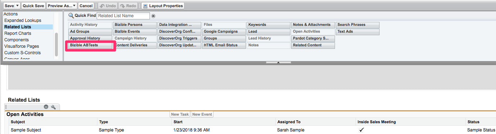
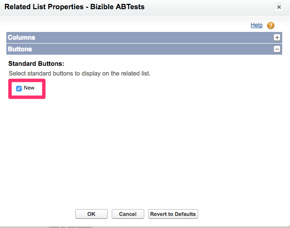
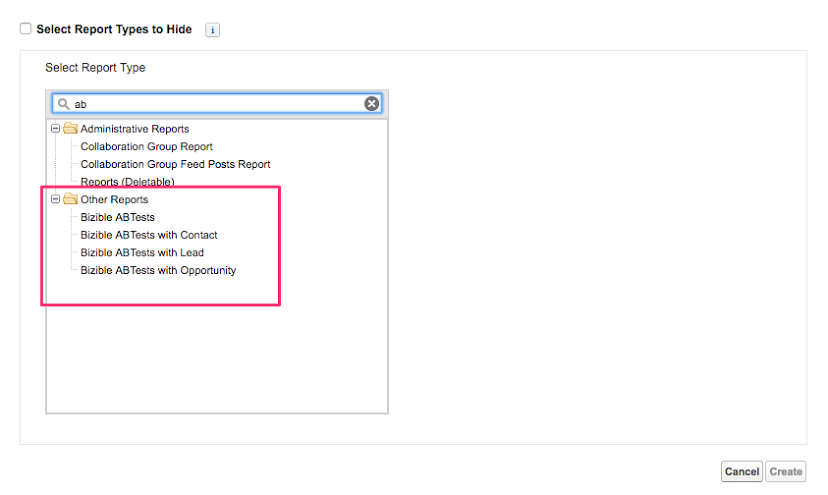

# Configuration des tests A/B et création de rapports {#a-b-testing-set-up-and-reporting}

L’intégration des tests A/B [!DNL Marketo Measure] vous permet de suivre l’impact sur les revenus de vos expériences sur les sites [Optimizely](https://www.optimizely.com/){target="_blank"} et VWO. Cet article fournit des instructions sur la façon d’ajouter des sections de tests A/B [!DNL Marketo Measure] aux dispositions des pages Prospect, [!UICONTROL Contact], Dossier et [!UICONTROL Opportunité]. Les pratiques et recommandations générales en matière de création de rapports pour l’exécution des types de rapports A/B [!DNL Marketo Measure] sont également abordées.

## Configuration {#set-up}

Ajoutez les sections de tests A/B [!DNL Marketo Measure] sur les pages Prospect, Contact, Dossier et Opportunité. L’intégration des tests A/B [!DNL Marketo Measure] vous permet de suivre l’impact sur les revenus de vos expériences sur le site [Optimizely](https://www.optimizely.com/){target="_blank"} and [VWO](https://vwo.com/){target="_blank"}.

1. Vérifiez que vous utilisez le package [!DNL Marketo Measure] v3.9 ou version ultérieure. Vous pouvez le faire en accédant à [!UICONTROL Salesforce] > [!UICONTROL Configuration] > [!UICONTROL Packages installés].
1. Modifiez la disposition de la page Prospect et ajoutez la liste connexe Tests A/B **[!DNL Marketo Measure]** à la page.

   

1. Cliquez sur le bouton [!UICONTROL Clé à molette]. Supprimer le champ « Id » du stock de la liste des champs sélectionnés. Ajoutez les champs **[!UICONTROL Expérience]**, **[!UICONTROL Variation]** et **[!UICONTROL DateReported]**. Remplacez « [!UICONTROL Trier par] » par **[!UICONTROL Date du rapport]**, et sélectionnez **[!UICONTROL Descendant]** dans la liste déroulante.

   

1. Sous [!UICONTROL Boutons], décochez **[!UICONTROL Nouveau]**.

   

1. Contactez votre personne représentante [!DNL Marketo Measure] ou le [Support de Marketo](https://nation.marketo.com/t5/support/ct-p/Support){target="_blank"} pour activer la fonctionnalité.

## Création de rapports {#reporting}

Les clientes et clients ont accès à quelques types de rapports A/B [!DNL Marketo Measure] qui vous permettent d’établir des rapports sur les tests A/B en lien avec les prospects, les contacts et les opportunités :

* Tests A/B [!DNL Marketo Measure]
* Tests A/B [!DNL Marketo Measure] avec Contact
* Tests A/B [!DNL Marketo Measure] avec Prospect
* Tests A/B [!DNL Marketo Measure] avec Opportunité

Les types de rapports A/B sont utilisés pour signaler quel Prospect, quel Contact ou quelle Opportunité a fait l’objet d’un test A/B. Ces rapports vous indiquent également le montant des revenus lié à une opportunité qui a fait l’objet d’un test A/B.

Il est important de noter qu’Optimizely/VWO est une plateforme de variation de contenu et non un canal marketing. Par conséquent, ces types de rapports A/B [!DNL Marketo Measure] sont utilisés différemment des rapports Buyer Touchpoint. Les types de rapports Buyer Touchpoint sont utilisés pour comprendre quel canal marketing (publicité payante, direct web, social) a amené un prospect ou un contact sur une page spécifique. Cependant, les types de rapports A/B [!DNL Marketo Measure] ne peuvent pas être utilisés pour rendre compte de l’influence d’une variation sur un prospect ou une opportunité. Étant donné qu’une variation de test A/B n’est pas un canal, les détails de la variation n’apparaissent pas dans le rapport Buyer Touchpoint.

Voici quelques champs recommandés à utiliser lors de la création d’un rapport sur un test A/B afin d’améliorer la clarté et la compréhension :

* Prospect converti
* Expérience
* ID d’expérience
* Variation
* ID de variation
* Date du rapport

## Exemples de rapports [!DNL Salesforce] {#salesforce-example-reports}

Test A/B **[!DNL Marketo Measure]avec Prospect**

Test A/B **[!DNL Marketo Measure]avec Opportunité**

