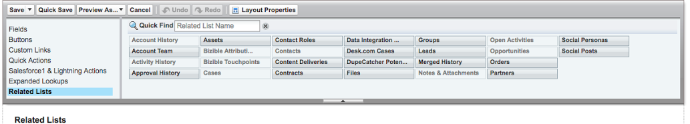

# Vue d’ensemble du marketing basé sur les comptes {#account-based-marketing-overview}

Les sections suivantes fournissent une brève vue d’ensemble d’ABM, des composants de la fonctionnalité ABM de [!DNL Marketo Measure] et de la manière de l’ajouter à votre disposition de page [!DNL Salesforce]. Pour en savoir plus sur ABM, consultez le [blog ABM](https://business.adobe.com/blog/basics/account-based-marketing){target="_blank"} d’Adobe.

Pour obtenir des instructions détaillées sur la configuration d’ABM dans votre instance [!DNL Salesforce], consultez [Configuration de la disposition de page d’ABM dans Salesforce](/help/advanced-marketo-measure-features/account-based-marketing/account-based-marketing-overview.md#setting-up-abm-page-layout-in-salesforce){target="_blank"}.

## Présentation d’ABM {#what-is-abm}

Le marketing basé sur les comptes, ou ABM, est une stratégie marketing dans laquelle vous ciblez et vendez à des entreprises et des comptes dans leur ensemble, pas seulement en tant que particuliers. [!DNL Marketo Measure] aide les équipes de marketing et de vente à exécuter des stratégies d’ABM réussies grâce à sa fonctionnalité de mappage prospect>compte et son score d’engagement prédictif.

Pour que notre modèle Account-Based Marketing commence à s’afficher dans votre CRM, [!DNL Marketo Measure] nécessite que les critères suivants soient remplis :

* Votre CRM a besoin d’au moins 25 comptes disposant d’au moins une opportunité gagnée fermée, pour pouvoir mieux évaluer les fonctionnalités communes d’un compte ou d’une opportunité « réussi(e) » pour votre entreprise.
* D’autre part, votre CRM a besoin d’au moins 25 comptes sans opportunité gagnée fermée (toutes les options doivent être soit dans une catégorie d’étape « Ouverte », soit dans une catégorie « Perdue fermée »), ce qui nous permet d’évaluer ce qui constitue un compte moins intéressant dans votre entreprise.

>[!NOTE]
>
>Les « mauvais » comptes mentionnés ci-dessus doivent être ouverts pendant au moins 12 mois sans accumuler d’opportunité « Gagnée fermée » ; c’est la ligne directrice de base pour savoir si une opportunité est devenue obsolète et améliorer le modèle.

## Mappage prospect>compte {#lead-to-account-mapping}

Le mappage prospect>compte est essentiel à l’efficacité de l’approche ABM. Grâce au mappage prospect>compte, les prospects sont regroupés dans le même compte d’entreprise lorsqu’ils s’intéressent à votre marque. Cela vous permet de cibler et de vendre à des personnes d’une même entreprise de manière cohérente. Il n’y a pas d’autre configuration [!DNL Salesforce] nécessaire pour commencer à bénéficier de cette fonctionnalité. Le mappage prospect>compte [!DNL Marketo Measure] dispose de cinq méthodes de correspondance différentes :

* Site web du prospect > site Web du compte
* Domaine d’adresse e-mail du prospect > domaine du site Web du compte
* Nom de l’entreprise du prospect > nom du compte
* Entreprise du prospect > domaine du site Web du compte
* Correspondance du domaine de l’adresse e-mail du prospect et le compte via l’adresse e-mail du contact

>[!NOTE]
>
>Chaque prospect tente d’être associé à un compte dans l’ordre préférentiel des méthodes ci-dessus. Une fois qu’une correspondance est établie, l’ID de compte est immédiatement défini sur le prospect et ne sera pas mis en correspondance à l’aide d’une autre méthode. Si le prospect dispose déjà d’un ID de compte valide, il est ignoré.

## Score d’engagement prédictif {#predictive-engagement-score}

Le score d’engagement prédictif [!DNL Marketo Measure], ou SEP, est une valeur dynamique qui illustre l’engagement d’un compte particulier vis-à-vis de vos actions marketing. Ce score est utile pour la segmentation des comptes à cibler. Il s’agit d’un outil précieux pour identifier les comptes à cibler de manière plus efficace.

De nombreux composants entrent dans l’algorithme qui calcule le SEP. La récence et l’âge ont une grande influence sur les changements de score, ainsi que sur les dernières activités de point de contact ou pages vues. L’ajout de nouveaux contacts à un compte a également un impact sur le SEP. Voici une liste de certains éléments du SEP :

* Nombre total de pages vues à partir du compte
* Nombre moyen de pages vues
* Nombre moyen de personnes dans le compte
* Âge de la dernière page vue
* Âge moyen des pages vues
* Nombre de personnes dans le compte
* Pages importantes spécifiques et s’il y a eu une visite au cours des 30/60/90 derniers jours
* Si le compte a une transaction perdue/gagnée fermée
* La probabilité qu’elle soit perdue/gagnée fermée

>[!NOTE]
>
>Vous remarquerez peut-être la mention « S/O » ou « - » (symbole du tiret) dans votre score d’engagement prédictif pour certains comptes.

_La mention « S/O » signifie simplement qu’il n’y a pas de données suffisantes sur ce compte pour que le modèle génère un score réel. Lorsqu’il dispose de données supplémentaires, il lui attribue un score._
_Un tiret « - » signifie que ce compte n’a pas encore été traité par le processus ABM, en raison de contraintes de temps, de processus parfois manqués, etc. Si vous pensez qu’un compte doit avoir un score, basé sur d’autres comptes ou périodes similaires, contactez et informez [!DNL Marketo Measure]._

## Configurer de la disposition de page ABM dans [!DNL Salesforce] {#setting-up-abm-page-layout-in-salesforce}

Pour commencer à utiliser le SEP, vous devez ajouter le champ SEP et la liste associée aux dispositions de page appropriées dans [!DNL Salesforce].

1. Accédez à **[!UICONTROL Configuration]** > **[!UICONTROL Personnaliser]** > **[!UICONTROL Comptes]** > **[!UICONTROL Disposition de page]**. Sélectionnez ensuite la disposition de page que vous souhaitez modifier.
1. Accédez à [!UICONTROL Champs] et déplacez le champ « Score d’engagement prédictif » dans la section Informations du compte.

   

1. Enfin, accédez à [!UICONTROL Listes associées] et déplacez la liste associée « Prospects » dans votre mise en page.

   

1. Ensuite, accédez à **[!UICONTROL Configuration]** > **[!UICONTROL Personnaliser]** > **[!UICONTROL Prospect]** > **[!UICONTROL Mise de page]** et sélectionnez les mises en page appropriées que vous souhaitez modifier.
1. Cliquez sur **[!UICONTROL Champs]** et ajoutez le champ [!UICONTROL Compte] à l’endroit qui vous convient sur la page.

   

Tout est prêt !

