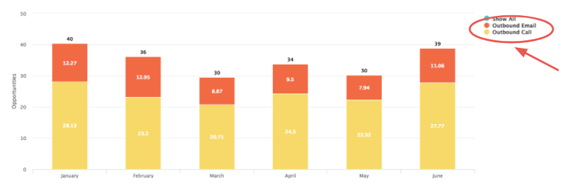
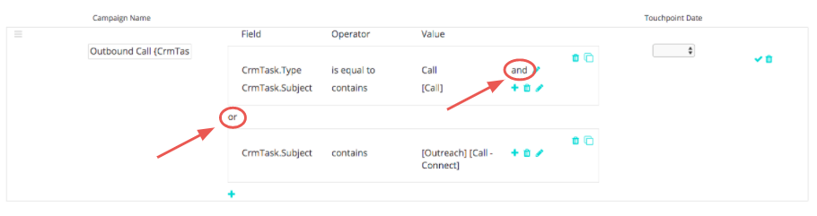
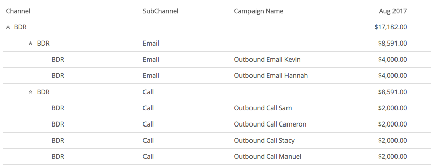

# Attribution des activités Salesforce {#salesforce-activities-attribution}

L’intégration des activités Salesforce [!DNL Marketo Measure] intègre des enregistrements de tâches et d’événements spécifiques à votre modèle d’attribution. Commencez à effectuer le suivi d’éléments tels que les e-mails de vente ou les appels téléphoniques de vente qui n’étaient pas crédités. Pour configurer la règle de vos activités, accédez à [experience.adobe.com/marketo-measure](https://experience.adobe.com/marketo-measure){target="_blank"}. À partir de là, accédez à l’onglet **[!UICONTROL Paramètres]** et cliquez sur l’onglet **[!UICONTROL Activités]**.

>[!AVAILABILITY]
>
>Cette fonctionnalité est activée uniquement pour les clients de niveau 2. Pour demander un niveau de compte supérieur, contactez l’équipe Compte d’Adobe (votre gestionnaire de compte).

Pour commencer, nous introduisons un nouveau concept appelé campagne [!DNL Marketo Measure]. Pour chaque règle que vous définissez, vous allez regrouper les enregistrements dans une campagne [!DNL Marketo Measure] que vous pouvez nommer. Ajoutez plusieurs campagnes selon vos besoins. Imaginez mesurer l’efficacité d’une campagne de ventes sortantes à côté d’une campagne de médias payants !

Vous allez utiliser ce nom de campagne [!DNL Marketo Measure] pour indiquer à quel canal il doit être mappé. Si vous pensez toujours aux ventes sortantes, peut-être que toutes les campagnes de ventes sortantes doivent être placées dans un canal BDR.

Familiarisez-vous avec cette hiérarchie :

* Canal
   * Sous-canal
      * Campagne
      * Campagne
   * Sous-canal
      * Campagne

>[!TIP]
>
>Si vous souhaitez définir une campagne unique pour chaque représentant commercial, par exemple, utilisez des paramètres de remplacement dynamiques pour renseigner le nom de la campagne [!DNL Marketo Measure]. Dans le même exemple, vous pouvez saisir `"Outbound Sales - {AssignedTo}"` et le remplacer par `"Outbound Sales - Jill"` ou `"Outbound Sales - Jack."`.

Une fois le nom de la campagne [!DNL Marketo Measure] défini, il est temps de configurer vos règles d’activité.

Les règles agissent comme un filtre pour nous indiquer les enregistrements éligibles à l’attribution. Imaginez que vous créez un rapport dans votre CRM en utilisant une logique similaire pour générer ce rapport. Vous avez la possibilité d’utiliser une combinaison d’instructions et/ou et de divers opérateurs tels que `matches any`, `contains`, `starts with`, `ends with`, `is equal to`. Définissez des instructions `and` dans une règle encadrée ou des instructions `or` de couche en dehors de la zone.

>[!NOTE]
>
>Les champs de formule ne peuvent pas être utilisés dans vos règles et n’apparaîtront pas dans la liste de sélection. Comme les formules sont calculées en arrière-plan et ne modifient pas d’enregistrement, [!DNL Marketo Measure] ne peut pas détecter si un enregistrement correspond ou non à une règle.
>
>Veillez à utiliser les valeurs correctes pour les champs d’ID tels que CrmEvent.CreatedById. [!DNL Salesforce IDs] comporte 18 caractères (0054H000007WmrfQAC).

Enfin, choisissez l’un de vos champs Date ou Date/Heure à utiliser comme Date Buyer Touchpoint. Les champs standard et personnalisés peuvent être sélectionnés.

>[!TIP]
>
>Avec l’installation de votre package, [!DNL Marketo Measure] inclut un champ de date Buyer Touchpoint personnalisé dans l’enregistrement d’activité. Si vous souhaitez utiliser une date dynamique, comme la date de changement de statut, il est possible d&#39;utiliser un workflow CRM pour définir la &quot;Date Buyer Touchpoint&quot; puis sélectionner la Date Buyer Touchpoint ici à cette étape.

N’oubliez pas de définir des règles différentes pour les tâches ou les événements. Vous devez connaître l’objet utilisé par votre équipe de vente pour enregistrer leurs activités.

Vous voudrez probablement placer ces nouveaux points de contact dans le [canal marketing](https://experience.adobe.com/#/marketo-measure/MyAccount/Business?busView=false&id=10#/!/MyAccount/Business/Account.Settings.SettingsHome?tab=Channels.Online%20Channels){target="_blank"} approprié. Pour ce faire, définissez le canal avec son nouveau mapping Campaign qui vient d&#39;être créé.

>[!TIP]
>
>Lors de l’ajout d’une définition de canal, utilisez des valeurs génériques, un moyen plus facile d’afficher les opérateurs tels que :
>
>commence par ( sortant&#42; )
>
>contient ( &#42;Sortant&#42; )
>
>se termine par ( &#42;Sortant )
>
>Aucun caractère générique ne signifie en fait &quot;est égal à&quot;. Veillez donc à les utiliser selon vos besoins.

| **Opérateur** | **Exemple d’utilisation** |
|---|---|
| Est égal à | Valeur unique : correspondance exacte |
| Contient | Valeur unique : contient la valeur |
| Correspond à n’importe quel | Plusieurs valeurs - Correspondance exacte |
| Correspond à n’importe quel (contient) | Plusieurs valeurs - &#42;value&#42;, &#42;value, &#42;value&#42; |

Enfin et surtout, vous avez la possibilité de saisir les coûts de vos nouveaux canaux. Le [téléchargement de dépenses marketing](https://experience.adobe.com/#/marketo-measure/MyAccount/Business?busView=false&id=10#/!/MyAccount/Business/Account.Settings.SettingsHome?tab=Reporting.Marketing%20Spend){target="_blank"} vous permet de saisir vos dépenses au niveau du canal, du sous-canal ou de la campagne. Avec vos nouvelles campagnes [!DNL Marketo Measure], vous pouvez ajouter ces coûts associés par mois, puis voir le retour sur investissement de chaque campagne !

>[!MORELIKETHIS]
>
>[FAQ sur l’attribution d’activités](/help/advanced-marketo-measure-features/activities-attribution/activities-attribution-faq.md)
