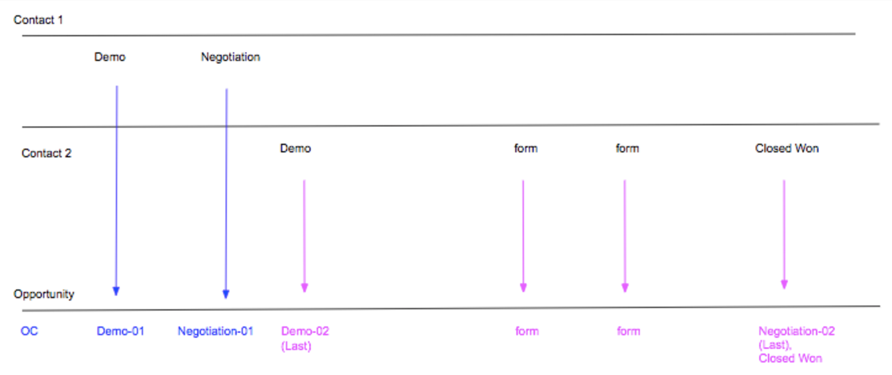

# Scénarios d’étape de boomerang {#boomerang-stage-scenarios}

>[!AVAILABILITY]
>
>La fonction Boomerang n’est activée que pour les clients de niveau 3. Pour demander un niveau de compte supérieur, contactez l’équipe Compte d’Adobe (votre gestionnaire de compte).

Vous trouverez ci-dessous quelques exemples de scénarios de Boomerang Stage pour expliquer comment [!DNL Marketo Measure] crée des points de contact dans chaque situation.

## Scénarios de piste uniques {#single-lead-scenarios}

**Scénario 1 : Points de contact standard Boomerang pour une piste**

C&#39;est le scénario Boomerang le plus simple. La ligne supérieure (appelée &quot;piste 1&quot;) représente le parcours des pistes individuelles et la manière dont leurs points de contact apparaissent dans l’enregistrement de piste. La ligne de bas (désignée par le terme Opportunité) indique comment les points de contact des Pistes se traduisent par Opportunité. La progression des points de contact sera expliquée dans l’occurrence chronologique, de gauche à droite.

Dans ce scénario, un client a choisi d’avoir sa **MQL** et **SQL** scènes suivies avec Boomerangs. Chaque position de point de contact Boomerang est associée à la scène et au nombre d’occurrences (MQL-01, SQL-01, MQL-02). etc). Le dernier point de contact boomerang de cette scène aura également &quot;(Dernier)&quot; en position de point de contact.

Le prospect 1 est ensuite converti en contact avec une opportunité, qui est considéré comme la touche OC.

**Scénario 2 : Points de contact Boomerang ET étapes personnalisées pour une piste**

Dans ce scénario, un client a choisi de suivre uniquement la variable **Etape SQL** avec des points de contact boomerang. Les scènes MQL et SAL sont toujours suivies, mais avec la variable [!DNL Marketo Measure] Fonctionnalité d’évaluation personnalisée.

Notez que la position du point de contact MQL n’est pas étiquetée avec un nombre. En effet, elle n’a pas été sélectionnée pour être suivie avec les points de contact Boomerang. Lors de la création de points de contact pour les scènes incluses dans le modèle personnalisé, mais qui ne sont pas suivies avec Boomerang, [!DNL Marketo Measure] prendra la dernière occurrence de cette étape.

Dans le cas de l’étape SAL, [!DNL Marketo Measure] ignore les deux premières occurrences de cette étape. [!DNL Marketo Measure] crée uniquement un point de contact SAL pour la variable _last_ . Dans l’exemple ci-dessus, cela se produit juste avant le point de contact OC.

La scène SQL est suivie avec les points de contact Boomerang, et trois points de contact ont été créés et étiquetés en conséquence.

Le prospect 1 est ensuite converti en contact avec une opportunité, qui est considéré comme la touche OC.

**Scénario 3 : Lorsque les pistes n’atteignent pas/ne sautent pas une scène**

Ce scénario utilise les mêmes critères que le scénario 2. Un client a choisi de ne suivre que la scène SQL avec des points de contact boomerang. MQL et SAL toujours en cours de suivi, mais avec la variable [!DNL Marketo Measure] Fonctionnalité d’évaluation personnalisée.

Dans ce scénario, le prospect ne passe jamais réellement à l’étape SAL. Il se convertit en Contact avant d’atteindre l’étape SAL, essentiellement &quot;sauter&quot; l’étape SAL. Dans ce cas, [!DNL Marketo Measure] supposera que la SAL se produit avec le point de contact OC, et que la position SAL et OC apparaîtront sur le même point de contact.

Le prospect 1 est ensuite converti en contact avec une opportunité, qui est considéré comme la touche OC.

## Scénarios avec plusieurs pistes {#scenarios-with-multiple-leads}

Les scénarios suivants sont là où les phases Boomerang peuvent devenir plus complexes, alors que nous étudions comment plusieurs pistes peuvent influencer le parcours d’opportunités.

La ligne supérieure (désignée sous le nom de piste 1, en bleu) représente le parcours des pistes individuelles et la manière dont leurs points de contact apparaissent dans l’enregistrement de piste. Il en va de même pour le Lead 2 (en rose) et le Lead 3 (en orange). La ligne de base (intitulée Opportunité) indique comment les points de contact de ces deux pistes se traduisent en opportunité. La progression des points de contact sera expliquée dans l’occurrence chronologique, de gauche à droite.

**Scénario 1 : [!UICONTROL Trois pistes pour l&#39;opportunité]**

Dans ce scénario, un client a choisi de suivre la variable **MQL** et **Etapes SAL** avec des points de contact boomerang. L’étape SQL est suivie par les étapes personnalisées standard.

Les points de contact FT et LC sur l’opportunité viendront de Lead 1 (bleu), car ils se sont produits avant le FT et la LC de Lead 2 (rose). Le point de contact LC pour l’piste 2 apparaît comme point de contact &quot;Formulaire&quot; sur l’opportunité.

Le MQL-01 (dernier) du prospect 2 sera le premier MQL sur l’opportunité. Le MQL-01 de la piste 1 n’apparaîtra pas comme point de contact sur l’opportunité, car le MQL de la piste 2 s’est produit en premier. Toutefois, les MQL-02 et MQL-03 de Lead 1 apparaissent dans l’opportunité.

Notez que la scène SQL est suivie avec des scènes personnalisées, et non des scènes boomerang. Même s’il existe trois occurrences de l’étape SQL entre la piste 1 et la piste 2, seule la dernière occurrence SQL sera incluse comme point de contact sur l’opportunité.

Le point de contact SAL-01 (dernier) de la piste 1 est transféré comme point de contact de l’opportunité. Le prospect 1 est ensuite converti en contact avec une opportunité, qui est considéré comme la touche OC. Le point de contact SAL-01 (dernier) de la piste 2 sera créé comme point de contact car cette transition d’étape s’est produite. _after_ la touche OC.

Les points de contact FT, LC et MQL de Lead 3, SQL, SAL (orange) se sont tous produits après le point de contact OC sur l’opportunité. Ces points de contact seront inclus dans l’opportunité, mais sont considérés comme des &quot;touches intermédiaires&quot;.

Lorsque les pistes 2 et 3 sont converties en contacts, [!DNL Marketo Measure] ne créera pas un autre point de contact OC, car il ne peut y avoir qu’une seule étape de création d’opportunités.

**Scénario 2 - [!UICONTROL Trois pistes pour l&#39;opportunité]**

Dans ce scénario, un client a choisi de suivre la variable **MQL**, **SQL**, et **SAL** étapes avec des points de contact boomerang.

Tous les points de contact du prospect 1 seront inclus sur l’opportunité, de FT à SAL-01 (dernier). Le point de contact LC de l’piste 2 sera inclus comme point de contact Formulaire entre les points de contact LC et MQL-01 de l’opportunité.

Le MQL-01 (dernier) du prospect 2 correspond finalement au MQL-04 (dernier) point de contact de l’opportunité. Dans la mesure où ce scénario examine plusieurs parcours de pistes dans une seule opportunité, le positionnement et la numérotation des points de contact des pistes peuvent changer lorsqu’ils sont traduits comme points de contact sur l’opportunité. De même, le SQL-01 (Dernier) du prospect 2 devient le SQL-04 (Dernier) du formulaire Opp. La piste 2 SAL-01 (dernière) devient également la SAL-02 (dernière) de l’opportunité.

Notez également qu’il n’y a que 2 points de contact SAL inclus dans l’opportunité. [!DNL Marketo Measure] ne tente pas de forcer/créer des points de contact pour les transitions intermédiaires si elles ne se sont pas réellement produites.

Le parcours de point de contact du prospect 3 commence juste avant que la touche OC ne se produise, mais longtemps après que les points 1 et 2 aient eu leur touche FT et LC. Dans ce cas, le formulaire FT et le document LC de la piste 3 apparaissent comme un point de contact de formulaire sur l’opportunité. Le prospect 1 est ensuite converti en contact avec une opportunité, qui est considéré comme la touche OC.

Les touches MQL, SQL et SAL du prospect 3 se produisent toutes en même temps, après la touche OC. Puisqu’elles se sont produites après le point de contact OC, ce point de contact s’affiche sous la forme d’un formulaire/contact intermédiaire sur l’opportunité plutôt que sous la forme d’une transition d’étape Boomerang.

**Scénario 2a - Points de contact du Boomerang des visites web**

Dans ce scénario, un client a choisi de suivre la variable **MQL**, **SQL**, et **SAL** étapes avec des points de contact boomerang. Ce scénario est presque identique à celui ci-dessus, à quelques exceptions près.

Tous les points de contact du prospect 1 seront inclus sur l’opportunité, de FT à SAL-01 (dernier). Le point de contact LC de l’piste 2 sera inclus comme point de contact Formulaire entre les points de contact LC et MQL-01 de l’opportunité.

Le MQL-01 (Dernière) de la piste 2 (Visite Web) ne sera pas créé comme point de contact sur l’Opp. Cela est dû au fait que ce point de contact était une visite web qui se produit après la dernière occurrence de l’étape SQL et n’aide pas à faire avancer l’opportunité.

L’étape du prospect 1 passe à SAL, puis est convertie en contact avec une opportunité ; dans ce cas, la position SAL-01 (dernier) et OC sera combinée dans le même point de contact.

Le formulaire FT de Lead 3, LC touch sera créé comme point de contact de formulaire dans l’Opp. Seules les actions de remplissage de formulaire seront créées en tant que points de contact après la touche OC. Pour cette raison, les transitions d’étape SQL-01 (dernier) et SAL-01 (dernier) de la piste 2 ne seront pas créées en tant que points de contact, car ces points de contact étaient des visites web.

Les touches MQL, SQL et SAL de Lead 3 seront incluses comme point de contact, car il s’agissait d’une action de remplissage de formulaire.

**Scénario 3 - Pondération de l’attribution Boomerang**

Dans ce scénario, un client a choisi de suivre la variable **MQL**, **SQL**, et **SAL** étapes avec des points de contact boomerang.

Les points de contact FT et LC sur l’opportunité viendront de Lead 1 (bleu), car ils se sont produits avant le FT et la LC de Lead 2 (rose). Le point de contact LC pour l’piste 2 apparaît comme point de contact &quot;Formulaire&quot; sur l’opportunité.

Le MQL-01 (dernier) du prospect 2 sera le premier MQL sur l’opportunité. Le MQL-01 de la piste 1 n’apparaîtra pas comme point de contact sur l’opportunité, car le MQL de la piste 2 s’est produit en premier.

Le SQL-01 (dernier) du prospect 2 deviendra SQL-01 sur l&#39;opportunité. Le code SQL-01 sur le prospect 1 n’apparaîtra pas comme point de contact sur l’opportunité, car SQL-01 sur le prospect 2 s’est produit en premier.

Notez que les boomerangs Lead 1 entre MQL et SQL plusieurs fois avant d’atteindre enfin l’étape SAL. SQL-01, MQL-02, SQL-02, MQL-03, SQL-03 _ne sera pas_ être inclus comme points de contact de l’opportunité, car ces transitions intermédiaires ne contribuent pas à faire avancer l’opportunité dans le parcours.

Le point de contact SAL-01 (dernier) de la piste 1 sera le prochain point de contact à être inclus dans l’Opp. La piste 1 se convertit ensuite en contact avec une opportunité, créant ainsi le point de contact OC.

Le FT et le LC de Lead 3, ainsi que le point de contact MQL, SQL et SAL, apparaîtront sous la forme d’une mise en forme sur l’opportunité.

Le point de contact SQL-01 (dernier) de la piste 2 ne sera pas inclus comme point de contact dans l’Opp, car il s’est produit après le point de contact OC. En outre, la transition de l’étape SQL du prospect 2 s’est produite _après la transition finale de l’étape SAL_, et n’aide pas à faire avancer le parcours d’opportunités.

## Scénarios d’opportunité {#opportunity-scenarios}

**Scénario 1 - Contacts avec suivi des opportunités et des boomerang**

Dans ce scénario, un client a choisi de suivre la variable **Transitions de l’étape Démo et Négociation** sur le **Contact**. Chaque étape de boomerang peut recevoir jusqu’à deux points de contact. La différence entre les transitions d’étape sur un contact et les transitions d’étape sur un prospect est que les transitions d’étape Contact peuvent apparaître en tant que points de contact Boomerang sur l’opportunité. _after_ le point de contact OC. Cela n’est pas vrai pour les transitions d’étape qui se produisent sur le piste, car elles s’affichent comme un point de contact de formulaire.

Dans cet exemple, les transitions d’étape de démonstration et de négociation de Contact 1 sont incluses en tant que points de contact Demo-01 et Négociation-01 sur l’opportunité. La transition de l’étape de démonstration du contact 2 se produit _after_ Contactez 1 et apparaît comme point de contact Démo 02 (Dernier) sur l’opportunité.

Notez qu’il n’y a pas de deuxième transition vers l’étape de négociation ; l’opportunité passe immédiatement de Demo-02 (Dernier) à Fermer gagnant. Dans ce cas, [!DNL Marketo Measure] inclura la transition de négociation avec le point de contact Won fermé .
