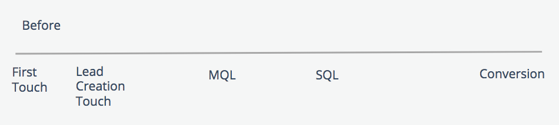

# Étapes et points de contact de boomerang {#boomerang-stages-and-touchpoints}

>[!AVAILABILITY]
>
>La fonction Boomerang n’est activée que pour les clients de niveau 3. Pour demander un niveau de compte supérieur, contactez l’équipe Compte d’Adobe (votre gestionnaire de compte).

[!DNL Marketo Measure] a lancé notre fonctionnalité Boomerang Stage ! La fonction d’évaluation Boomerang a été créée pour offrir une meilleure visibilité sur le parcours du client pour [!DNL Marketo Measure] clients ayant de longs cycles de vente. Cette fonctionnalité permet aux marketeurs de créer des points de contact pour toutes les transitions d’étape qui se produisent dans le parcours d’opportunité, comme lorsqu’un MQL de contact, passe ensuite à SAL, puis revient à l’étape MQL. Lorsque les contacts &quot;rentrent à nouveau dans la scène MQL&quot; ou &quot;re-MQL&#39;s&quot;, nous considérons que le MQL est une scène de boomerang. La fonction d’évaluation Boomerang fonctionne à côté de la fonction [!DNL Marketo Measure] Étapes personnalisées.

## Fonctionnement de cette fonctionnalité {#what-this-feature-does}

* Crée un point de contact &quot;boomerang&quot; pour toutes les transitions d’étape qui se produisent dans le parcours d’une opportunité
* Effectue le suivi des transitions répétées entre toutes les étapes personnalisées (ex. lorsqu’un MQL de contact est déplacé vers SAL, puis revient à l’étape MQL).
* Permet de spécifier le nombre et l’ensemble de transitions intermédiaires que vous souhaitez inclure dans l’ opportunité (ex. Les 10 premiers MQL ou les 5 derniers MQL)
* Si vous êtes un utilisateur de modèle personnalisé, vous pouvez déterminer la pondération d’attribution et le crédit en pourcentage que vous souhaitez allouer à chacune de ces étapes (par exemple, désigner le poids de l’attribution à la première ou à la dernière occurrence de MQL ou répartir uniformément la pondération de l’attribution entre toutes les occurrences) ;

>[!NOTE]
>
>[Instructions sur la configuration des phases Boomerang](/help/advanced-marketo-measure-features/boomerang/setting-up-boomerang-stages.md).

## À quoi ressemblent les étapes et points de contact Boomerang dans votre CRM {#what-boomerang-stages-and-touchpoints-look-like-in-your-crm}

Sans scènes Boomerang (le &quot;before&quot;), vous ne verrez que le MQL le plus récent ou le point de contact SQL le plus récent associé à un enregistrement Lead/Contact.

Avec les étapes Boomerang et les points de contact, vous verrez les points de contact qui se produisent pour chaque transition d’étape. La convention de dénomination de ces points de contact boomerang est la suivante :

**[Nom de l’étape]-00.**

En suivant l’exemple ci-dessous, ceci [!DNL Marketo Measure] ont inclus MQL et SQL dans leurs phases boomerang, et ont choisi d’afficher 2 points de contact boomerang par étape.

**MQL-01** est la première transition d’étape MQL.

La valeur numérique dans la position du point de contact indique l’ordre dans lequel la transition de l’étape s’est produite. Le dernier point de contact boomerang doit être marqué comme :

MQL-02 **(Dernier)**

## Comment les phases Boomerang changent vos données existantes {#how-boomerang-stages-change-your-existing-data}

Boomerang Stages aura un impact :

**Attribution par canal**

* Depuis [!DNL Boomerang Stages] créera d’autres points de contact, ce qui modifiera la manière dont l’attribution est distribuée parmi les points de contact qui existent actuellement dans vos données. Cela peut donc signifier que les valeurs des recettes changent d’un canal marketing à l’autre. Tenez compte de ces points avant de mettre en oeuvre la [!DNL Boomerang stages]ou contactez votre gestionnaire de compte pour plus d’informations.

**Tout rapport qui utilise &quot;est égal à&quot; [Position du point de contact]&quot;**

* Les scènes Boomerang introduisent de nouvelles positions de points de contact pour vos données. [!DNL Marketo Measure] modifie le format de la position du point de contact afin d’inclure l’occurrence de l’étape, comme &quot;MQL-01&quot; ou &quot;MQL-05 (Dernier)&quot;. Dans cet exemple, les phases Boomerang auront un impact sur tous les rapports qui utilisent &quot;La position du point de contact est égale à MQL&quot;. Pour ajuster ces rapports, le filtre doit utiliser l’opérateur &quot;contient&quot; à la place.

## Questions fréquentes {#faq}

**Combien de phases de boomerang puis-je inclure dans mon modèle d’attribution ?**

Vous pouvez sélectionner jusqu’à 15 étapes.

**Q : Combien de points de contact &quot;boomerang&quot; puis-je avoir par étape ?**

Vous pouvez sélectionner jusqu’à 10 points de contact boomerang par étape.

**Q : Pourquoi ne sommes-nous limités qu&#39;à 10 boomerangs par étape ?**

[!DNL Marketo Measure] doit limiter le nombre d’étapes pour que les temps de traitement restent sous contrôle. Si vous choisissez d’inclure les 15 étapes Boomerang dans votre modèle d’attribution et 10 points de contact boomerang par étape, vous pouvez avoir potentiellement plus de 150 points de contact par enregistrement de piste/contact.

**Q : J&#39;ai un Data Warehouse. Est-ce que je reçois toutes les données ou est-ce que la limite des phases Boomerang s&#39;applique aussi à moi ?**

Le plafond s’applique aux Data Warehouse et aux CRM en raison des limites de traitement que la variable [!DNL Marketo Measure] est en place. Data Warehouse affiche également la limite de 10 points de contact par étape.

**Q : Quel est l’avantage de l’utilisation des phases Boomerang avec la modélisation personnalisée ?**

Utilisation [!UICONTROL Boomerang] Les étapes avec un modèle personnalisé vous permettent d’affecter une pondération d’attribution à [!UICONTROL Boomerang] points de contact, qui attribueront du crédit de recettes à ces étapes.

Sans modélisation personnalisée, [!DNL Marketo Measure] créera des points de contact pour chaque transition boomerang et d’étape, mais n’attribuera aucun crédit d’attribution à ces points de contact. Les seuls points de contact boomerang qui recevront des crédits d’attribution sont les points de contact d’envoi de formulaire. Sans modèle personnalisé, [!DNL Boomerang] les points de contact sont considérés comme identiques à une &quot;touche intermédiaire&quot; et reçoivent un crédit d’attribution en conséquence.
