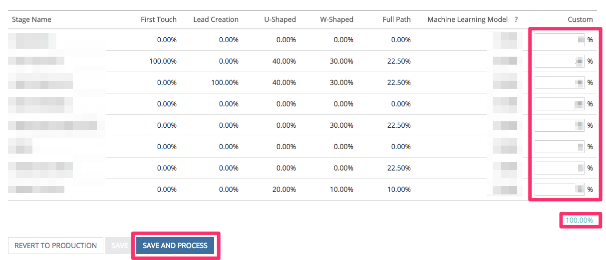

# Configuration d’étapes Boomerang {#setting-up-boomerang-stages}

Pour activer [!UICONTROL Boomerang] Pour votre compte, vous devez être un administrateur de compte. Ou, elle peut être activée en tendant la main vers [Prise en charge de Marketo](https://nation.marketo.com/t5/support/ct-p/Support){target="_blank"}. Une fois la fonctionnalité activée, suivez ces instructions pour la configurer.

## Configuration de l’étape Boomerang {#boomerang-stage-setup}

1. Accédez à [!UICONTROL Mappage d’étape]. Sous la colonne intitulée &quot;[!UICONTROL Boomerang],&quot; sélectionnez les cases en regard des scènes dont vous souhaitez effectuer le suivi.

   

1. Accédez au [!UICONTROL Paramètres d’attribution] et saisissez le nombre de points de contact pour chaque étape que vous souhaitez voir. Nous autorisons un maximum de 10. La valeur par défaut est 1.

   

1. Cliquez sur **[!UICONTROL Enregistrer]**.

   >[!NOTE]
   >
   >Veuillez prévoir entre 24 et 48 heures pour que vos données soient retraitées en fonction de ces modifications.

## Configuration de l’état Boomerang avec attribution de modèle personnalisée {#boomerang-stage-setup-with-custom-model-attribution}

1. Accédez à [!UICONTROL Mappage d’étape]. Sous la colonne intitulée &quot;[!UICONTROL Boomerang],&quot; sélectionnez les cases en regard des scènes dont vous souhaitez effectuer le suivi.

   

1. Si vous souhaitez également que ces scènes Boomerang soient incluses dans votre modèle personnalisé et reçoivent un crédit d’attribution, veillez également à cocher la case située sous le[!UICONTROL Modèle personnalisé]&quot;.

   

1. Accédez au [!UICONTROL Paramètres d’attribution] . Déterminez comment vous souhaitez pondérer l’attribution pour vos scènes de boomerang. Les options consistent à pondérer l’attribution sur la première occurrence, la dernière occurrence ou à la diviser uniformément entre toutes les occurrences.

   

1. Saisissez le nombre d’occurrences de chaque étape que vous souhaitez voir. Nous pouvons autoriser un maximum de 10. La valeur par défaut est 1.

   

1. Définissez le pourcentage d’attribution que vous souhaitez allouer aux étapes Boomerang que vous avez incluses dans le modèle personnalisé. Assurez-vous que l’attribution totale pour toutes les étapes s’élève à 100 %. Cliquez sur **[!UICONTROL Enregistrement et traitement]**.

   

   >[!NOTE]
   >
   >Veuillez prévoir entre 24 et 48 heures pour que vos données soient retraitées en fonction de ces modifications.
