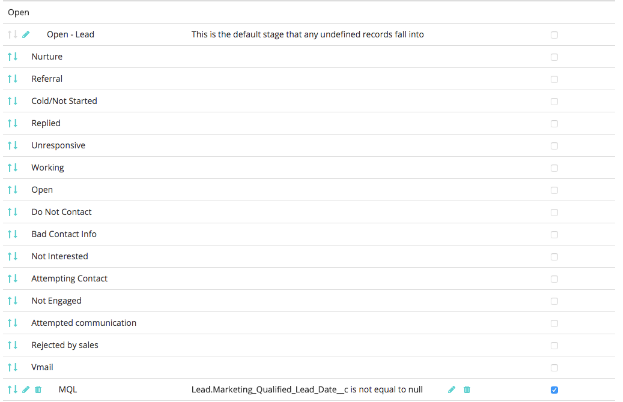
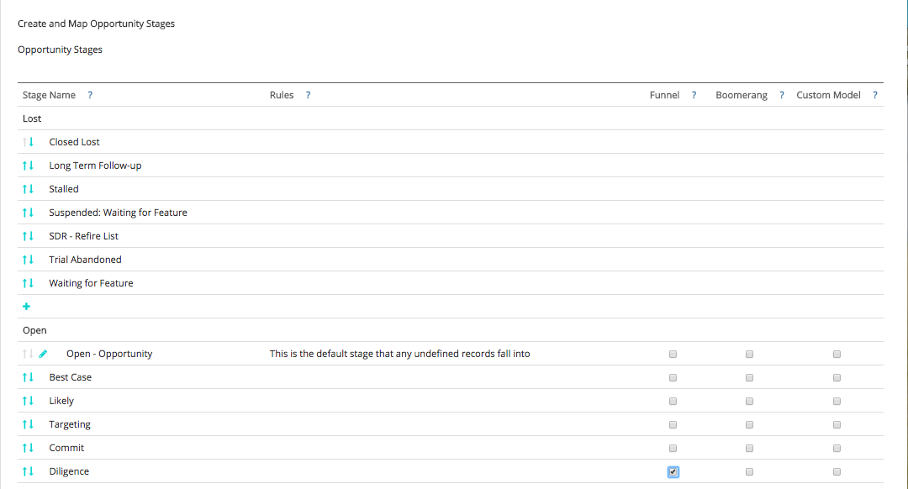

# Configuration et modèle et d’attribution personnalisés {#custom-attribution-model-and-setup}

Consultez ci-dessous un aperçu de la [!DNL Marketo Measure] modèle d’attribution personnalisé et comment le configurer.

## Modèle d’attribution personnalisé {#custom-attribution-model}

La variable [!DNL Marketo Measure] Le modèle d’attribution personnalisée permet aux utilisateurs de choisir les points de contact ou les étapes personnalisées à inclure dans le modèle. Les utilisateurs peuvent contrôler le pourcentage du crédit de recettes attribué à ces points de contact et scènes, ou peuvent utiliser les valeurs de pourcentage d’attribution suggérées par la variable [!DNL Marketo Measure] Modèle d’apprentissage automatique.

## Comment configurer votre modèle d’attribution personnalisé {#how-to-set-up-your-custom-attribution-model}

1. Déterminez les étapes que vous souhaitez inclure dans votre modèle personnalisé.

   Pour commencer à créer votre modèle d’attribution personnalisé, vous devez sélectionner les étapes qui sont importantes pour votre équipe marketing. En plus de la variable [!DNL Marketo Measure] étapes de jalon (FT, LC, OC, Fermé), vous pouvez ajouter jusqu’à six étapes supplémentaires d’état de piste/contact ou d’opportunité dans votre modèle personnalisé. Par exemple, il est courant que l’étape MQL soit incluse dans le modèle personnalisé. Les équipes marketing veulent souvent savoir quels efforts ou canaux mènent les transitions vers l’étape MQL.

   Se connecter à [experience.adobe.com/marketo-measure](https://experience.adobe.com/marketo-measure){target="_blank"}. Accédez à [!UICONTROL Mon compte] > [!UICONTROL Paramètres] > et sous la section CRM, sélectionnez **[!UICONTROL Mappage d’étape]**.

   Ici, vous devez sélectionner les étapes Leads/Contacts et Opportunity à inclure en sélectionnant le **[!UICONTROL Inclure dans le modèle]** de la boîte.

   >[!NOTE]
   >
   >Vous pouvez effectuer jusqu’à six étapes personnalisées (sans inclure les valeurs par défaut : FT, LC, OC, Fermé).

   

   >[!NOTE]
   >
   >_Tous_ Les étapes Leads/Contacts et Opportunity s’affichent ici, même si l’étape est inactive ou n’est plus utilisée dans [!DNL Salesforce]. Si vous souhaitez supprimer ces scènes, vous devez les supprimer définitivement dans [!DNL Salesforce].

   Lorsque vous avez sélectionné vos scènes, veillez à cliquer sur le **[!UICONTROL Enregistrement et traitement]** en bas de la page. Les étapes s’affichent désormais dans la **[!UICONTROL Paramètres d’attribution]** et vous pourrez attribuer des pourcentages d’attribution à chaque étape. Les étapes personnalisées s’affichent également dans la suite de performances marketing sous la forme d’une étape de piste ou d’opportunité dans la cascade de la demande.

   S’il existe d’autres étapes que vous souhaitez inclure dans le modèle, mais qu’elles ne se trouvent pas dans la variable [!UICONTROL État de piste/contact] ou [!UICONTROL Étape d’opportunité] liste, vous pouvez définir votre propre étape personnalisée en fonction des champs de votre CRM.

   Dans l’exemple ci-dessous, une étape personnalisée &quot;MQL&quot; est définie à l’aide d’un champ de date. La règle indique simplement que si le champ Date MQL n’est pas vide, il doit être considéré comme un MQL et doit être inclus dans le modèle personnalisé. Notez qu’il est également important de trier les étapes personnalisées une fois qu’elles ont été créées afin qu’elles suivent la progression de votre cycle de vente.

   

   >[!CAUTION]
   >
   >N’oubliez pas d’activer le suivi de l’historique pour les champs personnalisés.

Si un champ personnalisé est utilisé dans votre modèle personnalisé, le suivi de l’historique des champs DOIT être activé dans le CRM. Pour plus d&#39;informations sur l&#39;activation du suivi de l&#39;historique des champs, [cliquez ici](/help/advanced-marketo-measure-features/custom-attribution-models/custom-model-setup-enable-field-history-tracking.md).

1. Déterminez les pourcentages d’attribution pour le modèle personnalisé.

   Accédez au **[!UICONTROL Paramètres d’attribution]** in [!DNL Marketo Measure] Applications ; les étapes personnalisées s’affichent ici dans le tableau d’attribution. Le tableau d’attribution affiche l’ensemble des [!DNL Marketo Measure] les modèles d’attribution et la pondération d’attribution de chaque modèle. Les pourcentages d’attribution des cinq premiers modèles sont fixes et ne peuvent pas être modifiés.

   Dans la colonne d’extrême droite intitulée &quot;**[!UICONTROL Personnalisé]**,&quot; vous pouvez définir la pondération en pourcentage pour chaque étape de votre modèle d’attribution personnalisé. Il vous suffit de saisir les valeurs de chaque étape dans la colonne Personnalisé. Alors **[!UICONTROL Enregistrement et retraitement]** une fois terminé.

   À gauche de la colonne &quot;Personnalisé&quot; se trouve l’objet **[!DNL Marketo Measure]Modèle d’apprentissage automatique**. Le modèle d’apprentissage automatique calcule la pondération d’attribution en fonction de l’importance relative de gagner un accord en fonction de ce qui s’est passé à chaque étape personnalisée. Pour plus d’informations sur le modèle d’apprentissage automatique, [cliquez ici](/help/advanced-marketo-measure-features/custom-attribution-models/machine-learning-model-faq.md).

   

## Positions de point de contact {#touchpoint-positions}

Une fois les pourcentages d’attribution enregistrés et traités, les points de contact sont mis à jour et reçoivent leurs nouvelles étapes et positions. Le point de contact qui s’est produit le plus récemment, avant une transition d’étape, recevra du crédit pour cette étape (comme illustré ci-dessous). La pondération et les recettes personnalisées sont également redistribuées.

## Différence entre les étapes d’entonnoir et les étapes de modèle personnalisées {#the-difference-between-funnel-stages-and-custom-model-stages}

Vous pouvez maintenant voir les étapes personnalisées dans votre entonnoir de marketing, même si le modèle personnalisé n’est pas activé. Cela serait possible grâce à l’utilisation de notre fonctionnalité Entonnoir Stage. Les phases d’entonnoir vous permettent désormais d’ajouter des étapes à l’entonnoir, mais ne voient pas d’attribution pour elles.

Les phases d’entonnoir seront toujours suivies comme points de contact et apparaîtront toujours comme positions de point de contact dans votre gestion de la relation client. Sans modèle personnalisé, ces points de contact peuvent toujours recevoir l’attribution de la touche intermédiaire s’il existe un remplissage de formulaire (10 % pour les écrans tactiles moyens), mais aucun crédit d’attribution s’il s’agit d’une simple visite web.

Comme vous pouvez le voir ci-dessous, nous avons inclus l’étape de la diligence parmi nos phases d’entonnoir. Cela signifie que nous disposerons de points de contact où la position contient du renseignement, mais ces points de contact recevront uniquement du crédit d’attribution de la touche intermédiaire si le modèle personnalisé n’est pas activé (au plus 10 %).

>[!NOTE]
>
>Le comportement des modèles personnalisés BAT consiste à diviser le pourcentage du milieu de touche du modèle personnalisé de manière uniforme sur les autres étapes, à condition qu’il n’y ait pas de touches intermédiaires.
