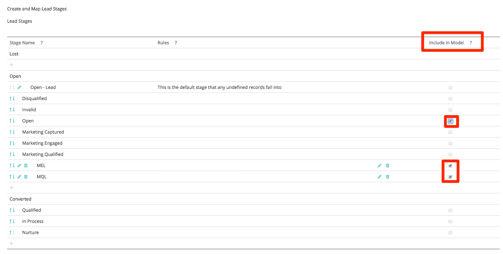

# Configuration et modèle et d’attribution personnalisés {#custom-attribution-model-and-setup}

Voir ci-dessous pour un aperçu du modèle d’attribution personnalisé [!DNL Marketo Measure] et comment le configurer.

## Modèle d’attribution personnalisé {#custom-attribution-model}

Le modèle d’attribution personnalisée [!DNL Marketo Measure] permet aux utilisateurs de choisir les points de contact ou les étapes personnalisées à inclure dans le modèle. Les utilisateurs peuvent contrôler le pourcentage du crédit de recettes attribué à ces points de contact et scènes, ou peuvent utiliser les valeurs de pourcentage d’attribution suggérées par le modèle d’apprentissage automatique [!DNL Marketo Measure].

## Comment configurer votre modèle d’attribution personnalisé {#how-to-set-up-your-custom-attribution-model}

1. Déterminez les étapes que vous souhaitez inclure dans votre modèle personnalisé.

   Pour commencer à créer votre modèle d’attribution personnalisé, vous devez sélectionner les étapes qui sont importantes pour votre équipe marketing. Outre les étapes de jalon [!DNL Marketo Measure] (FT, LC, OC, Fermé), vous pouvez ajouter jusqu’à six étapes supplémentaires d’état de piste/contact ou d’opportunité dans votre modèle personnalisé. Par exemple, il est courant que l’étape MQL soit incluse dans le modèle personnalisé. Les équipes marketing veulent souvent savoir quels efforts ou canaux mènent les transitions vers l’étape MQL.

   Connectez-vous à [experience.adobe.com/marketo-measure](https://experience.adobe.com/marketo-measure){target="_blank"}. Accédez à [!UICONTROL Mon compte] > [!UICONTROL Paramètres] > et, sous la section CRM, sélectionnez **[!UICONTROL Mappage dans l’environnement intermédiaire]**.

   Ensuite, sélectionnez les étapes Leads/Contacts et Opportunity à inclure en sélectionnant la zone **[!UICONTROL Inclure dans le modèle]**.

   >[!NOTE]
   >
   >Vous pouvez effectuer jusqu’à six étapes personnalisées (sans inclure les valeurs par défaut : FT, LC, OC, Fermé).

   

   >[!NOTE]
   >
   >_Toutes_ Les étapes Pistes/Contacts et Opportunité s’affichent ici, même si l’étape est inactive ou n’est plus utilisée dans [!DNL Salesforce]. Si vous souhaitez supprimer ces scènes, vous devrez les supprimer de manière irréversible dans [!DNL Salesforce].

   Lorsque vous avez sélectionné vos scènes, veillez à cliquer sur le bouton **[!UICONTROL Enregistrer et processus]** au bas de la page. Les étapes s’affichent désormais dans l’onglet **[!UICONTROL Paramètres d’attribution]** et vous pourrez attribuer des pourcentages d’attribution à chaque étape. Les étapes personnalisées s’affichent également dans la suite de performances marketing sous la forme d’une étape de piste ou d’opportunité dans la cascade de la demande.

   Si vous souhaitez inclure d’autres étapes dans le modèle, mais qu’elles ne figurent pas dans la liste [!UICONTROL État de piste/contact] ou [!UICONTROL État d’opportunité], vous pouvez définir votre propre étape personnalisée en fonction des champs de votre CRM.

   Dans l’exemple ci-dessous, une étape personnalisée &quot;MQL&quot; est définie à l’aide d’un champ de date. La règle indique simplement que si le champ Date MQL n’est pas vide, il doit être considéré comme un MQL et doit être inclus dans le modèle personnalisé. Il est également important de trier les étapes personnalisées une fois qu’elles ont été créées afin qu’elles suivent la progression de votre cycle de vente.

   

   >[!CAUTION]
   >
   >N’oubliez pas d’activer le suivi de l’historique pour les champs personnalisés.

Si un champ personnalisé est utilisé dans votre modèle personnalisé, le suivi de l’historique des champs DOIT être activé dans le CRM. Pour obtenir des instructions sur l’activation du suivi de l’historique des champs, reportez-vous à la section [Configuration de modèle personnalisé : activer le suivi de l’historique des champs](/help/advanced-marketo-measure-features/custom-attribution-models/custom-model-setup-enable-field-history-tracking.md).

1. Déterminez les pourcentages d’attribution pour le modèle personnalisé.

   Accédez aux **[!UICONTROL paramètres d’attribution]** dans les applications [!DNL Marketo Measure]. Les étapes personnalisées s’affichent ici dans le tableau d’attribution. Le tableau d’attribution affiche tous les modèles d’attribution [!DNL Marketo Measure] et la pondération d’attribution de chaque modèle. Les pourcentages d’attribution des cinq premiers modèles sont fixes et ne peuvent pas être modifiés.

   Dans la colonne d’extrême droite intitulée &quot;**[!UICONTROL Personnalisé]**&quot;, vous pouvez définir la pondération en pourcentage pour chaque étape de votre modèle d’attribution personnalisé. Saisissez les valeurs de chaque étape sous la colonne Personnalisé et cliquez sur **[!UICONTROL Enregistrer et retraiter]** une fois l’opération terminée.

   À gauche de la colonne _Personnalisé_ se trouve le **[!DNL Marketo Measure]modèle d’apprentissage automatique**. Le modèle d’apprentissage automatique calcule la pondération d’attribution en fonction de l’importance relative de gagner un accord en fonction de ce qui s’est passé à chaque étape personnalisée. Pour plus d’informations sur le modèle d’apprentissage automatique, reportez-vous à la [FAQ sur le modèle d’apprentissage automatique](/help/advanced-marketo-measure-features/custom-attribution-models/machine-learning-model-faq.md).

   

## Positions de point de contact {#touchpoint-positions}

Une fois les pourcentages d’attribution enregistrés et traités, les points de contact sont mis à jour et reçoivent leurs nouvelles étapes et positions. Le point de contact qui s’est produit le plus récemment, avant une transition d’étape, recevra du crédit pour cette étape (comme illustré ci-dessous). La pondération et les recettes personnalisées sont également redistribuées.

## Différence entre les étapes d’entonnoir et les étapes de modèle personnalisées {#the-difference-between-funnel-stages-and-custom-model-stages}

Vous pouvez maintenant voir les étapes personnalisées dans votre entonnoir de marketing, même si le modèle personnalisé n’est pas activé. Cela serait possible grâce à l’utilisation de notre fonctionnalité Entonnoir Stage. Les phases d’entonnoir vous permettent désormais d’ajouter des étapes à l’entonnoir, mais ne voient pas d’attribution pour elles.

Les phases d’entonnoir seront toujours suivies comme points de contact et apparaîtront toujours comme positions de point de contact dans votre gestion de la relation client. Sans modèle personnalisé, ces points de contact peuvent toujours recevoir l’attribution de la touche intermédiaire s’il existe un remplissage de formulaire (10 % pour les écrans tactiles moyens), mais aucun crédit d’attribution s’il s’agit d’une simple visite web.

Comme vous pouvez le voir ci-dessous, nous avons inclus l’étape de la diligence parmi nos phases d’entonnoir. Cela signifie que nous disposerons de points de contact où la position contient du renseignement, mais ces points de contact recevront uniquement du crédit d’attribution de contact moyen si le modèle personnalisé n’est pas activé (au plus 10 %).

>[!NOTE]
>
>Le comportement de BAT modèles personnalisés consiste à diviser le pourcentage de la touche moyenne du modèle personnalisé de manière uniforme sur les autres étapes, à condition qu’il n’y ait aucune touche intermédiaire.
