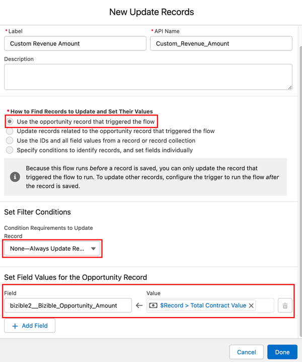

# Utilisation d’un champ de montant de recettes personnalisé {#using-a-custom-revenue-amount-field}

Par défaut, les points de contact d’attribution de l’acheteur extraient le montant de l’opportunité de l’un des deux champs suivants :

* Montant (par défaut SFDC)
* [!DNL Marketo Measure] Montant de l&#39;opportunité (personnalisé)

Si vous utilisez un champ Montant personnalisé pour vos opportunités, nous devrons configurer un workflow afin de calculer les Recettes du point de contact de l’acheteur. Cela nécessite des connaissances plus avancées en matière de [!DNL Salesforce], il peut donc nécessiter l’aide de votre administrateur SFDC.

À partir de maintenant, nous aurons besoin des informations suivantes :

* Nom de l’API de votre champ Montant

A partir de là, nous allons commencer à créer le workflow.

## Création du workflow dans Salesforce Lightning {#create-the-workflow-in-salesforce-lightning}

Les étapes suivantes sont destinées aux utilisateurs de Salesforce Lightning. Si vous utilisez toujours Salesforce Classic, ces étapes [sont répertoriés ci-dessous](#create-the-workflow-in-salesforce-classic).

1. Dans Configuration, saisissez &quot;Flux&quot; dans la zone de recherche rapide, puis sélectionnez **Flux** pour démarrer le créateur de flux. Dans le panneau de droite, cliquez sur le **Nouveau flux** bouton .

   

1. Sélectionner **Flux déclenché par un enregistrement** et cliquez sur le bouton **Créer** en bas à droite.

   

1. Dans la fenêtre Configurer le démarrage, sélectionnez l’objet Opportunité . Dans la section Configurer le déclencheur , sélectionnez **Un enregistrement est créé ou mis à jour**.

   

1. Dans la section Définir les conditions d’entrée , sous Conditions requises, sélectionnez **La logique de condition personnalisée est respectée**.
   * Dans le champ de recherche, sélectionnez votre champ Montant personnalisé.
   * Définissez l’opérateur comme **Is Null** et la valeur en tant que **False**.
   * Définissez les critères d’évaluation sur **Chaque fois qu’un enregistrement est mis à jour et qu’il respecte les conditions requises**.

   

1. Dans la section &quot;Optimiser le flux pour&quot;, sélectionnez **Mises à jour de champ rapides**. Cliquez sur **Terminé**.

   

1. Pour ajouter l’élément, cliquez sur l’icône plus (+) et sélectionnez **Mise à jour de l’enregistrement de déclenchement**.

   

1. Dans la fenêtre New Update Records , saisissez ce qui suit :

   * Saisissez un libellé. Le nom de l’API sera généré automatiquement.
   * Sous &quot;Comment rechercher des enregistrements à mettre à jour et définir leurs valeurs&quot;, sélectionnez **Utiliser l’enregistrement d’opportunité qui a déclenché le flux**.
   * Dans la section &quot;Définir les conditions de filtrage&quot;, sélectionnez **Toujours mettre à jour l’enregistrement** as a Condition requise pour mettre à jour l’enregistrement.
   * Dans &quot;Définir les valeurs de champ pour l’enregistrement de campagne&quot; à partir du champ, sélectionnez Montant de l’opportunité Marketo Measure et validez votre champ Montant personnalisé.
   * Cliquez sur **Terminé**.

   

1. Cliquez sur **Enregistrer**. Une fenêtre contextuelle s’affiche. Saisissez &quot;Libellé du flux&quot; dans la fenêtre Enregistrer le flux (le nom de l’API de flux sera généré automatiquement). Cliquez sur **Enregistrer** encore une fois.

   

1. Cliquez sur le bouton **Activer** pour activer le flux.

   

## Création du workflow dans Salesforce Classic {#create-the-workflow-in-salesforce-classic}

Les étapes suivantes sont destinées aux utilisateurs de Salesforce Classic. Si vous avez basculé vers Salesforce Lightning, ces étapes [se trouve ci-dessus](#create-the-workflow-in-salesforce-lightning).

1. Accédez à **[!UICONTROL Configuration]** > **[!UICONTROL Créer]** > **[!UICONTROL Processus et approbations]** > **[!UICONTROL Règles de workflow]**.

   

1. Sélectionner **[!UICONTROL Nouvelle règle]**, définissez l’objet sur &quot;Opportunité&quot; et cliquez sur **[!UICONTROL Suivant]**.

   

   

1. Configurez le workflow. Définissez le nom de la règle sur &quot;Mettre à jour&quot;. [!DNL Marketo Measure] Montant de l&#39;opportunité.&quot; Définissez le critère d’évaluation sur &quot;Créé&quot; et chaque fois qu’il est modifié. Pour les critères de règle, sélectionnez votre champ Montant personnalisé et choisissez l’ opérateur [!UICONTROL comme &quot;Not Equal To&quot;] et laissez le champ &quot;Valeur&quot; vide.

   

1. Ajoutez une action de workflow. Définissez cette liste de sélection sur &quot;[!UICONTROL Nouvelle mise à jour des champs].&quot;
   

1. Vous y trouverez les informations sur les champs. Dans le champ &quot;Nom&quot;, il est recommandé d&#39;utiliser le nom suivant : &quot;[!DNL Marketo Measure] Montant Opp.&quot; Le &quot;Nom unique&quot; est automatiquement renseigné à partir du champ &quot;Nom&quot;. Dans la liste de sélection &quot;Champ à mettre à jour&quot;, sélectionnez &quot;[!DNL Marketo Measure] Montant de l&#39;opportunité.&quot; Après avoir sélectionné le champ, cochez la case &quot;Réévaluer les règles de workflow après modification du champ&quot;. Dans &quot;Spécifier la nouvelle valeur du champ&quot;, sélectionnez &quot;Utiliser une formule pour définir la nouvelle valeur&quot;. Dans la zone vide, déposez le nom de l’API de votre champ Montant personnalisé. Cliquez sur **[!UICONTROL Enregistrer]**.

   

1. Vous serez redirigé vers une page de cumul pour votre workflow, assurez-vous d’&quot;activer&quot; et vous serez opérationnel. Pour activer, cliquez sur **Modifier** en regard de votre nouveau workflow, puis cliquez sur **Activer**.

   Une fois ces étapes terminées, les opportunités doivent être mises à jour afin de déclencher le workflow pour que la nouvelle valeur de la variable [!UICONTROL opportunité personnalisée] champ .

   Pour ce faire, exécutez vos opportunités via Data Loader dans SFDC. Pour plus d’informations sur l’utilisation de Data Loader dans [cet article](/help/advanced-marketo-measure-features/custom-revenue-amount/using-data-loader-to-update-marketo-measure-custom-amount-field.md).

Si vous avez des questions, n’hésitez pas à contacter l’équipe du compte Adobe (votre gestionnaire de compte) ou [[!DNL Marketo] Assistance](https://nation.marketo.com/t5/support/ct-p/Support){target="_blank"}.
