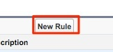
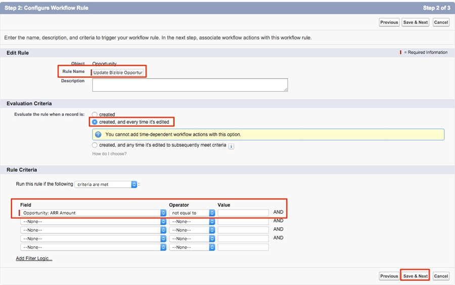

# Utilisation d’un champ de montant de recettes personnalisé {#using-a-custom-revenue-amount-field}

Par défaut, les points de contact d’attribution de l’acheteur extrairont le montant de l’opportunité de l’un des deux champs suivants :

* Montant (par défaut SFDC)
* [!DNL Marketo Measure] le montant de l’opportunité (personnalisé)

Si vous utilisez un champ de montant personnalisé sur vos opportunités, nous devrons configurer un workflow pour calculer le chiffre d’affaires Buyer Touchpoint. Cela nécessite des connaissances plus avancées en [!DNL Salesforce], donc il peut être nécessaire de faire appel à votre administrateur SFDC.

Pour commencer, nous aurons besoin des informations suivantes :

* Nom API de votre champ Montant

À partir de là, nous allons commencer à créer le workflow.

## Création du workflow dans Salesforce Lightning {#create-the-workflow-in-salesforce-lightning}

Les étapes suivantes s’adressent aux utilisateurs de Salesforce Lightning. Si vous utilisez toujours Salesforce Classic, ces étapes [sont répertoriées ci-dessous](#create-the-workflow-in-salesforce-classic).

1. Dans Configuration, saisissez « Flux » dans la zone Recherche rapide, puis sélectionnez **[!UICONTROL Flux]** pour démarrer le créateur de flux. Dans le panneau de droite, cliquez sur le bouton **[!UICONTROL Nouveau flux]**.

   

1. Sélectionnez **[!UICONTROL Flux déclenché par l’enregistrement]** et cliquez sur **[!UICONTROL Créer]** en bas à droite.

   

1. Dans la fenêtre Configurer le démarrage , sélectionnez l’objet Opportunité . Dans la section [!UICONTROL Configurer le déclencheur], sélectionnez **[!UICONTROL Un enregistrement est créé ou mis à jour]**.

   

1. Dans la section Définir des conditions de saisie, sous [!UICONTROL Conditions requises], sélectionnez **[!UICONTROL La logique de condition personnalisée est remplie]**.
   * Dans le champ de recherche, sélectionnez votre champ Montant personnalisé.
   * Définissez l’opérateur sur **Est nul** et la valeur sur **[!UICONTROL Faux]**.
   * Définissez les critères d’évaluation sur **[!UICONTROL Chaque fois qu’un enregistrement est mis à jour et répond aux exigences de condition]**.

   

1. Dans la section « Optimiser le flux pour », sélectionnez **[!UICONTROL Mises à jour rapides des champs]**. Cliquez sur **[!UICONTROL Terminé]** en bas à droite.

   

1. Pour ajouter l’élément, cliquez sur l’icône plus (+) et sélectionnez **[!UICONTROL Mettre à jour l’enregistrement de déclenchement]**.

   

1. Dans la fenêtre Nouvelle mise à jour des enregistrements , saisissez les informations suivantes :

   * Saisir un libellé : le nom de l’API est généré automatiquement
   * Sous « Comment trouver des enregistrements à mettre à jour et définir leurs valeurs », sélectionnez **[!UICONTROL Utiliser l’enregistrement de l’opportunité qui a déclenché le flux]**.
   * Dans la section « [!UICONTROL Définir des conditions de filtre] », sélectionnez **[!UICONTROL Toujours mettre à jour l’enregistrement]** comme condition obligatoire pour mettre à jour l’enregistrement.
   * Dans le champ « [!UICONTROL Définir les valeurs du champ pour l’enregistrement de campagne] », sélectionnez le montant de l’opportunité Marketo Measure (**bizible2__Bizible_Opportunity_Amount__c**) et la valeur de départ. Sélectionnez ensuite votre champ Montant personnalisé.
   * Cliquez sur **[!UICONTROL Terminé]**.

   

1. Cliquez sur **[!UICONTROL Enregistrer]**. Un pop-up s’affiche. Saisissez « Libellé de flux » dans la fenêtre Enregistrer le flux (le nom de l’API de flux sera généré automatiquement). Cliquez de nouveau sur **[!UICONTROL Enregistrer]**.

   

1. Cliquez sur le bouton **[!UICONTROL Activer]** pour activer le flux.

   

## Création du workflow dans Salesforce Classic {#create-the-workflow-in-salesforce-classic}

Les étapes suivantes s’adressent aux utilisateurs de Salesforce Classic. Si vous avez effectué le passage à Salesforce Lightning, ces étapes [sont disponibles ci-dessus](#create-the-workflow-in-salesforce-lightning).

1. Accédez à **[!UICONTROL Configuration]** > **[!UICONTROL Créer]** > **[!UICONTROL Workflow et approbations]** > **[!UICONTROL Règles de workflow]**.

   

1. Sélectionnez **[!UICONTROL Nouvelle règle]**, définissez l’objet comme « Opportunité » et cliquez sur **[!UICONTROL Suivant]**.

   

   

1. Configurez le workflow. Définissez le nom de la règle sur « Mettre à jour [!DNL Marketo Measure] montant de l’opportunité ». Définissez les critères d’évaluation sur « Créé », puis chaque fois qu’ils sont modifiés. Pour les Critères de la règle, sélectionnez votre champ Montant personnalisé, sélectionnez l’opérateur [!UICONTROL Différent de »] et laissez le champ « Valeur » vide.

   

1. Ajoutez une action de workflow. Définissez cette liste de sélection sur « [!UICONTROL Nouvelle mise à jour de champ] ».
   

1. Ici, vous allez remplir les informations de champ. Dans le champ « Nom », nous vous recommandons d’utiliser le nom suivant : « Montant de l’opportunité [!DNL Marketo Measure] ». Le « Nom unique » est automatiquement renseigné en fonction du champ « Nom ». Dans la liste de sélection « Champ à mettre à jour », sélectionnez « [!DNL Marketo Measure] le montant de l’opportunité ». Après avoir sélectionné le champ, sélectionnez la case « Réévaluer les règles de workflow après la modification du champ ». Dans la section « Spécifier une nouvelle valeur de champ », sélectionnez « Utiliser une formule pour définir la nouvelle valeur ». Dans la zone vide, déposez le nom d’API de votre champ Montant personnalisé. Cliquez sur **[!UICONTROL Enregistrer]**

   

1. Vous revenez alors à une page de cumul pour votre workflow. Assurez-vous d’avoir « Activé » et tout sera fin prêt. Pour activer, cliquez sur **[!UICONTROL Modifier]** en regard de votre nouveau workflow, puis cliquez sur **[!UICONTROL Activer]**.

   Une fois ces étapes terminées, les opportunités doivent être mises à jour afin de déclencher le workflow pour obtenir la nouvelle valeur du champ [!UICONTROL opportunité personnalisée].

   Pour ce faire, exécutez vos opportunités par le biais du chargeur de données dans SFDC. Pour plus d’informations sur l’utilisation du chargeur de données, consultez [cet article](/help/advanced-marketo-measure-features/custom-revenue-amount/using-data-loader-to-update-marketo-measure-custom-amount-field.md){target="_blank"}.

Pour toute question, n’hésitez pas à contacter l’équipe chargée de votre compte Adobe (votre gestionnaire de compte) ou l’[[!DNL Marketo] assistance](https://nation.marketo.com/t5/support/ct-p/Support){target="_blank"}.
