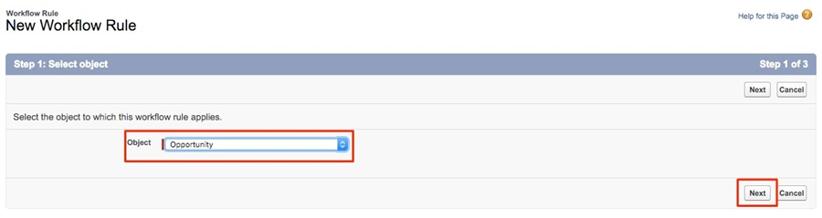
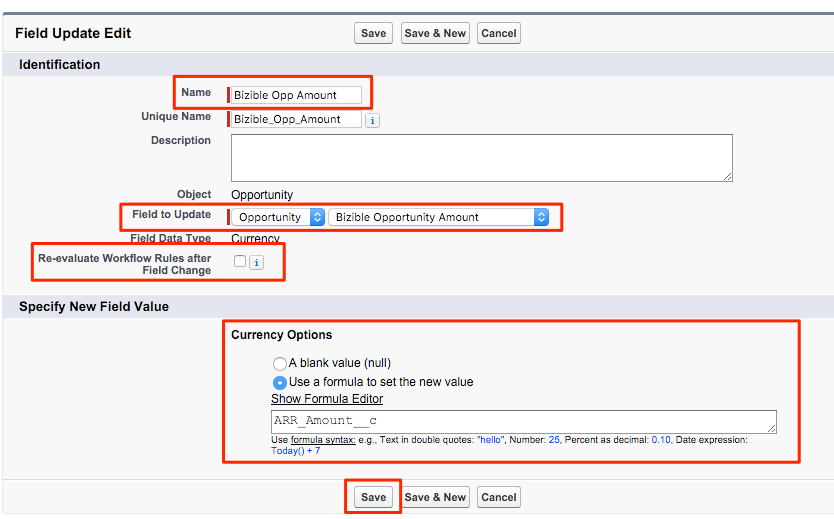

# Utilisation d’un champ de montant de recettes personnalisé {#using-a-custom-revenue-amount-field}

Par défaut, les points de contact d’attribution de l’acheteur extraient le montant de l’opportunité de l’un des deux champs suivants :

* Montant (par défaut SFDC)
* [!DNL Marketo Measure] Montant de l’opportunité (personnalisé)

Si vous utilisez un champ Montant personnalisé pour vos opportunités, nous devrons configurer un workflow pour calculer les recettes Buyer Touchpoint. Cette opération nécessite des connaissances plus avancées de [!DNL Salesforce]. Elle peut donc nécessiter l’aide de votre administrateur SFDC.

À partir de maintenant, nous aurons besoin des informations suivantes :

* Nom de l’API de votre champ Montant

A partir de là, nous allons commencer à créer le workflow.

## Création du workflow dans Salesforce Lightning {#create-the-workflow-in-salesforce-lightning}

Les étapes suivantes sont destinées aux utilisateurs de Salesforce Lightning. Si vous utilisez encore Salesforce Classic, ces étapes [ sont répertoriées ci-dessous](#create-the-workflow-in-salesforce-classic).

1. Dans Configuration, saisissez &quot;Flux&quot; dans la zone de recherche rapide, puis sélectionnez **[!UICONTROL Flux]** pour lancer le créateur de flux. Dans le panneau de droite, cliquez sur le bouton **[!UICONTROL Nouveau flux]** .

   

1. Sélectionnez **[!UICONTROL Flux déclenché par un enregistrement]** et cliquez sur **[!UICONTROL Créer]** en bas à droite.

   

1. Dans la fenêtre Configurer le démarrage, sélectionnez l’objet Opportunité . Dans la section [!UICONTROL Configurer le trigger] , sélectionnez **[!UICONTROL Un enregistrement est créé ou mis à jour]**.

   

1. Dans la section Définir les conditions d’entrée, sous [!UICONTROL Conditions requises], sélectionnez **[!UICONTROL La logique de condition personnalisée est remplie]**.
   * Dans le champ de recherche, sélectionnez votre champ Montant personnalisé.
   * Définissez l’opérateur sur **Is Null** et la valeur sur **[!UICONTROL False]**.
   * Définissez les critères d’évaluation sur **[!UICONTROL Chaque fois qu’un enregistrement est mis à jour et qu’il répond aux conditions requises]**.

   

1. Dans la section &quot;Optimiser le flux pour&quot;, sélectionnez **[!UICONTROL Fast Field Updates]**. Cliquez sur **[!UICONTROL Terminé]** en bas à droite.

   

1. Pour ajouter l’élément, cliquez sur l’icône plus (+) et sélectionnez **[!UICONTROL Mettre à jour l’enregistrement de déclenchement]**.

   

1. Dans la fenêtre New Update Records , saisissez ce qui suit :

   * Saisissez un libellé. Le nom de l’API sera généré automatiquement.
   * Sous &quot;Comment trouver des enregistrements à mettre à jour et définir leurs valeurs&quot;, sélectionnez **[!UICONTROL Utiliser l’enregistrement d’opportunité qui a déclenché le flux]**.
   * Dans la section &quot;[!UICONTROL Définir les conditions de filtrage]&quot;, sélectionnez **[!UICONTROL Toujours mettre à jour l’enregistrement]** comme condition requise pour mettre à jour l’enregistrement.
   * Dans &quot;[!UICONTROL Définir les valeurs de champ pour l’enregistrement de campagne]&quot;, dans le champ , sélectionnez le montant de l’opportunité Marketo Measure et la valeur . Sélectionnez ensuite le champ Montant personnalisé.
   * Cliquez sur **[!UICONTROL Terminé]**.

   

1. Cliquez sur **[!UICONTROL Enregistrer]**. Une fenêtre contextuelle s’affiche. Saisissez &quot;Libellé du flux&quot; dans la fenêtre Enregistrer le flux (le nom de l’API de flux sera généré automatiquement). Cliquez à nouveau sur **[!UICONTROL Enregistrer]**.

   

1. Cliquez sur le bouton **[!UICONTROL Activer]** pour activer le flux.

   

## Création du workflow dans Salesforce Classic {#create-the-workflow-in-salesforce-classic}

Les étapes suivantes sont destinées aux utilisateurs de Salesforce Classic. Si vous avez basculé vers Salesforce Lightning, ces étapes [ se trouvent au-dessus de ](#create-the-workflow-in-salesforce-lightning).

1. Accédez à **[!UICONTROL Configuration]** > **[!UICONTROL Créer]** > **[!UICONTROL Workflow et approbations]** > **[!UICONTROL Règles de workflow]**.

   

1. Sélectionnez **[!UICONTROL Nouvelle règle]**, définissez l’objet comme &quot;Opportunité&quot; et cliquez sur **[!UICONTROL Suivant]**.

   

   

1. Configurez le workflow. Définissez le nom de la règle sur &quot;Mettre à jour le montant de l’opportunité [!DNL Marketo Measure]&quot;. Définissez le critère d’évaluation sur &quot;Créé&quot; et chaque fois qu’il est modifié. Pour les critères de règle, sélectionnez votre champ Montant personnalisé et choisissez l’&#39;opérateur [!UICONTROL  comme &quot;Non égal à&quot;] et laissez le champ &quot;Valeur&quot; vide.

   

1. Ajoutez une action de workflow. Définissez cette liste de sélection sur &quot;[!UICONTROL Nouvelle mise à jour de champ]&quot;.
   

1. Vous y trouverez les informations sur les champs. Dans le champ &quot;Nom&quot;, nous vous recommandons d’utiliser ce nom : &quot;[!DNL Marketo Measure] Opp Amount&quot;. Le &quot;Nom unique&quot; est automatiquement renseigné à partir du champ &quot;Nom&quot;. Dans la liste de sélection &quot;Champ à mettre à jour&quot;, sélectionnez &quot;[!DNL Marketo Measure] Quantité d’opportunité&quot;. Après avoir sélectionné le champ, cochez la case &quot;Réévaluer les règles de workflow après modification du champ&quot;. Dans &quot;Spécifier la nouvelle valeur du champ&quot;, sélectionnez &quot;Utiliser une formule pour définir la nouvelle valeur&quot;. Dans la zone vide, déposez le nom de l’API de votre champ Montant personnalisé. Cliquez sur **[!UICONTROL Enregistrer]**.

   

1. vous serez ramené à une page de cumul pour votre workflow, assurez-vous d’&quot;activer&quot; et vous serez ravis d’y aller. Pour l’activer, cliquez sur **[!UICONTROL Modifier]** en regard de votre nouveau workflow, puis cliquez sur **[!UICONTROL Activer]**.

   Une fois ces étapes terminées, les opportunités doivent être mises à jour afin de déclencher le workflow pour que la nouvelle valeur du champ [!UICONTROL opportunité personnalisée] soit trouvée.

   Pour ce faire, exécutez vos opportunités via Data Loader dans SFDC. Découvrez comment utiliser Data Loader dans [cet article](/help/advanced-marketo-measure-features/custom-revenue-amount/using-data-loader-to-update-marketo-measure-custom-amount-field.md).

Si vous avez des questions, n’hésitez pas à contacter l’équipe du compte d’Adobe (votre gestionnaire de compte) ou l’[[!DNL Marketo] assistance](https://nation.marketo.com/t5/support/ct-p/Support){target="_blank"}.
