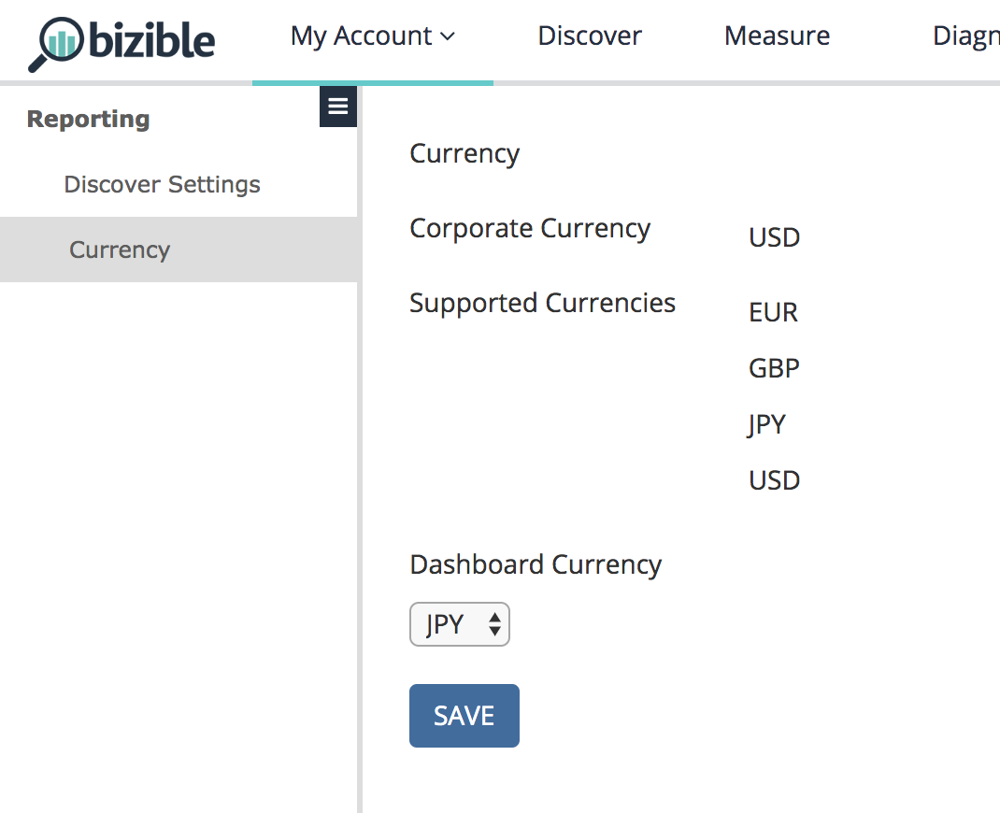

# Paramètres {#settings}

Deux bits de fonctionnalité distincts sont liés à cette fonctionnalité et se trouvent dans l’onglet [!UICONTROL Paramètres généraux] du CRM : Devises multiples et Devises avancées.

**Devises multiples** : activé si le client utilise plusieurs devises.

**Devises avancées** : bit supplémentaire qui doit être activé si le client utilise la fonction de « gestion avancée des devises » de Salesforce, dans laquelle l’utilisateur peut définir une plage temporelle de taux de conversion.

Sous votre [!UICONTROL Paramètres utilisateur] dans l&#39;application [!DNL Marketo Measure], nous afficherons la devise de l&#39;entreprise et toutes les devises prises en charge extraites du CRM. Comme ces valeurs sont toutes extraites du CRM, ces champs sont en lecture seule et ne peuvent pas être modifiés. La devise du tableau de bord est votre devise par défaut pour chaque chargement de tableau de bord. Vous pouvez revenir et modifier la devise selon vos besoins.

