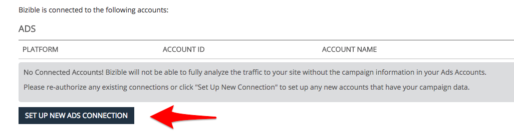

# Plateformes publicitaires intégrées {#integrated-ad-platforms}

[!DNL Marketo Measure] dispose de connexions d’API avec Google AdWords, Microsoft BingAds, [!DNL Facebook] Ads et DoubleClick Campaign Manager. Grâce à ces connexions d’API, [!DNL Marketo Measure] peut facilement extraire des données et les transmettre à votre CRM avec l’application cliente externe. Aucun chargement manuel des coûts ou des données n’est nécessaire. Vos comptes doivent simplement être connectés et autorisés à l’application [!DNL Marketo Measure]. [!DNL Marketo Measure] téléchargera alors automatiquement vos coûts de marketing sur les plateformes et les chargera dans l&#39;application [!DNL Marketo Measure]. Si vous choisissez d’activer le balisage automatique pour les publicités AdWords, BingAds ou [!DNL Facebook], [!DNL Marketo Measure] ajoutez automatiquement ses paramètres aux URL de vos publicités.

## Comment connecter des plateformes publicitaires {#how-to-connect-ad-platforms}

Avant d’entrer dans les détails de chaque plateforme, nous allons passer en revue la connexion de l’un de ces comptes à [!DNL Marketo Measure]. Connectez-vous d’abord à l’application [!DNL Marketo Measure] et accédez à l’option **[!UICONTROL Paramètres]** sous l’onglet **[!UICONTROL Mon compte]** en haut à gauche de l’écran. Sélectionnez ensuite **[!UICONTROL Connexions]** sous la section **[!UICONTROL Intégrations]** sur la gauche.

Comme illustré dans l’image ci-dessous, un bouton s’affiche pour configurer de nouvelles connexions publicitaires.

Après avoir cliqué sur le bouton [!UICONTROL Configurer une nouvelle connexion publicitaire], une fenêtre (illustrée ci-dessous) s’affiche avec quatre types d’[!UICONTROL &#x200B; publicitairesconnect]ion. Cliquez sur Connexion et une autre fenêtre s’affiche pour demander les informations d’identification. Saisissez les informations d’identification et cliquez sur [!UICONTROL autoriser] pour connecter le compte à [!DNL Marketo Measure].

## Google AdWords {#google-adwords}

Lorsque vous créez vos annonces dans [!DNL Google AdWords], nous vous recommandons de baliser vos campagnes de l’une des trois façons suivantes : en procédant au balisage manuel, au balisage automatique ou en créant un modèle de suivi. Pour baliser manuellement votre URL AdWords, vous devez définir et ajouter les paramètres à la fin des URL des annonces. Le balisage manuel permet à toute plateforme non Google de lire facilement les données collectées par les paramètres.

Le modèle de suivi est un outil fourni par Google pour ajouter ce qu’il appelle des paramètres ValueTrack. Ils fonctionnent de la même manière que les UTM et les autres paramètres de balisage.

## Ce qui se passe lorsque le balisage automatique est activé {#what-happens-when-auto-tagging-is-enabled}

[!DNL Marketo Measure] recherche des modèles de suivi dans votre compte [!DNL AdWords] :

* *Option A* : modèle de tracking trouvé. [!DNL Marketo Measure] ajoute ses paramètres au modèle.
* *Option B* : redirection tierce trouvée. Si une redirection tierce est trouvée dans le modèle de suivi, [!DNL Marketo Measure] ne pouvez effectuer aucune action. Vous devrez ajouter manuellement les balises [!DNL Marketo Measure] au système tiers. Un exemple de redirection tierce serait un outil de gestion des soumissions comme Kenshoo ou Marin. En savoir plus sur l&#39;impact des [&#x200B; outils de gestion des enchères  [!DNL Marketo Measure]](/help/api-connections/utilizing-marketo-measures-api-connections/how-bid-management-tools-affect-marketo-measure.md){target="_blank"}.

* *Option C* : aucun modèle de suivi n&#39;a été trouvé. [!DNL Marketo Measure] analysera toutes vos URL de destination publicitaire pour les paramètres [!DNL Marketo Measure]. Selon l’analyse, si :
   * Paramètres trouvés : la configuration est terminée.
   * Paramètres introuvables : [!DNL Marketo Measure] ajoutera ses paramètres à la fin des URL de destination publicitaire. [!DNL Marketo Measure] ajoute de nouvelles annonces dans les deux heures suivant leur création. Gardez à l’esprit que les paramètres ne seront pas ajoutés à un modèle.

En savoir plus sur notre [[!DNL AdWords]  fonctionnalité de balisage automatique &#x200B;](/help/api-connections/utilizing-marketo-measures-api-connections/understanding-marketo-measure-adwords-tagging.md){target="_blank"}.

## Activation du balisage automatique [!DNL Marketo Measure] pour Adwords {#how-to-enable-marketo-measure-auto-tagging-for-adwords}

Avant d’activer [!DNL Marketo Measure] balisage automatique, **assurez-vous qu’un modèle de suivi est activé au niveau du compte, de la campagne ou du groupe publicitaire dans votre compte Adwords. Cela est nécessaire pour tout compte Adwords dont [!DNL Marketo Measure] balisage automatique sera activé.** L’activation d’un modèle de tracking empêche toute perte dans les données de l’historique des performances publicitaires. Notez que l’activation des modèles de suivi au niveau du mot-clé, du lien du site ou de l’annonce publicitaire entraîne le passage par le processus de révision et d’approbation de l’annonce et peut potentiellement redémarrer l’historique des performances de vos annonces. Si aucun modèle de tracking n’est activé, [!DNL Marketo Measure] ajouterez directement les paramètres de tracking [!DNL Marketo Measure] à l’« URL finale » de la publicité, ce qui peut également entraîner la perte des données d’historique des publicités.

Une fois que vous avez mis en place un modèle de suivi, suivez les instructions ci-dessous pour activer le balisage automatique des [!DNL Marketo Measure]. Remarque : [!DNL Marketo Measure] balisera automatiquement toutes les publicités en pause dans votre compte.

1. Connectez-vous à votre compte [!DNL Marketo Measure] sur [experience.adobe.com/marketo-measure](https://experience.adobe.com/marketo-measure){target="_blank"}.

1. Accédez à [!UICONTROL Mon compte] > [!UICONTROL Paramètres] > [!UICONTROL Intégrations] > [!UICONTROL Connexions].

   

1. Cliquez sur l’icône en forme de crayon en regard du compte Adwords pour lequel [!DNL Marketo Measure] balisage automatique sera activé.

   

1. Dans le coin supérieur droit, basculez le bouton (bascule) du **[!UICONTROL Balisage automatique]** sur **[!UICONTROL Oui]**. Au bas de la page, cliquez sur **[!UICONTROL En savoir plus]** pour développer la zone de texte, puis cliquez sur **[!UICONTROL Enregistrer]**. La configuration du balisage automatique est terminée.

   

## Comment configurer un modèle de suivi dans AdWords avec des paramètres [!DNL Marketo Measure] {#how-to-set-up-a-tracking-template-in-adwords-with-marketo-measure-parameters}

Gardez à l’esprit que vous devez ajouter des modèles de suivi au niveau [!UICONTROL Compte], [!UICONTROL Campagne] ou Groupe publicitaire dans AdWords. Si vous ajoutez des modèles de suivi au niveau Mot-clé, Lien de site ou Annonce, votre annonce devra passer par le processus de révision et d’approbation et vous risquez de redémarrer l’historique des performances de vos annonces. En savoir plus sur la [création de modèles de tracking](https://support.google.com/adwords/answer/6076199?hl=en#tracking){target="_blank"}.

1. Connectez-vous à votre compte [!DNL Google AdWords].
1. Accédez à la vue [!UICONTROL &#x200B; Campagnes &#x200B;] à partir de la barre de navigation de gauche
1. Accédez à « [!UICONTROL &#x200B; Paramètres &#x200B;] », également dans la barre de navigation de gauche
1. Activez la vue « [!UICONTROL Paramètres du compte] » en haut
1. Développez la section « [!UICONTROL &#x200B; Tracking &#x200B;]
1. Collez l’une des chaînes de texte suivantes dans le modèle de suivi pour définir la valeur du modèle :

   * Si TOUTES vos URL comportent des points d’interrogation, utilisez le texte d’URL suivant :

   `{lpurl}&_bt={creative}&_bk={keyword}&_bm={matchtype}&_bn={network}&_bg={adgroupid}`

   * Si aucun de vos URL ne comporte de point d’interrogation, ajoutez le texte d’URL suivant :

   `{lpurl}?_bt={creative}&_bk={keyword}&_bm={matchtype}&_bn={network}&_bg={adgroupid}*`

   Pour éviter que des erreurs ne se produisent lorsque vous balisez manuellement vos URL, il est généralement recommandé de générer automatiquement les paramètres UTM. Cela ne signifie pas nécessairement un balisage automatique avec des paramètres AdWords ou [!DNL Marketo Measure]. Plusieurs outils simplifient le processus en générant automatiquement les paramètres de l’URL en fonction des informations que vous fournissez.

   >[!TIP]
   >
   >Si vous obtenez une erreur indiquant que le modèle de suivi n’est pas valide, essayez d’effacer le cache de votre navigateur et réessayez. Le problème est souvent résolu.

## Génération automatique de balises UTM pour [!DNL Google AdWords] {#how-to-automatically-generate-utm-tags-for-google-adwords}

Les balises UTM peuvent sembler difficiles à créer au début, mais il existe de nombreux outils disponibles pour créer facilement des URL avec des paramètres UTM. Vous pouvez utiliser l’une des ressources suivantes ou rechercher d’autres outils sur le web. Gardez à l&#39;esprit que [!DNL Marketo Measure] n&#39;endosse ni ne garantit quoi que ce soit avec ces plateformes et outils.

**[!DNL Google URL]Builder**

Le créateur d’URL de Google est un outil standard permettant de créer des URL correctement formatées à l’aide de balises UTM. Saisissez l’URL et la valeur souhaitée de chaque paramètre, puis cliquez sur « [!UICONTROL &#x200B; Générer l’URL &#x200B;] ». Il s’agit d’un outil idéal à utiliser si vous ne disposez que d’une poignée d’URL à baliser. Accédez à l’outil [ici](https://support.google.com/analytics/answer/1033867?hl=fr){target="_blank"}.

**Feuille de calcul Google générée par EpikOne**

Cette feuille de calcul comporte une formule qui génère automatiquement des URL de destination balisées. Il s’agit d’un excellent outil à utiliser si un grand nombre de liens doivent être balisés. Accédez à la feuille [ici](https://spreadsheets.google.com/ccc?key=p7c_HKcmspSUfEYSO0gskKw&hl=en){target="_blank"}.

**Outil de balisage de liens Rafflecopter**

La feuille de calcul créée par Rafflecopter est une version modifiée de [!DNL EpikOne's] feuille de calcul. Il contient également une formule qui génère automatiquement des liens de destination balisés que vous pouvez utiliser.

Chacun de ces outils contient des instructions détaillées sur la manière de l’utiliser et de le modifier en fonction de vos besoins. L’outil est disponible [ici](https://docs.google.com/spreadsheets/d/1QCIr1WUJQHE68cA4VTks2XE7nxuryaUymCEy_23-Oew/edit#gid=0){target="_blank"}.

**Effin Amazing UTM Builder**

Cet outil est une extension de Chrome qui vous permet de générer rapidement des balises UTM. Trouve-le [ici](https://chrome.google.com/webstore/detail/effin-amazing-utm-builder/eoaapiimcaimddnfhfnifgkinmpcbccp?hl=en){target="_blank"}.

## Publicités Bing {#bing-ads}

Bing Ads est une plateforme intégrée qui vous permet d’activer le balisage automatique des URL ou d’utiliser un outil tiers, tel que [!DNL Marketo Measure], pour baliser les annonces. [!DNL Bing Ads] repose également sur les paramètres UTM.

Notre intégration prend en charge les types d’annonces suivants :

* Annonce textuelle
* Annonce publicitaire mobile
* Annonce texte développée

La fonction de balisage automatique des publicités Bing ajoute les paramètres UTM suivants :

* Utm_source
* Utm_medium
* Utm_term

Le balisage automatique des publicités Bing ajoute également le paramètre personnalisé suivant :

`_bt={adid}`

La chaîne se présenterait comme suit :

`{lpurl}?_bt={adid}&utm_term={keyword}&utm_source=Bing_Yahoo&utm_medium=CPC`

Il est important de noter que [!DNL Bing Ads] vous permet d’ajouter encore plus de paramètres en utilisant leurs balises personnalisées dans vos URL finales pour obtenir plus de granularité, si vous le souhaitez.

Un modèle de tracking peut être utilisé si nécessaire, mais il n’est pas nécessaire que [!DNL Bing Ads] et [!DNL Marketo Measure] s’intègrent. En effet, [!DNL Bing] permet de modifier les publicités sans modifier l’historique, [!DNL Marketo Measure] est donc en mesure de mettre à jour l’URL de destination.

Le balisage automatique doit être activé via [!DNL Marketo Measure] afin que les paramètres de [!DNL Marketo Measure] personnalisés puissent être automatiquement ajoutés. Il n’y a aucun risque de perdre l’historique des performances publicitaires avec les publicités Bing.

Consultez le site web [[!DNL Bing Ads]](https://advertise.bingads.microsoft.com/en-us/blog/post/august-2016/upgraded-urls-now-available-in-bing-ads-an-easier-way-to-manage-your-tracking-urls){target="_blank"} pour plus d’informations sur l’ajout de balises sur leur plateforme.

## Publicités Facebook {#facebook-ads}

L’intégration d’[!DNL Marketo Measure] à [!DNL Facebook] lui permet de télécharger automatiquement les informations de l’annonce publicitaire et de baliser l’URL avec ses paramètres. [!DNL Marketo Measure] extraira les informations sur la campagne et la visionneuse d’annonces par le biais de notre balisage automatique. La visionneuse d’annonces renseigne le champ Nom du groupe publicitaire . Pour plus d’informations sur la configuration des balises d’URL sur la plateforme [!DNL Facebook], consultez la page [!DNL Facebook] [entreprise](https://www.facebook.com/business/help/1016122818401732/?ref=u2u){target="_blank"}.

Avant d’activer le balisage automatique avec [!DNL Facebook Ads], il est important d’exporter l’historique des performances précédent au format CSV. À ce stade, lorsque [!DNL Marketo Measure] balises [!DNL Facebook Ads] avec son paramètre _bf, [!DNL Facebook] lit les annonces comme étant toutes nouvelles et efface l’historique des performances. Par conséquent, il est important d’exporter un enregistrement des performances précédentes si cela présente une valeur pour vous et votre organisation.

Notez que vous pouvez connecter votre compte [!DNL Facebook] à tout moment à l’application [!DNL Marketo Measure] et aucune donnée ne sera perdue. Ce n’est que lorsque le balisage automatique est activé que l’historique des performances est effacé.

Voir [cet article](https://www.facebook.com/business/help/393890194130036){target="_blank"} de Facebook pour plus d’informations sur l’exportation de rapports sur les publicités [!DNL Facebook].

## Contenu sponsorisé par LinkedIn {#linkedin-sponsored-content}

L’intégration LinkedIn [!DNL Marketo Measure] permet de baliser les URL de destination sur [!DNL LinkedIn] contenu sponsorisé, ce qui [!DNL Marketo Measure] permet finalement de suivre un utilisateur à travers l’ensemble de son parcours de points de contact et de mapper l’activité à [!DNL LinkedIn] Campaign et Creative spécifiques. Cela permet aux clients d’obtenir des informations sur le retour sur investissement de leur activité [!DNL LinkedIn]. [!DNL Marketo Measure] recherchera des contenus publicitaires avec un Partage de [!DNL LinkedIn] unique et ajoutera un paramètre de `?_bl={creativeId}` à la fin.

Comme les partages [!DNL LinkedIn] peuvent être utilisés dans plusieurs campagnes et contenus publicitaires, nous vous demandons de ne pas copier/cloner/dupliquer des contenus publicitaires existants afin qu’ils restent uniques. Si des partages sont détectés et ne sont utilisés que sur un seul Creative, [!DNL Marketo Measure] pouvez les baliser tels quels sans avoir à recréer de contenu publicitaire ou de partages et l’historique de toutes les publicités (impressions, clics, partages) restera.

Dès qu’un partage est partagé entre plusieurs contenus publicitaires, [!DNL Marketo Measure] devez effectuer un processus de mise en pause, de copie et de rebalisage pour créer un ensemble unique. [!DNL Marketo Measure] interrompra et archivera les contenus publicitaires en direct, ce qui signifie que les contenus publicitaires contenant les impressions, les clics et les partages sur les réseaux sociaux seront également archivés.

## Plateformes non intégrées {#non-integrated-platforms}

Pour les plateformes qui ne sont pas intégrées à [!DNL Marketo Measure], la fonctionnalité de balisage automatique [!DNL Marketo Measure] ne peut pas être utilisée. Les paramètres devront être ajoutés manuellement.
