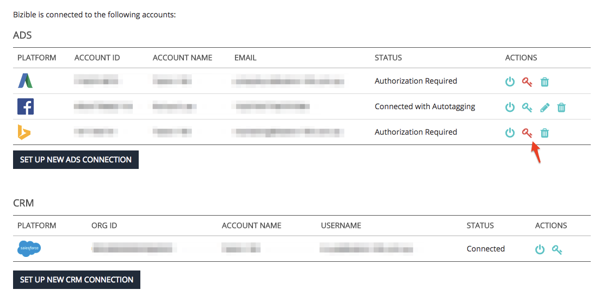

# Réautorisation de comptes connectés {#reauthorizing-connected-accounts}

Lorsqu’un compte est déconnecté de votre compte [!DNL Marketo Measure], l’état de la plateforme passe à &quot;Autorisation requise&quot; et affiche une icône de clé rouge.

Si votre plateforme d’annonces publicitaires n’est plus connectée, [!DNL Marketo Measure] ne pourra pas télécharger de données de coût ou, si le balisage automatique est activé, ajouter les paramètres de l’UTM [!DNL Marketo Measure] aux annonces nouvellement créées. [!DNL Marketo Measure] ne pourra pas ajouter rétroactivement les paramètres UTM aux points de contact créés à partir de la plateforme publicitaire tant que le compte n’a pas été déconnecté.

Si votre plateforme CRM est déconnectée, [!DNL Marketo Measure] ne pourra pas mettre à jour les données [!DNL Marketo Measure] ni envoyer de nouveaux points de contact dans votre organisation. Une fois la connexion CRM rétablie, [!DNL Marketo Measure] envoie toutes les données qui ont été manquées pendant la déconnexion du compte.

## Réautorisation de comptes déconnectés {#re-authorizing-disconnected-accounts}

1. Accédez à [experience.adobe.com/marketo-measure](https://experience.adobe.com/marketo-measure){target="_blank"} et connectez-vous.
1. Sélectionnez **[!UICONTROL Paramètres]** sous l’onglet [!UICONTROL Mon compte] dans le coin supérieur gauche.
1. Recherchez la section Intégrations à gauche et cliquez sur **[!UICONTROL Connexions]**.
1. Sélectionnez le symbole Clé rouge en regard du compte qui doit être reconnecté.
1. Une fenêtre contextuelle s’affiche, vous invitant à fournir les détails de connexion du compte.
