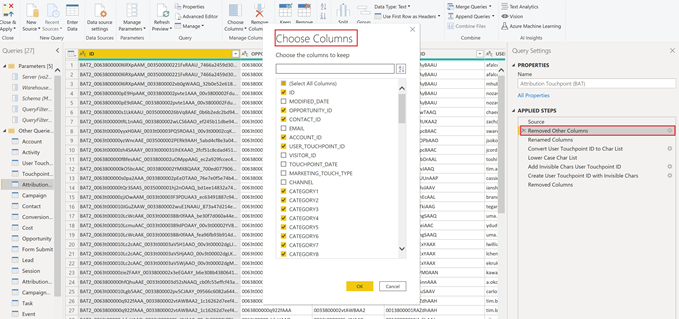
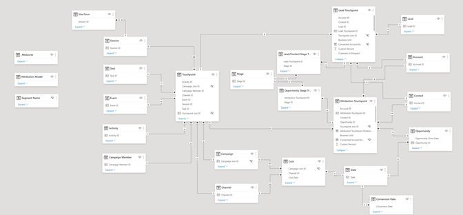

# Modèle de rapport [!DNL Marketo Measure] - Power BI {#marketo-measure-report-template-power-bi}

## Prise en main {#getting-started}

Vous pouvez accéder au modèle de rapport Power BI [ici](https://github.com/adobe/Marketo-Measure-BI-Templates){target="_blank"}.

Ouvrez le fichier Power BI de modèle de création de rapports [!DNL Marketo Measure] Adobe.

Vous trouverez vos informations spécifiques sur le serveur, l’entrepôt de données et le schéma dans l’interface utilisateur [!DNL Marketo Measure] sur la page d’informations [!DNL Data Warehouse]. Les instructions pour localiser cette page sont détaillées [ici](/help/marketo-measure-data-warehouse/data-warehouse-access-reader-account.md){target="_blank"}.

Les paramètres QueryFilterStartDate et QueryFilterEndDate permettent de limiter la quantité de données importées. Ces paramètres doivent être au format SQL comme ils sont utilisés dans les requêtes envoyées à [!DNL Snowflake]. Par exemple, si vous souhaitez limiter les données aux deux dernières années, QueryFilterStartDate sera `dateadd` (year,-2,current_date()). Ces paramètres sont comparés aux types de données datetime. Il est donc recommandé d’utiliser `dateadd` (day,1,current_date()) pour que QueryFilterEndDate renvoie toutes les données à la date actuelle.

## Connexion des données {#data-connection}

Les paramètres saisis lors de l’ouverture du fichier sont utilisés pour structurer les requêtes natives qui importent des tableaux à partir de l’entrepôt de données. Vous devrez toujours configurer une connexion de données à votre instance [!DNL Snowflake]. Pour ce faire, vous aurez besoin des mêmes noms de serveur et d’entrepôt, ainsi que de vos nom d’utilisateur ou d’utilisatrice et mot de passe. En cas de besoin, vous trouverez [ici](/help/marketo-measure-data-warehouse/data-warehouse-access-reader-account.md){target="_blank"} comment accéder à votre nom d’utilisateur et réinitialiser votre mot de passe.

## Import de données {#data-import}

Afin d’améliorer les performances des rapports et de tirer parti des fonctionnalités de transformation de Power Query, configurez ce modèle à l’aide de la méthode de stockage d’import.

### Paramètres de requête {#query-parameters}

Pour limiter les données importées dans le modèle, chaque tableau est configuré en utilisant une requête native comme source. Les requêtes natives doivent être approuvées pour être exécutées. Vous devrez cliquer sur Exécuter pour chaque requête. Cette étape n’est nécessaire que lors de la première exécution des requêtes ou si les paramètres changent.

Toutes les requêtes filtrent les lignes supprimées et les tableaux de [!UICONTROL faits] sont définies pour filtrer les lignes avec une date de modification entre les dates de début et de fin renseignées en tant que paramètres.

>[!NOTE]
>
>Les filtres de date étant appliqués à la date de modification d’une ligne, procédez avec prudence lorsque vous créez des rapports sur des dates qui se situent en dehors de la période limitée. Par exemple, la période modifiée est limitée aux deux dernières années. Cela peut inclure un événement avec une date d’événement d’il y a trois ans, mais qui a été modifié récemment. Toutefois, les rapports sur les événements d’il y a trois ans renverront des résultats incomplets, car toutes les lignes n’auront pas été modifiées au cours de la période de deux ans.

Les tableaux suivants sont traités comme des tableaux de faits; les limites de date à la date de modification ont été ajoutées à ces requêtes.

* Activité
* Point de contact
* Point de contact de prospect
* Point de contact d’attribution
* Coût
* Formulaire de site
* Session
* Personne membre de la campagne
* Tâche
* Événement
* Transitions de l’étape de prospect/contact
* Transition de l’étape d’opportunité

Les tableaux suivants sont traités comme des tableaux de dimension ; aucune limite de date n’est définie pour ces requêtes.

* Compte
* Campagne
* Contact
* Taux de conversion
* Opportunité
* Prospect
* Étape
* Canal

## Transformations des données {#data-transformations}

Quelques transformations ont été appliquées aux données dans Power Query. Pour afficher les transformations spécifiques d’un tableau, ouvrez Power Query, accédez à un tableau, puis notez les étapes appliquées sur le côté gauche de la fenêtre. Certaines des transformations spécifiques sont décrites ci-dessous.

### Colonnes supprimées {#removed-columns}

Pour simplifier le modèle de données et supprimer les données redondantes et inutiles, nous avons réduit le nombre de colonnes importées dans Power BI depuis le tableau [!DNL Snowflake] d’origine. Les colonnes supprimées comprennent les clés étrangères inutiles, les données dimensionnelles dénormalisées mieux exploitées par le biais de relations avec d’autres tableaux dans le modèle, les colonnes d’audit et les champs utilisés pour les traitements [!DNL Marketo Measure] internes. Vous pouvez ajouter ou supprimer des colonnes en fonction des besoins de votre entreprise. Accédez à l’étape « Autres colonnes supprimées » après l’étape « Source » dans n’importe quel tableau, cliquez sur l’icône en forme d’engrenage, puis mettez à jour les colonnes sélectionnées dans la liste fournie.

>[!NOTE]
>
>* Procédez avec prudence lorsque vous ajoutez des valeurs de clé étrangère supplémentaires. Power BI est souvent configuré pour détecter automatiquement les relations dans le modèle et l’ajout de valeurs de clé étrangère peut entraîner des liens indésirables entre les tableaux et/ou désactiver les relations existantes.
>
>* La plupart des tableaux de l’entrepôt de données [!DNL Marketo Measure] contient des données dimensionnelles dénormalisées. Nous avons fait de notre mieux pour normaliser et nettoyer le modèle dans Power BI afin d’améliorer les performances et la précision des données. Faites preuve de prudence lorsque vous incluez des champs dénormalisés supplémentaires dans les tableaux de faits, cela peut rompre le filtrage dimensionnel dans les tableaux et générer des rapports inexacts.

### Colonnes renommées {#renamed-columns}

Les tableaux et les colonnes ont été renommés afin de les rendre plus conviviaux et de normaliser les conventions de nommage. Pour afficher les modifications apportées au nom de la colonne, accédez à l’étape « Colonnes renommées » après l’étape « Autres colonnes supprimées » d’un tableau.

### Segments renommés {#renamed-segments}

Les noms de segments pouvant être personnalisés, ils comportent des noms de colonne génériques dans l’entrepôt de données Snowflake. [!DNL BIZ_SEGMENT_NAMES] est un tableau de mappage qui répertorie le nom du segment générique et le nom de segment personnalisé auquel il est mappé, défini dans la section de segment de l’interface utilisateur [!DNL Marketo Measure]. Le tableau Nom de segment est utilisé pour renommer les colonnes de segments dans les tableaux Point de contact de prospect et Point de contact d’attribution. S’il n’existe aucun segment personnalisé, le nom du segment générique est conservé.

### Conversion d’ID sensible à la casse {#case-sensitive-id-conversion}

Les données [!DNL Marketo Measure] comportent deux tableaux où les valeurs (ID) de clé primaire sont sensibles à la casse, à savoir Point de contact et Campagne. Le moteur de données qui génère la couche de modélisation de Power BI n’est pas sensible à la casse, ce qui entraîne des valeurs d’ID « en double ». Pour préserver la sensibilité à la casse de ces valeurs clés, nous avons mis en œuvre des étapes de transformation qui associent des caractères invisibles aux caractères en minuscules, tout en préservant l’unicité de l’ID lors de l’évaluation dans la couche du moteur de données. Vous trouverez plus de détails sur le problème et les étapes détaillées sur la méthode que nous avons utilisée [ici] (https://blog.crossjoin.co.uk/2019
/10/06/power-bi-and-case-sensitivity/){target="_blank"}. Ces valeurs d’ID sensibles à la casse sont étiquetées « ID d’abonnement » et utilisées comme clés d’abonnement dans la couche de relation. Nous avons masqué les ID de jointure dans la couche de création de rapports, en conservant les valeurs d’ID d’origine visibles pour une utilisation dans la création de rapports, puisque les caractères invisibles peuvent interférer avec les fonctions de couper
/coller et le filtrage.

### Lignes ajoutées {#rows-added}

Pour ajouter des fonctionnalités de conversion de devise aux calculs dans le modèle, nous avons ajouté une colonne de taux de conversion d’entreprise aux tableaux Opportunité et Coût. La valeur de cette colonne est ajoutée au niveau de la ligne et évaluée en se joignant au tableau Taux de conversion à la date et à l’ID de devise. Pour plus d’informations sur le fonctionnement de la conversion de devises dans ce modèle, consultez la section [Conversion de devises](#currency-conversion) dans cette documentation.

Le tableau Taux de conversion stocké dans [!DNL Snowflake] contient une période pour chaque conversion. Power BI n’autorise pas les critères d’abonnement sur un calcul (c’est-à-dire dans une période). Pour les jointures sur la date, nous avons ajouté des étapes au tableau Taux de conversion afin de développer les lignes et ainsi qu’il y ait une ligne pour chaque date de la période de conversion.

## Modèle de données {#data-model}

Cliquez sur l’image ci-dessous pour afficher la version agrandie.

{target="_blank"}

### Relations et flux de données {#relationships-and-data-flow}

Les données d’événement, utilisées pour créer des points de contact, sont stockées dans les tableaux [!UICONTROL Session], [!UICONTROL Tâche], [!UICONTROL Événement], [!UICONTROL Activité] et Membres de la campagne. Ces tableeaux d’événements se joignent au tableau Point de contact par l’intermédiaire de leurs identifiants respectifs. Si l’événement a entraîné un point de contact, les détails sont stockés dans le tableau Point de contact.

Les points de contact de prospect et d’attribution sont stockés dans leurs propres tableaux, avec un lien vers le tableau Point de contact. La plupart des données dimensionnelles des points de contact de prospect et d’attribution proviennent de leur lien vers le point de contact correspondant.

Dans ce modèle, les dimensions Campagne et Canal sont liées au point de contact. Par conséquent, tous les rapports sur ces dimensions sont générés par ce lien, ce qui signifie que les rapports dimensionnels sur les données d’événement peuvent être incomplets. En effet, de nombreux événements ne comportent de liens vers ces dimensions qu’après leur traitement dans les points de contact. Remarque : certains événements, tels que les sessions, comportent des liens directs vers les dimensions Campagne et Canal. Si vous souhaitez créer des rapports au niveau de la session sur ces dimensions, il est recommandé de créer un modèle de données distinct.

Les données de coût sont stockées à différents niveaux d’agrégation dans le tableau Coût de l’entrepôt de données [!DNL Snowflake]. Pour tous les fournisseurs d’annonces publicitaires, les données au niveau de la campagne peuvent être cumulées au niveau du canal. Ce modèle extrait ainsi les données de coût en fonction de l’indicateur « campaign_is_aggregatable_cost ». Les coûts auto-déclarés peuvent être envoyés au niveau du canal uniquement et ne sont pas nécessaires pour disposer de données Campagne. Pour fournir un rapport de coûts le plus précis possible, les coûts auto-déclarés sont extraits en fonction de l’indicateur « channel_is_aggregatable_cost ». La requête qui importe les données de coût est écrite avec la logique suivante : si ad_provider = &quot;SelfReported&quot; alors channel_is_aggregatable_cost = true, sinon campaign_is_aggregatable_cost = true.

Les données Coût et les données Point de contact ont des dimensions communes. Par conséquent, les deux tableaux de faits ont des relations avec les tableaux de dimension Campagne et Canal.

Dans le contexte de ce modèle, les données [!UICONTROL Prospect], [!UICONTROL Contact], [!UICONTROL Compte], et [!UICONTROL Opportunité] sont considérées comme des données dimensionnelles et sont jointes directement au tableau de point de contact [!UICONTROL Prospect] et au tableau de point de contact [!UICONTROL Attribution].

### Tableaux ajoutés {#added-tables}

**Date**

Dans la mesure où Power BI autorise uniquement les relations entre les tableaux sur une colonne, un tableau de dimension Date a été ajouté afin de faciliter la jointure nécessaire entre les tableaux contenant les montants (Opportunité et Coût) et le tableau Taux de conversion. Pour plus d’informations sur le mode de calcul des conversions de devises dans ce modèle, reportez-vous à la section Conversion de devise.

**Mesures**

Toutes les mesures ont été ajoutées au tableau Mesures. Il n’est pas connecté au modèle, mais sert d’emplacement unique pour stocker toutes les mesures, pour en faciliter l’utilisation.

**Modèle d’attribution**

Un tableau distinct a été ajouté pour stocker les noms des modèles d’attribution. Ce tableau sert à créer des filtres qui permettent à l’utilisateur ou l’utilisatrice de basculer entre les modèles d’attribution pour le calcul du revenu attribué.

### Conversion de devise {#currency-conversion}

Les taux dans le tableau Taux de conversion représentent la valeur nécessaire pour convertir un montant à partir de la devise de l’entreprise. Les conversions vers n’importe quelle devise nécessitent une double conversion, d’abord de la devise d’origine vers la devise de l’entreprise, puis de la devise de l’entreprise vers la devise sélectionnée. La première étape de cette chaîne dans le modèle consiste à ajouter une colonne avec le taux de conversion de l’entreprise aux tableaux avec les montants, Opportunité et Coût. Ces étapes sont détaillées dans l’en-tête Lignes ajoutées de la section Transformations de données de ce document. La conversion de la devise d’origine vers la devise de l’entreprise consiste à diviser la valeur par cette colonne ajoutée. L’étape suivante consiste à multiplier la valeur de la devise de l’entreprise par le taux dans le tableau Taux de conversion, qui correspond à la devise sélectionnée.

* Convertir la valeur d’origine en valeur de devise de l’entreprise/taux de conversion de l’entreprise = valeur en devise de l’entreprise
* Convertir la valeur de la devise de l’entreprise en valeur de devise sélectionnée dans la devise de l’entreprise `*` taux de conversion de la devise sélectionnée = valeur dans la devise sélectionnée

Étant donné que les taux de conversion ne doivent pas être statiques et peuvent varier selon des périodes spécifiées, tous les calculs de conversion de devise doivent être effectués au niveau de la ligne. Ici encore, dans la mesure où les taux de conversion se rapportent à une période spécifique, le calcul de recherche doit être effectué dans le DAX de la mesure, de sorte que la relation puisse être définie à la fois sur le code de devise et sur la date.

Les mesures de conversion de devise de ce modèle remplacent le taux par une valeur de 1,0 si aucun taux de conversion ne peut être identifié. Des mesures distinctes ont été créées pour afficher la valeur de la devise pour la mesure et alerter si un calcul comprend plusieurs valeurs de devise (c’est-à-dire qu’une valeur n’a pas pu être convertie dans la devise sélectionnée).

## Définitions des données {#data-definitions}

Des définitions ont été ajoutées au modèle de Power BI pour les tableaux, les colonnes personnalisées et les mesures.

Pour afficher les définitions des colonnes provenant directement de [!DNL Snowflake], reportez-vous à la [documentation de l’entrepôt de données](/help/marketo-measure-data-warehouse/data-warehouse-schema.md){target="_blank"}.

## Incohérences entre les modèles et Discover {#discrepancies-between-templates-and-discover}

### Revenu attribué {#attributed-revenue}

Les points de contact de prospect et les points de contact d’attribution héritent des données dimensionnelles du point de contact d’origine. Le modèle de rapport extrait toutes les données dimensionnelles héritées de la relation au point de contact, tandis que dans le modèle Discover, les données dimensionnelles sont dénormalisées en fonction des enregistrements Point de contact de prospect et d’attribution. Les valeurs de revenu totales attribuées ou de revenu de pipeline attribuées doivent correspondre entre les deux rapports. Cependant, des incohérences peuvent se produire lorsque le revenu est divisé ou filtré par données dimensionnelles (canal, sous-canal ou campagne). Si les revenus dimensionnels ne correspondent pas entre le modèle et Discover, il est probable qu’il manque des enregistrements de point de contact dans le jeu de données du rapport de modèle. Cela se produit lorsqu’il existe un enregistrement Point de contact de prospect ou d’attribution, mais qu’il n’y a aucun enregistrement correspondant dans le tableau Points de contact du jeu de données importé dans le rapport. Comme ces tableaux sont filtrés par date de modification, il est possible que l’enregistrement Point de contact de prospect/d’attribution ait été modifié plus récemment que l’enregistrement Point de contact. Par conséquent, le point de contact de prospect/d’attribution a été importé dans le jeu de données alors que l’enregistrement Point de contact d’origine ne l’était pas. Pour résoudre ce problème, élargissez la période filtrée du tableau Point de contact ou envisagez de supprimer la contrainte de date. Remarque : Point de contact est un tableau volumineux. Il faut donc tenir compte des compromis entre un jeu de données plus complet et la quantité de données à importer.

### Coût {#cost}

La création de rapports de coûts dans les modèles n’est disponible qu’aux niveaux de la campagne et du canal. Toutefois, Discover permet de créer des rapports à des niveaux de granularité inférieurs pour certains fournisseurs d’annonces publicitaires (c’est-à-dire contenu créatif, mots-clés, groupes publicitaires, etc.). Pour plus d’informations sur la modélisation des données de coût dans les modèles, reportez-vous à la section Modèle de données de cette documentation. Si le filtre de dimension dans [!UICONTROL Discover] est défini sur canal ou campagne, les coûts au niveau du canal, du sous-canal et de la campagne doivent correspondre entre Discover et les modèles de rapport.

### ROI {#roi}

Comme le ROI est calculé à partir du revenu et des coûts attribués, les incohérences qui peuvent survenir dans l’un de ces calculs peuvent apparaître dans le ROI et pour les mêmes raisons, comme indiqué dans ces sections.

### Points de contact {#touchpoints}

Ces mesures, comme indiqué dans les modèles de création de rapports, ne sont pas reflétées dans Discover. Il n’existe actuellement aucune comparaison directe possible entre les deux.

### Trafic Web {#web-traffic}

Le modèle de données de création de rapports normalise les données des dimensions des canaux, des sous-canaux et des campagnes au moyen de la relation entre la session et le point de contact. Il diffère du modèle de données Discover, qui dénormalise ces dimensions en session. En raison de cette distinction, les comptes globaux des visites, des visiteurs et des visiteuses doivent correspondre entre Discover et le modèle de création de rapports. Toutefois, une fois affichés ou filtrés par dimension, ces chiffres ne sont pas censés correspondre. En effet, les données dimensionnelles du modèle ne sont disponibles que pour les événements web qui ont généré un point de contact (c’est-à-dire des événements non anonymes). Pour plus d’informations, reportez-vous à la section [Modèle de données](#data-model) de cette documentation.

Il peut y avoir de légères différences dans le nombre total de formulaires du site entre [!DNL Discover] et le modèle. En effet, le modèle de données du modèle de création de rapports obtient des données dimensionnelles pour le formulaire du site par le biais d’une relation avec la session, puis avec le point de contact. Dans certains cas, les données de formulaire de site n’ont pas de session en corrélation.

### Prospects et comptes {#leads-and-accounts}

La création de rapports dimensionnels pour les comptes concernés peut différer légèrement entre Discover et le modèle. Cela est dû à la modélisation dimensionnelle issue de la relation entre le point de contact et le point de contact de prospect ou le point de contact d’attribution. Pour plus d’informations, reportez-vous aux détails décrits dans la section Revenu attribué.

Tous les comptes de prospects dans Discover se voient attribuer le nombre de prospects et, dans le modèle de création de rapports, la mesure est le nombre de prospects concernés. Il n’y a donc pas de comparaison directe entre les deux rapports pour cette mesure.

### Parcours d’engagement {#engagement-path}

Il n’existe aucune comparaison directe entre le rapport [!UICONTROL Parcours d’engagement] dans Discover et le modèle. Le rapport dans [!DNL Discover] est modélisé à partir du point de contact, tandis que le rapport du modèle est modélisé à partir du point de contact d’attribution. Le modèle se concentre uniquement sur les opportunités et leurs points de contact associés au lieu d’afficher toutes les données de point de contact.

### Vitesse de transaction {#deal-velocity}

Il ne doit pas y avoir d’incohérence entre ce rapport dans le modèle et la tuile Vitesse de transaction dans le tableau de bord Vitesse de Discover.
