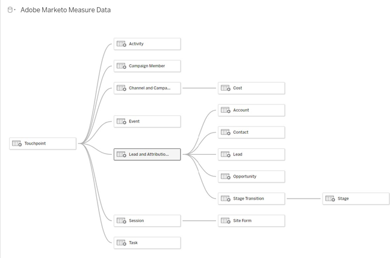

# [!DNL Marketo Measure] Modèle de rapport - Tableau {#marketo-measure-report-template-tableau}

## Démarrer {#getting-started}

Vous pouvez accéder au [!DNL Tableau] modèle de rapport [here](https://github.com/adobe/Marketo-Measure-BI-Templates){target="_blank"}.

Ouvrez le [!DNL Adobe Marketo Measure] Fichier du classeur Tableau du modèle de création de rapports.

Vous devez mettre à jour les données de connexion existantes avec vos informations de connexion de Snowflake spécifiques. Cliquez sur le bouton [!UICONTROL Modifier la connexion] et suivez les étapes décrites dans la section [[!UICONTROL Connexion aux données]](#data-connection) de cette documentation.


## Connexion aux données {#data-connection}

Vous devez configurer une connexion de données à votre instance de Snowflake. Pour ce faire, vous aurez besoin du nom du serveur ainsi que de votre nom d’utilisateur et de votre mot de passe. Vous trouverez des informations détaillées sur l’emplacement de ces informations et la réinitialisation de votre mot de passe, le cas échéant. [here](/help/marketo-measure-data-warehouse/data-warehouse-access-reader-account.md){target="_blank"}.


Vous devez également saisir une commande SQL initiale. Cela prend en charge l’utilisation de requêtes personnalisées dans ce modèle de données. La commande à saisir est &quot;Utiliser le schéma&quot;. `<your schema name>`&quot;. Le nom de votre schéma figure dans la section [!UICONTROL connexions à l’entrepôt de données] , voir la documentation référencée ci-dessus.


### Requêtes SQL personnalisées {#custom-sql-queries}

Parce que [!DNL Tableau] applique des filtres de source de données à la requête globale, et non à la table individuelle sur laquelle le filtre est défini, nous avons choisi d’utiliser SQL personnalisé pour chaque table du modèle. Cela permet au modèle de filtrer les lignes supprimées et dupliquées au niveau du tableau. Par exemple, lorsqu’elle est appliquée en tant que filtre de source de données, session.La valeur _delete_date est null sera ajoutée à la clause where de la requête, ce qui entraîne la requête suivante.

**Filtres ajoutés à la source de données**

```
--A deleted session removes this row completely and the touchpoint data is lost. Select *
   From Touchpoint    tp
      join Session sn
      on tp.session_id = sn.session_id 
 Where tp._deleted_date is null
    and sn._deleted_date is null
```

Cependant, cette erreur est due au fait que si une session a été supprimée, mais que le point de contact correspondant n’est pas supprimé, les données du point de contact sont supprimées du jeu de données. Nous voulons que les données de point de contact soient présentes dans le jeu de données, car le point de contact n’a pas été supprimé. L&#39;ajout de SQL personnalisé garantit que les critères de filtrage sont appliqués au niveau de la table, ce qui entraîne la requête suivante.

**Filtres appliqués via SQL personnalisé**

```
--A deleted session only removes the session related data, and the touchpoint data is preserved. Select *
   From Touchpoint       tp
      join Session sn
      on tp.session_id          = sn.session_id 
      and sn._deleted_date      is null
  Where tp._deleted_date is null
```

## Transformations de données {#data-transformations}

Quelques transformations ont été appliquées aux données dans [!DNL Tableau] de son état d’origine en Snowflake. La plupart de ces transformations sont appliquées dans les requêtes SQL personnalisées qui génèrent les tables dans la variable [!DNL Tableau] modèle. Pour visualiser le code SQL personnalisé utilisé pour générer une table, cliquez avec le bouton droit sur le nom de la table et sélectionnez &quot;Modifier la requête SQL personnalisée&quot;. Certaines des transformations spécifiques sont décrites ci-dessous.


### Colonnes supprimées {#removed-columns}

Pour simplifier le modèle de données et supprimer les données redondantes et inutiles, nous avons réduit le nombre de colonnes importées dans Tableau à partir de la table de Snowflake d’origine. Les colonnes supprimées comprennent les clés étrangères inutiles, les données dénormalisées mieux exploitées par le biais de relations avec d’autres tables dans le modèle, les colonnes de contrôle et les champs utilisés pour les [!DNL Marketo Measure] traitement. Vous pouvez ajouter ou supprimer des colonnes selon les besoins de votre entreprise en modifiant la liste des colonnes importées dans la section Sélectionner de la requête SQL personnalisée.

>[!NOTE]
>
>La plupart des tableaux de l’entrepôt de données contiennent des données dimensionnelles dénormalisées. Nous avons travaillé à normaliser et nettoyer le modèle dans [!DNL Tableau] autant que possible pour améliorer les performances et la précision des données. Soyez prudent lorsque vous incluez des champs dénormalisés supplémentaires dans les tableaux de faits, cela peut rompre le filtrage dimensionnel dans les tableaux et générer des rapports inexacts.

### Colonnes renommées {#renamed-columns}

Les tableaux et les colonnes ont été renommés afin de les rendre plus conviviaux et de normaliser les conventions d’appellation. Pour afficher les modifications de nom de colonne, référencez les instructions SQL personnalisées qui créent les tables.

### Lignes ajoutées {#rows-added}

Pour ajouter des fonctionnalités de conversion de devise aux calculs dans le modèle, nous avons ajouté un taux de conversion d’entreprise et une colonne de taux de conversion cible aux tableaux Opportunité et Coût . La valeur de ces colonnes est ajoutée au niveau de la ligne et évaluée en se joignant au tableau Taux de conversion à la date et à l’ID de devise. Comme Tableau ne permet pas aux tableaux de faits de partager plusieurs tableaux de dimensions, les taux de conversion ont été ajoutés directement aux tableaux qui les utilisent. Pour plus d’informations sur le fonctionnement de la conversion de devise dans ce modèle, voir [Conversion de devise](#currency-conversion) dans cette documentation.


Il y a quelques endroits où deux tables de [!DNL Snowflake] ont été combinés avec une union pour créer un tableau dans la variable [!DNL Tableau] modèle de données. Dans ces instances, une colonne &quot;Type&quot; a été ajoutée pour indiquer laquelle [!DNL Snowflake] le tableau provient et désigne l’entité que la ligne représente. Pour plus d’informations sur les tables qui ont été combinées, consultez la section Relation et flux de données de cette documentation.


### Noms de segments {#segment-names}

Les noms de segment pouvant être personnalisés, ils comportent des noms de colonne génériques dans l’entrepôt de données du Snowflake. [!DNL BIZ_SEGMENT_NAMES] est un tableau de mappage qui répertorie le nom du segment générique avec le nom du segment personnalisé auquel il est mappé, tel que défini dans la section du segment dans la variable [!DNL Marketo Measure] Interface utilisateur. Si vous utilisez des noms de segment personnalisés et souhaitez mettre à jour votre [!DNL Tableau] pour les incorporer, utilisez ce tableau et renommez manuellement les colonnes du modèle Tableau. Les colonnes de segments se trouvent dans le tableau Point de contact de piste et d’attribution. Elles ne devront être renommées qu’une seule fois.

Le [!UICONTROL CATÉGORIE] répertorie le numéro de catégorie et la colonne SEGMENT_NAME possède le nom de segment personnalisé auquel elle est mappée.


Les noms peuvent être mis à jour de deux manières. La première option consiste à mettre à jour le code SQL personnalisé. Dans cet exemple, les catégories 1 à 6 ont été renommées en fonction du mappage issu de la table Noms de segment .


L’autre option consiste à renommer les colonnes directement dans la variable [!DNL Tableau] table.


## Modèle de données {#data-model}

Cliquez sur l’image ci-dessous pour sa version agrandie.

[](/help/bi-report-templates/assets/tableau-data-model.png){target="_blank"}

### Relations et flux de données {#relationships-and-data-flow}

Les données d’événement, utilisées pour créer des points de contact, sont stockées dans la variable [!UICONTROL Session], [!UICONTROL Tâche], [!UICONTROL Événement], [!UICONTROL Activité], et [!UICONTROL Membre de la campagne] des tables. Ces tables d’événements se joignent à la table Point de contact par l’intermédiaire de leurs identifiants respectifs. Si l’événement a entraîné un point de contact, les détails sont stockés dans la table Point de contact.

Les points de contact de piste et d’attribution sont combinés en un seul tableau dans ce modèle, avec un lien vers le tableau de points de contact. La colonne &quot;Type de point de contact&quot; a été ajoutée afin de désigner si une ligne est un point de contact de piste ou d’attribution. La plupart des données dimensionnelles des points de contact de piste et d’attribution proviennent de leur lien vers le point de contact correspondant.

Les transitions d’étape d’opportunité et les transitions d’étape de piste sont combinées en un tableau dans ce modèle, avec un lien vers [!UICONTROL Lead et attribution] Table de points de contact. La colonne &quot;Type de transition&quot; a été ajoutée pour désigner si une ligne est une transition d’étape d’opportunité ou de piste.

Les dimensions Canal et Campagne partagent les données de coûts et de points de contact. Cependant, Tableau est limité dans sa capacité à modéliser des dimensions partagées entre des tableaux de faits. Puisque nous sommes limités à un seul tableau de dimension partagé, les données Canal et Campagne ont été combinées en un seul tableau. Elles sont combinées à l’aide d’une jointure croisée des deux dimensions en un tableau dans Tableau : Canal et Campaign. L’identifiant unique est créé en concaténant les identifiants de canal et de campagne. Cette même valeur d’identifiant est ajoutée aux tableaux Point de contact et Coût pour créer une relation avec ce tableau de dimension combiné.


Dans ce modèle, les dimensions Campagne et Canal sont liées au point de contact. Par conséquent, tous les rapports sur ces dimensions sont générés par ce lien et signifie que les rapports dimensionnels sur les données d’événement peuvent être incomplets. En effet, de nombreux événements ne comportent de liens vers ces dimensions qu’après leur traitement dans les points de contact.

>[!NOTE]
>
>Certains événements, tels que les sessions, comportent des liens directs vers les dimensions Campagne et Canal. Si vous souhaitez créer des rapports au niveau de la session sur ces dimensions, il est recommandé de créer un modèle de données distinct à cet effet.

Les données de coût sont stockées à différents niveaux d’agrégation dans le tableau Coût de l’entrepôt de données du Snowflake. Pour tous les fournisseurs d&#39;annonces, les données au niveau de la campagne peuvent être cumulées au niveau du canal. Pour cette raison, ce modèle extrait les données de coût en fonction de l’indicateur &quot;campaign_is_aggatable_cost&quot;. Les coûts auto-déclarés peuvent être envoyés au niveau du canal uniquement et ne sont pas nécessaires pour disposer de données Campaign. Pour fournir un rapport de coûts le plus précis possible, les coûts auto-déclarés sont extraits en fonction de l’indicateur &quot;channel_is_aggatable_cost&quot;. La requête qui importe les données de coût est écrite avec la logique suivante : Si ad_provider = &quot;SelfReported&quot; alors channel_is_aggatable_cost = true, else campaign_is_aggatable_cost = true.

Dans le contexte de ce modèle, le plomb, [!UICONTROL Contact], [!UICONTROL Compte], et [!UICONTROL Opportunité] Les données sont considérées comme des données dimensionnelles et sont jointes directement au tableau Point de contact de piste et d’attribution.

### Conversion de devise {#currency-conversion}

Les taux dans le tableau Taux de conversion représentent la valeur nécessaire pour convertir un montant à partir de la devise de l’entreprise. Les conversions vers n’importe quelle devise nécessitent une double conversion, d’abord de la devise d’origine vers la devise de l’entreprise, puis de la devise de l’entreprise vers la devise sélectionnée. La première étape de cette chaîne dans le modèle consiste à ajouter deux colonnes avec ces taux de conversion aux tables avec les montants Opportunité et Coût. Ces étapes sont détaillées dans la section Lignes ajoutées de ce document. Étant donné que les taux de conversion ne doivent pas être statiques et peuvent varier selon des périodes spécifiées, tous les calculs de conversion de devise doivent être effectués au niveau de la ligne. La conversion de la devise d’origine vers la devise de l’entreprise consiste à diviser la valeur par le taux de conversion de l’entreprise, puis à la multiplier par le taux de conversion cible. Le taux de conversion cible est déterminé par la valeur du paramètre de devise sélectionné.

* Convertir la valeur d’origine en valeur de devise de l’entreprise/taux de conversion de l’entreprise = valeur en devise de l’entreprise
* Convertir la valeur de la devise de l’entreprise en valeur de devise sélectionnée dans la devise de l’entreprise `*` taux de conversion de la devise sélectionnée = valeur dans la devise sélectionnée


Les mesures de conversion de devise de ce modèle remplacent le taux par une valeur de 1,0 si aucun taux de conversion ne peut être identifié. Des mesures distinctes ont été créées pour afficher la valeur de la devise de la mesure, et une alerte s’affiche si un calcul comprend plusieurs valeurs monétaires (c’est-à-dire qu’une valeur n’a pas pu être convertie dans la devise sélectionnée) a été créée. Ces mesures, Devise de coût et Devise du chiffre d’affaires, sont incluses sous forme d’info-bulles dans n’importe quel visuel qui affiche des données sur les coûts ou les recettes.


## Définitions des données {#data-definitions}

Des définitions ont été ajoutées à la variable [!DNL Tableau model] pour les paramètres, les colonnes personnalisées et les mesures.


Pour afficher les définitions des colonnes provenant directement de [!DNL Snowflake], reportez-vous à la section [documentation de l’entrepôt de données](/help/marketo-measure-data-warehouse/data-warehouse-schema.md){target="_blank"}.

## Incohérences entre les modèles et Discover {#discrepancies-between-templates-and-discover}

### Chiffre d’affaires attribué {#attributed-revenue}

Les points de contact de piste et les points de contact d’attribution héritent des données dimensionnelles du point de contact d’origine. Le modèle de rapport source toutes les données dimensionnelles héritées de la relation au point de contact, tandis que dans le modèle Discover, les données dimensionnelles sont dénormalisées en fonction des enregistrements Point de contact de piste et d’attribution. Les recettes totales attribuées ou les valeurs de recettes de pipeline attribuées doivent correspondre entre les deux rapports. Cependant, des incohérences peuvent être observées lorsque les recettes sont ventilées ou filtrées par données dimensionnelles (canal, sous-canal ou campagne). Si les recettes dimensionnelles ne correspondent pas entre le modèle et Discover, il est probable qu’il manque des enregistrements de point de contact dans le jeu de données du rapport de modèle. Cela se produit lorsqu’il existe un enregistrement Point de contact de piste ou d’attribution, mais qu’aucun enregistrement correspondant n’est présent dans le tableau Points de contact du jeu de données importé dans le rapport. Comme ces tables sont filtrées par date de modification, il est possible que l’enregistrement Point de contact de piste/attribution ait été modifié plus récemment que l’enregistrement Point de contact. Par conséquent, le point de contact de piste/attribution a été importé dans le jeu de données alors que l’enregistrement Point de contact d’origine ne l’était pas. Pour résoudre ce problème, élargissez la période filtrée du tableau Point de contact ou envisagez de supprimer la contrainte de date dans son ensemble.

>[!NOTE]
>
>Le point de contact est un tableau volumineux. Il faut donc tenir compte des compromis entre un jeu de données plus complet et la quantité de données à importer.

### Coût {#cost}

La création de rapports de coûts dans les modèles n’est disponible qu’aux niveaux de la campagne et du canal. Toutefois, Discover offre la création de rapports aux niveaux de granularité inférieurs pour certains fournisseurs d’annonces (c’est-à-dire créatifs, mots-clés, groupes d’annonces, etc.). Pour plus d’informations sur la manière dont les données de coût sont modélisées dans les modèles, reportez-vous à la section [!UICONTROL Modèle de données] de cette documentation. Si la dimension est filtrée dans [!UICONTROL Discover] est définie sur canal ou campagne, les coûts au niveau du canal, du sous-canal et de la campagne doivent s’aligner entre Discover et les modèles de rapport.

### RSI {#roi}

Comme le ROI est calculé à partir des recettes et des coûts attribués, les mêmes incohérences qui peuvent survenir dans l’un de ces calculs peuvent apparaître dans le ROI et pour les mêmes raisons, comme indiqué dans ces sections.

### Points de contact {#touchpoints}

Ces mesures, comme indiqué dans les modèles de rapport, ne sont pas reflétées dans Discover. Il n’existe actuellement aucune comparaison directe entre les deux.

### Trafic Web {#web-traffic}

Le modèle de données de rapport normalise les données des dimensions des canaux, des sous-canaux et des campagnes au moyen de la relation entre la session et le point de contact. Il diffère du modèle de données de Discover , qui dénormalise ces dimensions en session. En raison de cette distinction, les comptes globaux des visites et des visiteurs doivent correspondre entre Discover et le modèle de rapport. Toutefois, une fois affichés ou filtrés par dimension, ces chiffres ne doivent pas s’aligner. En effet, les données dimensionnelles du modèle ne sont disponibles que pour les événements web qui ont généré un point de contact (c’est-à-dire des événements non anonymes). Pour plus d’informations, reportez-vous à la section [Modèle de données](#data-model) de cette documentation.

Il peut y avoir de légères différences dans le nombre total de formulaires du site entre [!DNL Discover] et le modèle. En effet, le modèle de données du modèle de rapport obtient des données dimensionnelles pour le formulaire du site par le biais d’une relation avec Session, puis avec Point de contact ; il existe quelques cas où les données de formulaire de site n’ont pas de session en corrélation.

### Prospects et comptes {#leads-and-accounts}

Les rapports dimensionnels pour les comptes concernés peuvent différer légèrement d’un [!DNL Discover] et le modèle, cela est à nouveau dû à la modélisation dimensionnelle issue de la relation entre le point de contact et le point de contact de piste ou le point de contact d’attribution. Pour plus d’informations, reportez-vous aux détails décrits dans la section Recettes affectées .

Tous les comptes de piste dans [!UICONTROL Discover] se voient attribuer des nombres de prospects et dans le modèle de rapport, la mesure est [!UICONTROL leads] touché. Il n&#39;y a donc pas de comparaison directe entre les deux rapports pour cette mesure.

### Parcours d’engagement {#engagement-path}

Il n’existe aucune comparaison directe entre la variable [!UICONTROL Chemin de l’engagement] rapport dans [!DNL Discover] et le modèle. Le rapport dans [!DNL Discover] est modélisé à partir du point de contact, tandis que le rapport du modèle est modélisé à partir du point de contact d’attribution. Le modèle se concentre uniquement sur les opportunités et leurs points de contact associés au lieu d’afficher toutes les données de point de contact.

### Vitesse de transaction {#deal-velocity}

Il ne doit pas y avoir d’incohérence entre ce rapport dans le modèle et la mosaïque Vitesse de transaction dans le tableau de bord Velocity de Discover.
