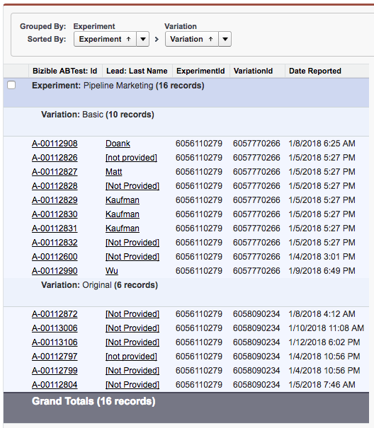
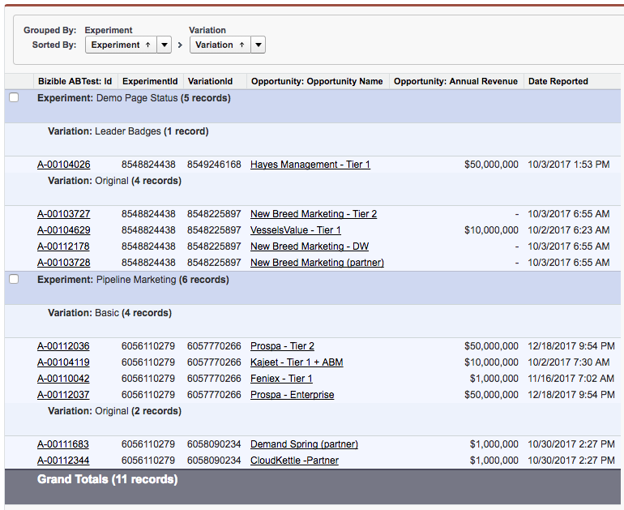
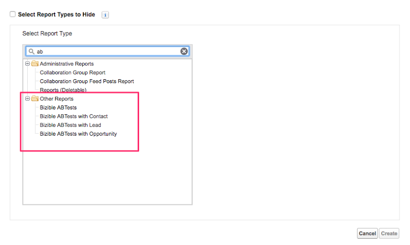
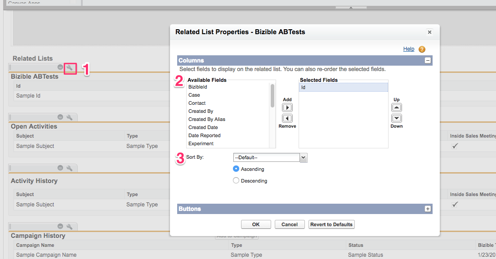
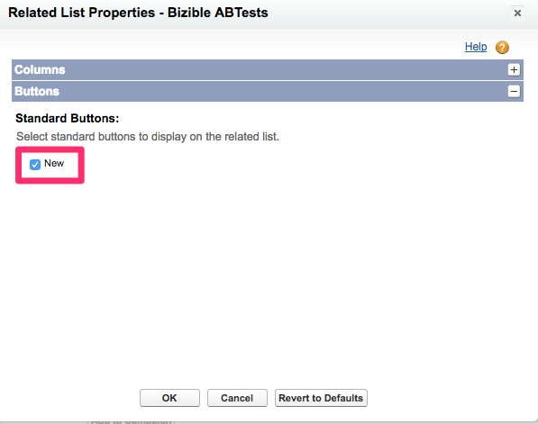
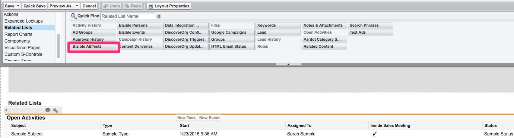

# Configuration des tests AB et reporting {#a-b-testing-set-up-and-reporting}

L’intégration du test A/B [!DNL Marketo Measure] vous permet de suivre l’impact sur le chiffre d’affaires de vos expériences de site [Optimizely](https://www.optimizely.com/){target="_blank"} et VWO. Cet article fournit des instructions sur la façon d’ajouter des sections de tests A/B [!DNL Marketo Measure] aux dispositions des pages Prospect, [!UICONTROL Contact], Dossier et [!UICONTROL Opportunité]. Les pratiques et recommandations générales en matière de création de rapports pour l’exécution des types de rapports A/B [!DNL Marketo Measure] sont également abordées.

## Configuration {#set-up}

Ajoutez les sections de test A/B [!DNL Marketo Measure] sur le lead, le contact, le cas et l’opportunité. [!DNL Marketo Measure] L’intégration du test A/B vous permet de suivre l’impact sur le chiffre d’affaires de vos expériences de site [Optimizely](https://www.optimizely.com/){target="_blank"} et [VWO](https://vwo.com/){target="_blank"}.

1. Vérifiez que vous utilisez le package [!DNL Marketo Measure] v3.9 ou version ultérieure. Vous pouvez le faire en accédant à [!UICONTROL Salesforce] > [!UICONTROL Configuration] > [!UICONTROL Packages installés].
1. Modifiez la disposition de la page Prospect et ajoutez la liste connexe Tests A/B **[!DNL Marketo Measure]** à la page.

   

1. Cliquez sur le bouton [!UICONTROL Clé à molette]. Supprimez le champ « Id » par défaut de la liste des champs sélectionnés. Ajoutez les champs **[!UICONTROL Expérience]**, **[!UICONTROL Variation]** et **[!UICONTROL DateReported]**. Remplacez « [!UICONTROL Trier par] » par **[!UICONTROL Date du rapport]**, et sélectionnez **[!UICONTROL Descendant]** dans la liste déroulante.

   

1. Sous [!UICONTROL Boutons], décochez **[!UICONTROL Nouveau]**.

   

1. Contactez votre représentant [!DNL Marketo Measure] ou l’assistance [Marketo](https://nation.marketo.com/t5/support/ct-p/Support){target="_blank"} pour activer la fonctionnalité.

## Création de rapports {#reporting}

Les clientes et clients ont accès à quelques types de rapports A/B [!DNL Marketo Measure] qui vous permettent d’établir des rapports sur les tests A/B en lien avec les prospects, les contacts et les opportunités :

* Tests A/B [!DNL Marketo Measure]
* Tests A/B [!DNL Marketo Measure] avec Contact
* Tests A/B [!DNL Marketo Measure] avec Prospect
* Tests A/B [!DNL Marketo Measure] avec Opportunité

Les types de rapport AB sont utilisés pour indiquer quel Lead, Contact ou Opportunité a été exposé à un test AB. Ces rapports vous indiquent également le montant des revenus associés à une Opportunité exposée à un test AB.

Il est important de noter qu’Optimizely/VWO est une plateforme de variation de contenu et non un canal marketing. Par conséquent, ces types de rapports A/B [!DNL Marketo Measure] sont utilisés différemment des rapports Buyer Touchpoint. Les types de rapports Buyer Touchpoint sont utilisés pour comprendre quel canal marketing (publicité payante, direct web, social) a amené un prospect ou un contact sur une page spécifique. Cependant, les types de rapports A/B [!DNL Marketo Measure] ne peuvent pas être utilisés pour rendre compte de l’influence d’une variation sur un prospect ou une opportunité. Étant donné qu’une variation de test AB n’est pas un canal, les informations la concernant n’apparaissent pas sur le point de contact Acheteur.

Voici quelques champs recommandés à utiliser lors de la création d’un rapport sur un test A/B afin d’améliorer la clarté et la compréhension :

* Prospect converti
* Expérience
* ID d’expérience
* Variation
* ID de variation
* Date du rapport

## Exemples de rapports [!DNL Salesforce] {#salesforce-example-reports}

Test A/B **[!DNL Marketo Measure]avec Prospect**

Test A/B **[!DNL Marketo Measure]avec Opportunité**

