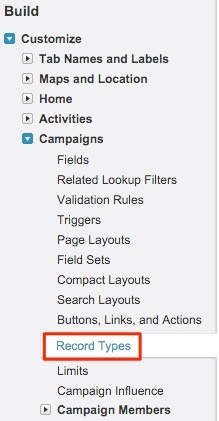

# Configurations pour plusieurs types d’enregistrement de campagne {#configurations-for-multiple-campaign-record-types}

**Valeurs de liste de sélection manquantes dans le champ « Activer les points de contact de l’acheteur »**

Si votre organisation SFDC utilise plusieurs types d’enregistrements de campagne, les valeurs de la liste de sélection pour « Activer les points de contact d’acheteur » doivent être ajoutées pour chaque type d’enregistrement. Pour ajouter les options, procédez comme suit.

1. Accédez à **[!UICONTROL Configuration]** > **[!UICONTROL Personnaliser]** > **[!UICONTROL Campagnes]** > **[!UICONTROL Types d’enregistrements]**.

   

1. Sélectionnez les types d’enregistrements Campaign en cliquant sur le bouton **[!UICONTROL Libellé du type d’enregistrement]**, et non sur le bouton [!UICONTROL modifier].

   

1. Ici, vous êtes affiché à l’écran avec les listes de sélection disponibles pour ce type d’enregistrement. Sélectionnez **[!UICONTROL Modifier]** en regard du champ « Activer les points de contact de l’acheteur ».

   

1. Ajoutez les trois valeurs du groupe « Valeurs disponibles » au groupe « Valeurs sélectionnées ».

   

1. Définissez la valeur par défaut sur « Aucun » et cliquez sur **[!UICONTROL Enregistrer]**. Répétez l’opération pour tout type d’enregistrement de campagne supplémentaire.
