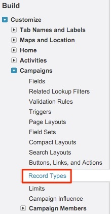

# Configurations pour plusieurs types d’enregistrement de campagne {#configurations-for-multiple-campaign-record-types}

**Valeurs de liste de sélection manquantes dans le champ &quot;Activer les points de contact d’achat&quot;**

Si votre organisation SFDC utilise plusieurs types d’enregistrements de campagne, les valeurs de liste de sélection pour &quot;Activer les points de contact d’achat&quot; doivent être ajoutées pour chaque type d’enregistrement. Pour ajouter les options, procédez comme suit.

1. Accédez à **[!UICONTROL Configuration]** > **[!UICONTROL Personnaliser]** > **[!UICONTROL Campagnes]** > **[!UICONTROL Types d’enregistrement]**.

   

1. Sélectionnez les types d’enregistrement de campagne en cliquant sur le bouton **[!UICONTROL Libellé du type d’enregistrement]**, pas le [!UICONTROL edit] bouton .

   

1. Vous accédez ici à l’écran avec les listes de sélection disponibles pour ce type d’enregistrement. Sélectionner **[!UICONTROL Modifier]** en regard du champ &quot;Activer les points de contact de l’acheteur&quot;.

   

1. Ajoutez les trois valeurs du groupement &quot;Valeurs disponibles&quot; au groupement &quot;Valeurs sélectionnées&quot;.

   

1. Définissez la valeur par défaut sur &quot;Aucun&quot; et cliquez sur **[!UICONTROL Enregistrer]**. Répétez cette opération pour tout autre type d’enregistrement Campaign.
