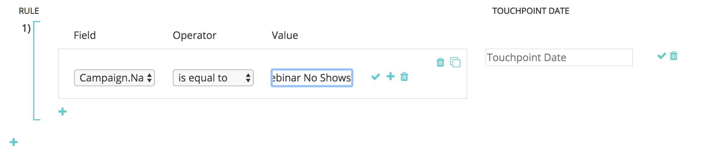

# Synchronisation de campagne personnalisée {#custom-campaign-sync}

Aujourd’hui, avec le package [!DNL Marketo Measure] installé, vous pouvez indiquer les campagnes à inclure en tant que point de contact éligible. Il y a de multiples obstacles à cela, comme c&#39;était le cas auparavant. Une fois le package [!DNL Marketo Measure] installé dans le CRM, son approbation par votre équipe de sécurité peut prendre du temps. En outre, l’utilisation d’une seule liste de sélection sur l’objet Campaign présente un manque de flexibilité. Avec cette nouvelle fonctionnalité, il n’est pas nécessaire d’installer de package pour commencer à utiliser les enregistrements Campaign et Membre de la campagne . Des règles peuvent être créées pour définir exactement quels enregistrements peuvent être créés afin de définir exactement quels enregistrements sont éligibles.

## Exigences {#requirements}

* La synchronisation de la campagne est disponible à tous les niveaux.
* Pour importer des données, vous devez toujours connecter votre CRM à votre compte [!DNL Marketo Measure]

## Fonctionnement {#how-it-works}

1. Avec les autorisations d’administrateur de compte, vous pouvez accéder à **[!UICONTROL Paramètres]** > **[!UICONTROL Campagnes]** et voir l’interface utilisateur des règles Synchroniser les membres de la campagne .
1. Cliquez sur l’icône **+** pour commencer à créer une règle.

   

1. Vous avez la possibilité de créer une règle à partir des champs [!UICONTROL Campagne] ou [!UICONTROL Membre de la campagne]. Renseignez le reste de la règle avec l’opérateur et la valeur que nous sommes censés valider. Dans l’exemple ci-dessous, nous recherchons une campagne spécifique par son nom.

   

   >[!NOTE]
   >
   >Les champs de formule ne peuvent pas être utilisés dans vos règles et n&#39;apparaîtront pas dans la liste de sélection. Étant donné que les formules calculent en arrière-plan et ne modifient pas un enregistrement, [!DNL Marketo Measure] ne pouvez pas détecter si un enregistrement correspond ou non à une règle.

1. Choisissez la date du point de contact. La liste des dates possibles s’affiche après avoir saisi un crochet `{`, puis vous pouvez sélectionner la date à appliquer à tous les points de contact créés à partir de la règle.

   

   >[!NOTE]
   >
   >Si vous utilisez des règles de synchronisation de campagne personnalisées, [!DNL Marketo Measure] ne lirez aucune des mises à jour que vous avez effectuées à l’aide du bouton Date de point de contact de mise à jour en bloc .

1. Cliquez sur la coche, puis ajoutez des règles supplémentaires pour d’autres campagnes, si nécessaire.

   

   >[!NOTE]
   >
   >Maintenant que les règles sont définies avec la synchronisation CRM, les règles qui sont énoncées vont naturellement commencer à entrer en conflit. Si vous choisissez de continuer à utiliser à la fois la synchronisation de campagne personnalisée _et_ le type de synchronisation CRM, il est essentiel de créer des règles afin que vos types de synchronisation CRM ne soient pas ignorés.

   

   >[!NOTE]
   >
   >Si vous envisagez d’arrêter l’utilisateur du [!UICONTROL Type de synchronisation CRM], il est idéal de créer des règles qui ne font pas référence au « Type de synchronisation », mais _conservent toujours_ les points de contact CRM actuels. De cette manière, les règles fonctionnent toujours si/lorsque ce changement est effectué.

Voici un exemple de ce à quoi cela pourrait ressembler, afin qu’aucun point de contact CRM existant ne soit perdu :

## Validation {#validation}

Vous pouvez facilement vérifier les enregistrements Points de contact de l’acheteur et Buyer Attribution Touchpoint dans Campaign pour vous assurer que les règles fonctionnent correctement. Voici un BAT qui [!DNL Marketo Measure] créé avec la date de point de contact dynamique appropriée, extraite de la campagne. Le champ Date de création se trouve dans l’image en dessous.

## Test {#testing}

1. La fonction de synchronisation de la campagne est fournie avec une fonction de test afin que vous puissiez vérifier si les règles que vous avez créées répondent réellement aux critères de Campaign. Commencez par cliquer sur le bouton [!UICONTROL Tester]. Les règles doivent d’abord être enregistrées avant de pouvoir commencer le test.

   

   Un pop-up s’affiche et vous pouvez saisir un identifiant de campagne (15 ou 18 caractères du CRM) à tester. Il s’agit de saisir l’identifiant de campagne du CRM que vous tentez de synchroniser pour vous assurer qu’il correspond à la règle que vous avez créée.

   

1. Après avoir cliqué sur [!UICONTROL Tester], le nom de la campagne et le nombre de membres de la campagne éligibles aux points de contact s’affichent. Un tableau s’affiche ci-dessous avec toutes les règles correspondant à votre identifiant de campagne. Seules les correspondances s’affichent.

   

1. Vous pouvez également cliquer sur le nombre de membres pour afficher la liste des leads et des contacts, ainsi que leurs identifiants qui font partie de l’éligibilité de la règle Campaign. Il s’agit simplement d’un ensemble d’échantillons qui affiche jusqu’à 50 afin que vous puissiez avoir une idée des enregistrements qualifiés.

   
