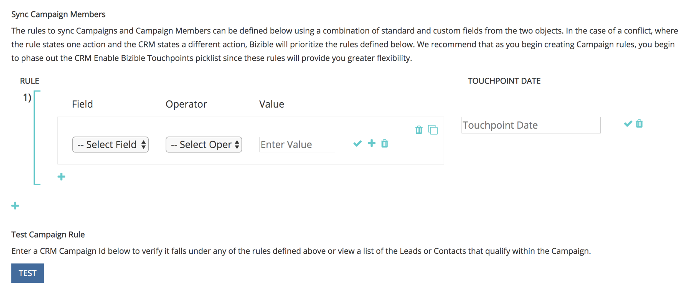

# Synchronisation de campagne personnalisée {#custom-campaign-sync}

Aujourd’hui, avec l’ installé [!DNL Marketo Measure] module, vous pouvez indiquer les campagnes à inclure comme point de contact éligible. Il y a plusieurs obstacles à cela, tels qu&#39;ils existaient auparavant. Une fois que la variable [!DNL Marketo Measure] Le package est installé dans le CRM. Il peut s’avérer nécessaire d’être approuvé par votre équipe de sécurité. En outre, l’utilisation d’une seule liste de sélection sur l’objet Campaign manque de flexibilité. Avec cette nouvelle fonctionnalité, l’installation d’un package n’est pas nécessaire pour commencer à utiliser les enregistrements Campaign et Campaign Member . Des règles peuvent être créées pour définir exactement les enregistrements qui peuvent être créés pour définir exactement les enregistrements éligibles.

## Exigences {#requirements}

* La synchronisation des campagnes est disponible dans tous les niveaux
* Pour importer des données, vous devez toujours connecter votre CRM à votre [!DNL Marketo Measure] account

## Fonctionnement {#how-it-works}

1. Avec les autorisations AccountAdmin, vous pouvez accéder à **[!UICONTROL Paramètres]** > **[!UICONTROL Campagnes]** et voir l’interface utilisateur des règles de synchronisation des membres de Campaign .
1. Cliquez sur le bouton **+** pour créer une règle.

   

1. Vous avez la possibilité de créer une règle à partir de [!UICONTROL Campagne] ou [!UICONTROL Membre de la campagne] des champs. Remplissez le reste de la règle avec l’ opérateur et la valeur que nous sommes censés valider. Dans l&#39;exemple ci-dessous, nous recherchons une campagne spécifique par son nom.

   

   >[!NOTE]
   >
   >Les champs de formule ne peuvent pas être utilisés dans vos règles et n’apparaîtront pas dans la liste de sélection. Parce que les formules sont calculées en arrière-plan et ne modifient pas d&#39;enregistrement, [!DNL Marketo Measure] ne peut pas détecter si un enregistrement correspond à une règle ou non.

1. Sélectionnez la Date du point de contact. La liste des dates possibles apparaît une fois que vous avez saisi une accolade. `{` - vous pouvez alors sélectionner la date que vous souhaitez appliquer à tous les points de contact créés à partir de la règle.

   

   >[!NOTE]
   >
   >Si vous utilisez des règles de synchronisation de campagne personnalisées, [!DNL Marketo Measure] ne lira aucune mise à jour que vous avez effectuée à l’aide du bouton Date de point de contact de mise à jour en bloc .

1. Cliquez sur la coche, puis ajoutez des règles supplémentaires pour les campagnes supplémentaires si nécessaire.

   

   >[!NOTE]
   >
   >Maintenant que les règles sont définies en même temps que la synchronisation CRM, les règles indiquées commencent naturellement à entrer en conflit. Si vous choisissez de continuer à utiliser la synchronisation Campaign personnalisée _et_ Pour le type de synchronisation CRM, il est essentiel de créer des règles afin que vos types de synchronisation CRM ne soient pas ignorés.

   

   >[!NOTE]
   >
   >Si vous envisagez d’arrêter l’utilisateur de la variable [!UICONTROL Type de synchronisation CRM], il est idéal de créer des règles qui ne font pas référence au &quot;type de synchronisation&quot; mais _always_ conserver les points de contact CRM actuels ; Ainsi, les règles fonctionnent toujours si/quand cet interrupteur est effectué.

Voici un exemple de ce à quoi cela ressemblerait, de sorte qu’aucun point de contact CRM existant ne soit perdu :

## Validation {#validation}

Vous pouvez facilement vérifier les enregistrements Points de contact de l’achat et Points de contact de l’attribution de l’achat dans Campaign pour vous assurer que les règles fonctionnent correctement. Voici une AT qui [!DNL Marketo Measure] créé avec la date de point de contact dynamique appropriée, extraite de la campagne. Le champ Date de création se trouve dans l’image ci-dessous.

## Faites des tests {#testing}

1. La fonctionnalité Synchronisation des campagnes s’accompagne d’une fonctionnalité de test qui vous permet de vérifier si les règles que vous avez créées correspondent réellement aux critères de campagne. Commencez par cliquer sur le bouton [!UICONTROL Test] bouton . Les règles doivent d’abord être enregistrées avant de pouvoir commencer le test.

   

   Une fenêtre contextuelle s’affiche, dans laquelle vous pouvez saisir un ID de campagne (15 ou 18 caractères du CRM) à tester. Il s’agit de saisir l’ID de campagne du CRM que vous tentiez de synchroniser pour vous assurer qu’il correspond à la règle que vous avez créée.

   

1. Cliquez ensuite sur [!UICONTROL Test], vous verrez le nom de la campagne et le nombre de membres de la campagne éligibles pour les points de contact. Un tableau ci-dessous présente toutes les règles correspondant à votre ID de campagne. Seules les correspondances s’affichent.

   

1. Vous pouvez également cliquer sur le nombre de membres pour voir la liste des Leads et contacts et leurs identifiants qui font partie de l&#39;éligibilité aux règles de Campaign. Il s’agit simplement d’un jeu d’exemples qui affichera jusqu’à 50 enregistrements afin que vous puissiez vous faire une idée des enregistrements à qualifier.

   
