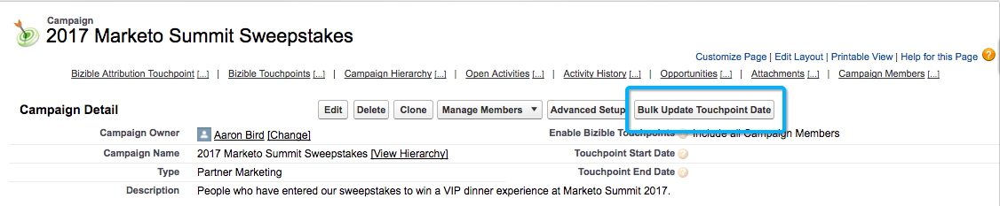

# Campagnes et personnes membres de campagne {#campaigns-and-campaign-members}

Les campagnes [!DNL Salesforce] sont destinées à suivre les listes de prospects et de contacts associés à un programme ou à une activité marketing. Il s’agit généralement de webinaires, d’inscriptions ou de visites de stands, par exemple. Les personnes spécialisées dans le marketing peuvent choisir si une campagne doit être créditée ou non dans un parcours de points de contact.

>[!NOTE]
>Cet article traite d’un processus obsolète. Nous encourageons les utilisateurs et les utilisatrices à utiliser le [nouveau processus in-app amélioré](/help/channel-tracking-and-setup/offline-channels/custom-campaign-sync.md){target="_blank"}.

## Activer des points de contact {#enabling-touchpoints}

Le package [!DNL Marketo Measure] [!DNL Salesforce] comprendra un champ intitulé « Activer Buyer Touchpoints » sur l’objet de campagne. Une fois le champ ajouté à la disposition de page, il apparaît comme suit :

Mise en page 

Les options disponibles dans la liste de sélection sont les suivantes :

* Inclure toutes les personnes membres de la campagne : chaque prospect ou contact ajouté à la campagne recevra un point de contact associé à cette campagne.
* Inclure uniquement les personnes membres de la campagne qui ont répondu : seuls les prospects ou les contacts dont le statut de personne membre de la campagne est « A répondu » recevront un point de contact associé à cette campagne.
* Exclure toutes les personnes membres de la campagne : aucun des prospects ou contacts ne recevra de point de contact associé à cette campagne.

Notez que les personnes membres de la campagne doivent avoir une adresse e-mail associée à leur enregistrement pour que [!DNL Marketo Measure] puisse créer un point de contact. Sans adresse e-mail, [!DNL Marketo Measure] n’attribuera pas de point de contact à la personne membre de la campagne.

## Dates de synchronisation de campagne {#campaign-sync-dates}

Avec l’installation du package, [!DNL Marketo Measure] inclura également 2 champs de date sur l’objet de campagne : Date de début du point de contact et Date de fin du point de contact.

Ces dates indiquent à [!DNL Marketo Measure] quand nous devons commencer ou arrêter l’inclusion des personnes membres de la campagne dans le parcours du point de contact. Vous pouvez définir une seule date, les deux, ou aucune.

## Cas d’utilisation de la date de début du point de contact {#use-case-for-touchpoint-start-date}

La date de début peut être utilisée dans le cas où une campagne existante est utilisée pour le suivi des prospects et des contacts, mais que la personne ne souhaite commencer à mesurer qu’une fois que les nouveaux systèmes ou processus ont été mis en place. Elle décide donc de définir une date de début à partir de laquelle [!DNL Marketo Measure] doit commencer à suivre ces personnes membres de la campagne.

## Cas d’utilisation de la date de fin du point de contact {#use-case-for-touchpoint-end-date}

Si, avant d’utiliser [!DNL Marketo Measure], vous utilisiez une plateforme d’automatisation du marketing qui suivait les interactions numériques des prospects (par exemple, les envois de formulaires), puis chargeait ces prospects dans une campagne [!DNL Saleforce], vous pouvez utiliser le champ Date de fin du point de contact. Vous aviez défini la date de fin du point de contact comme date de début avec [!DNL Marketo Measure] et activé Buyer Touchpoints. Chaque interaction numérique de ces prospects deviendrait alors un point de contact. La raison pour laquelle vous définissez la date de fin du point de contact comme date de début avec [!DNL Marketo Measure] est que, à l’avenir, nous suivrons ces interactions numériques par l’intermédiaire de notre JavaScript.

## Personnes membres de la campagne {#campaign-members}

Les personnes membres de la campagne sont imbriquées dans des [!UICONTROL campagnes] et sont liées à un prospect ou à un contact. Un prospect ou un contact ne peut être ajouté qu’une seule fois à une campagne, ce qui peut être problématique en fonction du cas d’utilisation de la campagne. Lorsqu’une campagne est synchronisée, l’abonnement aux campagnes est utilisé comme activité marketing intégrée au parcours du point de contact et considérée comme un formulaire à remplir.

## Statut de Buyer Touchpoint {#buyer-touchpoint-status}

S’il est activé, [!DNL Marketo Measure] transmettra une valeur de statut sur la personne membre de la campagne dans 4 champs différents inclus dans le package installé : Statut du point de contact (Prospect), Statut du point de contact (Contact), Statut du point de contact (Opportunité) et Date de statut du point de contact. Cela permet aux clientes et clients de vérifier si un point de contact a été créé en tant que Buyer Touchpoint ou Buyer Attribution Touchpoint, en fonction de l’objet auquel il est lié. La date de statut du point de contact correspond simplement à la dernière date de mise à jour du statut sur la personne membre de la campagne.

## Date de Buyer Touchpoint {#buyer-touchpoint-date}

Avec l’installation du package, [!DNL Marketo Measure] inclut également un champ sur la personne membre de la campagne intitulé « Date de Buyer Touchpoint ». Cela permet à l’utilisateur et l’utilisatrice de remplacer la date utilisée par [!DNL Marketo Measure] comme date du point de contact dans l’enregistrement du point de contact.

Cela pourrait s’avérer nécessaire si une liste était chargée des jours/semaines/mois après qu’un événement s’est réellement produit. Des moyens permettent de mettre à jour tous les enregistrements simultanément, comme expliqué ci-dessous.

Pour savoir si vous devez utiliser la date de Buyer Touchpoint ou non, voici comment les dates sont déterminées par [!DNL Marketo Measure] en fonction du [!UICONTROL type de synchronisation] sélectionné pour la campagne.

Si le [!UICONTROL type de synchronisation] est défini sur « Inclure toutes les personnes membres de la campagne », la priorité de définition de la date du point de contact se fait du haut vers le bas :

* Date de Buyer Touchpoint
* Date de création de la personne membre de la campagne

Si le [!UICONTROL type de synchronisation] est défini sur « Inclure uniquement les personnes membres de la campagne qui ont répondu », la priorité de définition de la date du point de contact se fait du haut vers le bas :

* Date de Buyer Touchpoint
* Date de première réponse
   * La date de première réponse est automatiquement définie dès que le statut passe à « A répondu ». Il s’agit d’un champ [!DNL Salesforce] standard qui ne peut pas être modifié.

* Date de création de la personne membre de la campagne

## Date de mise à jour en bloc du point de contact {#bulk-update-touchpoint-date}

La date de mise à jour en bloc du point de contact est incluse dans le package [!DNL Marketo Measure] [!DNL Salesforce] installé et un bouton doit être ajouté à la disposition de page.

Si un grand nombre d’enregistrements de personnes membres de la campagne doivent être mis à jour, vous pouvez utiliser le bouton [!UICONTROL Date de mise à jour en bloc du point de contact] pour apporter des modifications en bloc.

S’il existe des cas d’utilisation uniques que cette interface ne couvre pas, vous pouvez également utiliser le [Chargeur de données](https://dataloader.io/){target="_blank"} pour exporter les enregistrements, apporter la modification et charger à nouveau les enregistrements.

Commencez par rechercher les enregistrements et filtrer ceux pour lesquels vous souhaitez définir une date de Buyer Touchpoint.

>[!CAUTION]
>Une recherche ne fonctionne pas, comme le montre l’exemple ci-dessous. L’interface utilisateur ne permet pas de rechercher des dates de Buyer Touchpoint nulles (la recherche ci-dessous ne fonctionnerait pas) :

Si vous n’avez pas besoin d’utiliser la recherche et que vous appliquez simplement les dates à chaque enregistrement de personne membre de la campagne, utilisez la case à cocher « [!UICONTROL Inclure tous les enregistrements] » (voir la copie d’écran ci-dessous). Tous les enregistrements sur toutes les pages seront alors cochés.

Sélectionnez la date et l’heure dans le sélecteur de calendrier. Si vous souhaitez sélectionner la date et l’heure actuelles, cliquez sur la date et l’heure affichées en regard du sélecteur de calendrier.

Une fois la date et l’heure définies, cliquez sur le bouton **[!UICONTROL Mettre à jour les enregistrements sélectionnés]** pour appliquer les modifications.

## Coûts de campagne {#campaign-costs}

Pour en savoir plus sur les coûts de campagne, [consultez cet article](/help/marketing-spend/crm-campaign-costs.md){target="_blank"}.

## Suppression de personnes membre de la campagne {#campaign-member-removal}

La façon dont [!DNL Marketo Measure] suit les enregistrements supprimés dans Salesforce, qu’il s’agisse de prospects, de comptes ou d’opportunités, consiste à afficher ces enregistrements dans l’API et à suivre les entrées marquées comme « IsDeleted ». Malheureusement, avec les personnes membres de la campagne, Salesforce a introduit une manière différente de supprimer ces personnes membres d’une campagne et elles sont en réalité marquées comme « retirées » plutôt que « supprimées ». Le problème est donc que des points de contact liés à des personnes membres de la campagne supprimées subsistaient dans Salesforce.

Pour contourner ce problème, [!DNL Marketo Measure] a créé un objet d’historique [!DNL Marketo Measure] et un déclencheur pour suivre chaque fois que des personnes membres de la campagne sont supprimées, puis pour supprimer le point de contact correspondant. **Vous aurez besoin du package [!DNL Marketo Measure] Marketing Analytics V6.15 ou supérieure** pour utiliser cette fonctionnalité.

>[!CAUTION]
>Gardez à l’esprit que ce déclencheur ne suit pas les personnes membres de la campagne qui ont été supprimées par le passé. Il ne fonctionne donc que pour l’avenir. Si vous devez supprimer un grand nombre de points de contact d’anciens membres de la campagne, contactez l’assistance de [Marketo](https://nation.marketo.com/t5/support/ct-p/Support){target="_blank"}.

>[!MORELIKETHIS]
>[[!DNL Marketo Measure] Tutoriels : Champs D’Objet De Campagne](https://experienceleague.adobe.com/fr/docs/marketo-measure-learn/tutorials/onboarding/marketo-measure-salesforce/campaign-object-fields){target="_blank"}
>[[!DNL Marketo Measure] Tutoriels : Mappage de canaux hors ligne](https://experienceleague.adobe.com/fr/docs/marketo-measure-learn/tutorials/onboarding/marketo-measure-salesforce/mapping-offline-channels){target="_blank"}
