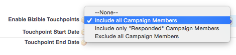
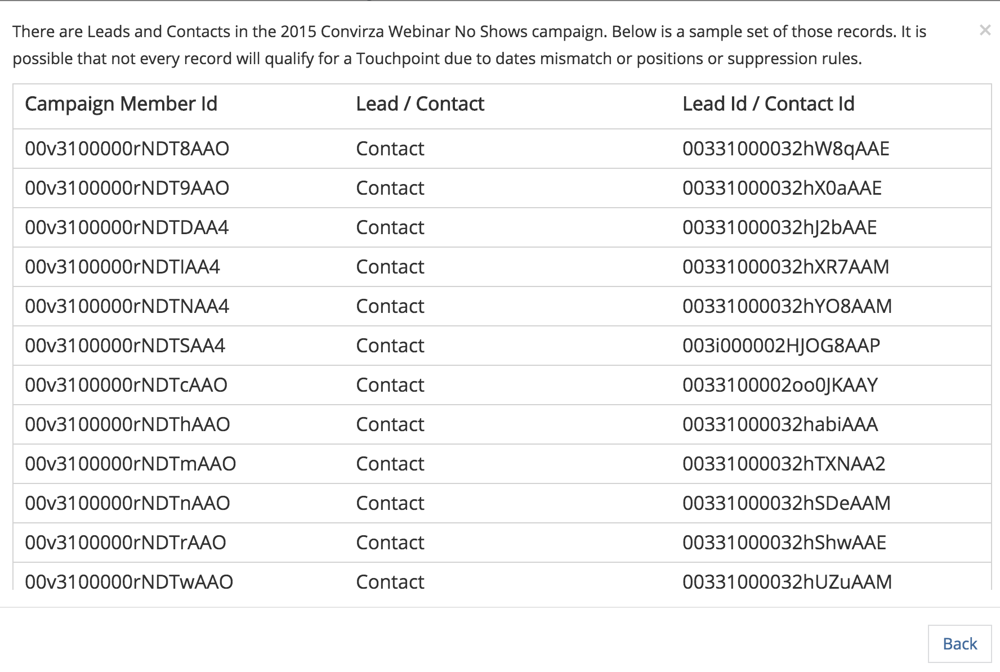

# Campagnes Dynamics et listes marketing {#dynamics-campaigns-and-marketing-lists}

>[!NOTE]
>Cet article traite d’un processus obsolète. Nous encourageons les utilisateurs et les utilisatrices à utiliser le [nouveau processus in-app amélioré](/help/channel-tracking-and-setup/offline-channels/custom-campaign-sync.md){target="_blank"}.

## Campagnes {#campaigns}

Les campagnes Dynamics sont utiles pour le suivi de l’activité marketing hors ligne et son inclusion dans le parcours omnicanal. Les campagnes doivent être liées aux leads ou aux contacts et peuvent être cumulées à la campagne via les réponses de la campagne ou les listes marketing.

## Réponses de la campagne {#campaign-responses}

Lorsque des leads ou des contacts sont directement ajoutés à une campagne, ils sont saisis en tant qu’enregistrement de réponse de campagne.

## Activer les points de contact {#enable-touchpoints}

Pour inclure ces enregistrements dans le parcours de point de contact, il existe quelques options pour les types de réponses de campagne à synchroniser. Dans l’enregistrement Campaign, il doit y avoir un champ personnalisé de la solution installée intitulé « [!UICONTROL  Activer les points de contact de l’acheteur ] ». Si vous ne le voyez pas, le champ doit être ajouté via l’éditeur de formulaire.

Vous pouvez choisir d&#39;inclure tous les enregistrements qui ont une réponse de campagne dans la campagne, ou uniquement ceux qui ont une réponse « Intéressants », ou par défaut, vous ne pouvez pas inclure les réponses de la campagne du tout. Vous pouvez soit laisser le champ vide, soit choisir explicitement de l’exclure.

[!DNL Marketo Measure] ne prend pas en charge les valeurs de réponse personnalisées.

Voici les valeurs de réponse de stock pour la réponse de la campagne :

En fonction de votre sélection, ces enregistrements sont désormais éligibles pour les points de contact dans le parcours Lead, Contact ou Opportunité. S’ils remplissent les critères, un point de contact « Dynamics Campaign » s’affiche dans le parcours.

L’une des raisons pour lesquelles une réponse de campagne peut ne pas s’afficher est qu’une activité Première touche et/ou Étape de création de lead avait déjà été enregistrée pour le lead/contact et que la fonctionnalité « PostLC » est désactivée ou a atteint son nombre maximal de points de contact.

## Date du point de contact {#touchpoint-date}

La date de point de contact d’une campagne correspond généralement à la date à laquelle la réponse de la campagne a été ajoutée à la campagne. Il peut être remplacé si le champ personnalisé de la solution installée intitulé « Date du Buyer Touchpoint » est renseigné. Si vous ne le voyez pas, le champ doit être ajouté via l’éditeur de formulaire.

Un exemple d’utilisation courant de ce champ concerne les événements pour lesquels une liste d’analyses de badges d’un événement est ajoutée au CRM jours après l’événement. L’utilisateur peut donc redéfinir la Date Buyer Touchpoint sur la date à laquelle l’événement s’est produit.

Champ personnalisé de date de 

## Listes marketing {#marketing-lists}

Les listes marketing sont un autre moyen d’inclure des prospects ou des contacts dans un parcours marketing. Les listes marketing sont uniques pour un groupe de leads ou de contacts, ce qui signifie que l’utilisateur doit choisir si sa liste est un ensemble de leads ou un ensemble de contacts.

[!DNL Marketo Measure] ne prend en charge que les listes marketing statiques. Nous ne prenons pas en charge les listes marketing dynamiques, car notre traitement nécessite de vérifier la date de modification d’un enregistrement. Cependant, étant donné qu’une liste dynamique est fréquemment modifiée, il n’existe aucune date de modification à laquelle les [!DNL Marketo Measure] peuvent vérifier. Cela nécessiterait un téléchargement constant du jeu de données complet tout au long de la journée.

La capture d’écran ci-dessus est une liste marketing pour les prospects. Les listes marketing sont associées aux campagnes et peuvent être associées à plusieurs campagnes. À moins que vous ne créiez qu’une seule liste marketing pour une campagne, [!DNL Marketo Measure] ne recommande pas aux clients d’utiliser des listes marketing pour suivre leurs campagnes. Il est peu probable que la même liste exacte de leads/contacts soit éligible pour les points de contact sur plusieurs campagnes.

## Activer les points de contact {#enable-touchpoints-1}

Pour activer une liste marketing pour les points de contact, il existe un paramètre distinct sur l’enregistrement Campaign intitulé « [!UICONTROL Synchroniser les listes marketing] » qui consiste en un simple changement par oui/non. Si vous ne le voyez pas, le champ doit être ajouté via l’éditeur de formulaire. Dans l’enregistrement Campagne, vous pouvez voir quelles listes marketing sont liées à la campagne afin de connaître le nombre de listes que vous activez.

## Date du point de contact {#touchpoint-date-1}

La date de point de contact d’une liste marketing est généralement la date de création du membre de liste, de sorte que la date à laquelle le prospect ou le contact a été ajouté à la liste marketing. Il peut être remplacé si le champ personnalisé de la solution installée intitulé « Date du Buyer Touchpoint » est renseigné. Si vous ne le voyez pas, le champ doit être ajouté via l’éditeur de formulaire.

Champ de date 

## Mappage de canal {#channel-mapping}

Les campagnes Dynamics sont regroupées dans vos canaux marketing personnalisés à l’aide du champ Type de campagne . Ils peuvent être modifiés dans votre menu Personnalisations Dynamics.

Les valeurs du menu Type de campagne sont extraites dans l’application [!DNL Marketo Measure]. **[!UICONTROL Mon compte]** > **[!UICONTROL Paramètres]** > **[!UICONTROL Canaux hors ligne]**.

Pour chaque type de campagne, il peut être mappé à une combinaison de canal et de sous-canal afin que chaque point de contact dérivé de la campagne ait le canal et le sous-canal mappés appropriés.

## Date de synchronisation de la campagne {#campaign-sync-date}

Cette option n&#39;est pas disponible pour les clients Dynamics

## Questions fréquentes {#faq}

**Pouvons-nous activer les points de contact sur les listes marketing ou uniquement les campagnes dans Dynamics ?**

Vous pouvez activer une liste marketing, mais elle doit être liée à une campagne, car l’option de synchronisation d’une liste marketing réside dans la campagne.

**Pouvons-nous utiliser des réponses de campagne et des listes marketing sur une campagne ?**

Oui.
