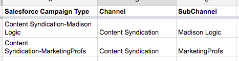

# Configuration de canal personnalisé hors ligne {#offline-custom-channel-setup}

## Prise en main {#getting-started}

Comparé à [!DNL Marketo Measure] gère les règles de canal en ligne. Vous remarquerez que les règles de canal hors ligne ne nécessitent pas l’utilisation d’une feuille de calcul. Cependant, le plan de mise en oeuvre comporte toujours une feuille de calcul, car cela peut s’avérer utile pour réfléchir à la manière dont vous souhaitez organiser vos canaux hors ligne.

La feuille de calcul comporte trois colonnes :

**[!UICONTROL Salesforce] Type de campagne** - Ajoutez les types de campagne identifiés dans [!DNL Salesforce] here

* Il peut s’agir, par exemple, d’un email, d’un webinaire, d’une conférence ou de toute valeur créée pour ce champ à laquelle vous souhaitez attribuer des points de contact.

**[!UICONTROL Canal]** - ajoutez vos différents canaux marketing ici

**[!UICONTROL Subchannel]** - ajouter les sous-canaux correspondants ici

## Logique de canal hors ligne {#offline-channel-logic}

[!DNL Marketo Measure] La logique de canal hors ligne est déterminée par l’objet Campaign, en particulier par la variable [!DNL Salesforce] Type de campagne. Chaque opération hors ligne doit avoir une [!DNL Salesforce] Type de campagne, tel que dîner ou commerce, car [!DNL Marketo Measure] repose sur ce champ pour déterminer le canal et le sous-canal à mapper.

Les types de campagne de la collecte de données régionale apparaîtront dans l’onglet du canal hors ligne, répertoriés sous [!DNL Salesforce] Type de campagne. Notez que [!DNL Marketo Measure] ne peut importer que les types de campagne SFDC pour les campagnes auxquelles sont associés des points de contact Acheteur.

C’est là que vous pouvez créer le mappage Canal/Sous-canal dans la variable [!DNL Marketo Measure] application. Cela implique probablement la création de canaux et de sous-canaux dans la variable [!DNL Marketo Measure] , qui est effectuée dans la section Créer des canaux de l’application, affichée dans l’image ci-dessous. De nouveaux canaux et sous-canaux doivent être créés pour [!DNL Marketo Measure] pour comprendre où pousser les points de contact. Vous pouvez décider comment mapper les types de campagne.

## Exemple de mappage de canaux {#channel-mapping-example}

Par exemple, imaginez que vous assistiez à deux [!DNL Salesforce] par an. Chaque conférence est cependant très différente et a un public cible unique. Vous voulez savoir laquelle des deux apporte plus de valeur. Dans votre [!DNL Salesforce] environnement, vous pouvez attribuer à l’événement de janvier le type de campagne &quot;Conférence&quot;, nommer votre canal &quot;[!DNL Salesforce],&quot; et votre sous-canal &quot;Conférence de janvier&quot;.

Maintenant, vous voulez faire la même chose pour la conférence de juin. Comme il s&#39;agit aussi d&#39;une conférence, on peut lui donner le même type de campagne, ici &quot;Conférence&quot;. Le canal est le même, [!DNL Salesforce], et le sous-canal de cette deuxième conférence est &quot;Conférence de juin&quot;. C&#39;est logique du point de vue de l&#39;organisation. Cependant, il est très déroutant pour le [!DNL Marketo Measure] pour lire et appliquer ces règles, car les deux campagnes ont le même type de campagne. [!DNL Marketo Measure] ne peut pas mapper les données d’un type à deux sous-canaux différents. Cela signifie que vous devez créer un type de campagne pour chaque sous-canal, mais les sous-canaux peuvent avoir le même canal.

Voici un exemple de logique : [!DNL Marketo Measure] ne serait pas en mesure de lire :

Dans le scénario ci-dessus, vous souhaitez créer un type de campagne unique, car vous ne pouvez pas mapper le même type de campagne à deux sous-canaux différents. Vous souhaitez plutôt configurer des types uniques tels que :

Tous les types de campagne existants doivent être inclus dans la carte de vos canaux et &quot;NULL&quot; doit être ajouté en tant que canal.

Prenez le temps d&#39;entrer dans [!DNL Salesforce] pour déterminer le nombre et la nature de vos types d’enregistrements existants, que vous souhaitez inclure, et si vous devez créer des campagnes supplémentaires en fonction des informations ci-dessus. Une fois que vous avez renseigné toutes les informations nécessaires, vous êtes prêt à les télécharger.

En savoir plus sur [synchronisation hors ligne [!DNL Salesforce] Campagnes avec [!DNL Marketo Measure]](/help/channel-tracking-and-setup/offline-channels/legacy-processes/syncing-offline-campaigns.md).

## Gestion des campagnes SFDC pour les efforts de marketing en ligne {#handling-sfdc-campaigns-for-online-marketing-efforts}

Il est courant que les équipes marketing créent des [!DNL Salesforce] campagnes pour effectuer le suivi de divers efforts de marketing numérique. Cette pratique ne pose aucun problème. Il est toutefois important de traiter ces campagnes différemment des campagnes réelles hors ligne, telles que le courrier ou les conférences, par exemple. Les campagnes liées aux événements numériques (interactions qui se produisent sur votre site web) ne doivent pas être synchronisées avec [!DNL Marketo Measure]. La synchronisation de ces campagnes entraînerait la duplication des points de contact, car la variable [!DNL Marketo Measure] JavaScript effectue déjà le suivi des efforts en ligne.

Une autre astuce pour gérer les campagnes pour les activités en ligne consiste à mapper la variable [!DNL Salesforce] Type de campagne à NULL. Pour ce faire, créez d’abord un canal dans la variable [!DNL Marketo Measure] application intitulée NULL comme illustré dans l’image ci-dessous. Cette variable se trouve dans la variable [!DNL Marketo Measure] sous **Création de canaux** . Cela s’avère utile si une campagne qui ne doit pas être synchronisée est synchronisée accidentellement. Il est facile de trouver la campagne et de corriger l’état de synchronisation en examinant tous les éléments regroupés sous NULL.

## Saisie de vos règles de canal hors ligne dans l’application {#entering-your-offline-channel-rules-to-the-app}

Une fois que vous avez modifié et mis à jour la feuille de calcul avec vos règles personnalisées, l’étape suivante consiste à recréer ce mappage de canal dans le [!DNL Marketo Measure] application : vous ne téléchargerez pas de feuille de calcul pour les canaux hors ligne. Vous devez saisir les informations dans les zones de liste de sélection, comme dans l’image ci-dessous. Pour le trouver, cliquez sur **[!UICONTROL Canaux hors ligne]** sous le **[!UICONTROL Canaux]** .

>[!TIP]
>
>Vous souhaitez déterminer _when_ a [!DNL Salesforce] Le type de campagne est déplacé vers le bas [!DNL Marketo Measure] mappage de canal ? Accédez à **[!UICONTROL Configuration]** > **[!UICONTROL Campagnes]** > **[!UICONTROL Champs]** > **[!UICONTROL Type]**. Vous pouvez ensuite voir les valeurs figurant dans la liste de sélection et celles qui sont inactives. Les inactifs n’apparaîtront pas comme type sélectionnable dans notre[!UICONTROL Canaux hors ligne]&quot;. Notez que ce processus peut prendre de quelques minutes à 48 heures.

Cliquez sur **[!UICONTROL Enregistrer]** lorsque vous avez terminé et [!DNL Marketo Measure] charge les modifications et traite à nouveau les données.

>[!MORELIKETHIS]
>
>* [[!DNL Marketo Measure] Tutorials : mappage de canaux hors ligne](https://experienceleague.adobe.com/en/docs/marketo-measure-learn/tutorials/onboarding/marketo-measure-salesforce/mapping-offline-channels){target="_blank"}
>
>* [[!DNL Marketo Measure] Tutorials : synchronisation des campagnes hors ligne](https://experienceleague.adobe.com/en/docs/marketo-measure-learn/tutorials/onboarding/marketo-measure-salesforce/syncing-offline-campaigns){target="_blank"}
>
>* [Intégration des programmes Marketo Engage](/help/marketo-measure-and-marketo/marketo-measure-integrations-with-marketo/marketo-engage-programs-integration.md#channel-mapping){target="_blank"}
