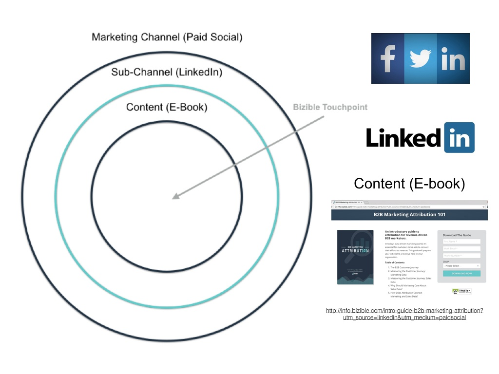

# Canaux et sous-canaux marketing {#marketing-channels-and-subchannels}

## But {#purpose}

Pour définir ce que sont un canal et un sous-canal dans [!DNL Marketo Measure], leur relation avec votre contenu, la différence entre les deux classifications et comment ils sont utilisés dans l’application [!DNL Marketo Measure].

## Vue d’ensemble {#overview}

Les canaux marketing permettent de classer (ou de « regrouper ») vos activités marketing afin de faciliter la création de rapports, aussi bien dans le tableau de bord Retour sur investissement de [!DNL Marketo Measure] que dans votre CRM. [!DNL Marketo Measure] s’accompagne de 12 canaux prêts à l’emploi (que vous pouvez personnaliser/renommer pour les adapter aux conventions de votre entreprise), ainsi que de la possibilité de créer d’autres canaux personnalisés pour un filtrage encore plus précis.

Chaque fois que vous recevez une visite sur l’une des pages de contenu de votre site (qu’il s’agisse d’une page web, d’un téléchargement de livre blanc, d’une URL de page, etc.), ce prospect est « regroupé » dans un canal/sous-canal en fonction de plusieurs paramètres UTM trouvés dans l’URL :

* Support
* Source
* Campagne
* Page de destination
* Site Web de renvoi

Pour personnaliser le « regroupement » de vos prospects en fonction de leurs paramètres UTM, vous pouvez utiliser des règles de canal. Pour plus d’informations sur la configuration et la maintenance des règles de canal, [cliquez ici](/help/channel-tracking-and-setup/online-channels/online-custom-channel-setup.md).

Découvrez comment configurer vos [canaux en ligne](/help/channel-tracking-and-setup/online-channels/online-custom-channel-setup.md) et vos [canaux hors ligne](/help/channel-tracking-and-setup/offline-channels/offline-custom-channel-setup.md), ainsi que la différence entre les deux.

**Canal marketing**

Le canal marketing est le niveau de classification le plus large et peut englober un important éventail de sous-canaux. Vous pouvez considérer ces sous-canaux comme le « type » de vos prospects. Exemples de canaux marketing : **Référencement payant, Référencement organique, Affichage,** et **Référencement social payant**. Le canal marketing correspond généralement à la valeur du paramètre utm_medium qui se trouve dans votre URL.

**Sous-canal**

Les sous-canaux constituent la deuxième pièce du puzzle lors du regroupement de vos prospects entrants. Les sous-canaux indiquent exactement _quelle_ itération de votre canal marketing a été utilisée. Par exemple, dans le canal marketing de référencement social payant, vous pouvez disposer de sous-canaux pour **AdWords**, **BingAds**, **Facebook**, etc. Le sous-canal correspond généralement à la valeur du paramètre utm_source qui se trouve dans votre URL.

## Exemple de cas d’utilisation {#use-case-example}

Le diagramme ci-dessous illustre un exemple de canal marketing, de sous-canal et de contenu basé sur une page web avec l’URL suivante :

* [http://info.bizible.com/intro-guide-b2b-marketing-attribution?utm_source=linkedin&amp;utm_medium=paidsocial](http://info.bizible.com/intro-guide-b2b-marketing-attribution?utm_source=linkedin&amp;utm_medium=paidsocial)*

Dans ce cas, le contenu auquel l’utilisateur ou l’utilisatrice tente d’accéder est le Guide d’introduction à l’attribution marketing B2B. [!DNL Marketo Measure] analyse l’URL qui mène à ce contenu à l’aide des règles de canal configurées dans cette organisation et les utilise pour « regrouper » ce prospect dans le canal marketing « Référencement social payant » et le sous-canal « LinkedIn ».

Autres exemples...

**Canal marketing (support)**

* PPC
* Référencement social payant
* Référencement social organique
* E-mail
* Événements et conférences
* Référencement organique/SEO
* Presse
* Programmes de parrainage

**Sous-canal (source du point de contact)**

* Google AdWords
* BingAds
* Publicités Facebook
* Adroll
* DoubleClick
* Capterra
* Campagnes au goutte-à-goutte
* Annonces LinkedIn

**Contenu (livres blancs, URL de page, articles de blog)**

* www.adobe.com/blog1
* www.adobe.com/whitepaper
* www.adobe.com/sign-up-now
