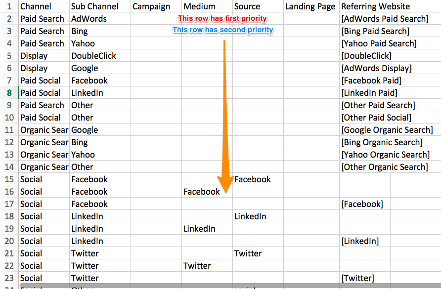
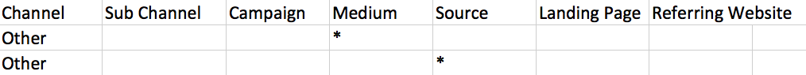

# Configuration de canal personnalisé en ligne {#online-custom-channel-setup}

Pour que les rapports soient précis, les canaux marketing doivent être configurés pour refléter la stratégie de gestion dynamique des balises de votre entreprise. Ce guide vous explique comment configurer au mieux vos règles de canal personnalisées.

## Avant de commencer {#before-you-begin}

Avant de commencer à créer vos règles de canal pour [!DNL Marketo Measure], prenez le temps de réfléchir à l’organisation de vos campagnes marketing et à leur place dans la variable [!DNL Marketo Measure] framework. Vous devez déterminer les canaux, sous-canaux, campagnes et sites web référents dont vous souhaitez effectuer le suivi.

À retenir :

* Votre entreprise peut créer un maximum de 40 canaux marketing personnalisés. Cela inclut les canaux hors ligne et en ligne.
* Votre entreprise peut créer jusqu’à 200 sous-canaux.
* Chaque collection, ou regroupement, de données a besoin de sa propre règle (ligne dans la feuille de calcul) pour spécifier la manière dont les données seront organisées. Soyez aussi précis que possible.
* [!DNL Marketo Measure] La logique donne la priorité aux données dans l’ordre décroissant, en commençant par la ligne supérieure de la feuille de calcul et en descendant. Il lit chaque intervalle, ou cellule, rangée après rangée, en cherchant la première rangée. Les données sont ensuite triées en fonction des valeurs contenues dans ces compartiments. Voir à ce sujet ci-dessous.
* Ne triez pas votre feuille dans l’ordre alphabétique, car cela interférera avec les règles logiques.
* Une fois le fichier téléchargé, vous ne pouvez pas modifier les règles pendant sept jours. [!DNL Marketo Measure] utilise cette période pour traiter et mettre à jour les points de contact.

## [!DNL Marketo Measure] Logique et priorités {#marketo-measure-logic-and-priorities}

La première étape consiste à télécharger la feuille de calcul de canal personnalisé à partir de la [!DNL Marketo Measure] application. Accédez à **Paramètres** sous le **Mon compte** et sélectionnez **En ligne**. Vous pouvez sélectionner l’une des options suivantes : **Télécharger le modèle d’origine** ou **Télécharger les règles actuelles**.

La feuille de calcul comporte 7 colonnes :

* **Canal :** ajoutez les différents canaux marketing ici
* **Subchannel :** ajoutez les sous-canaux correspondants ici
* **Campagne :** ajoutez des noms de campagne ici, que la valeur provienne des UTM ou des campagnes Salesforce pour la variable [!DNL Marketo Measure] Fonctionnalité des activités
* **Moyen :** la colonne medium représente la valeur du paramètre utm_medium
* **Source :** la colonne source représente la valeur du paramètre utm_source
* **Page d’entrée :** ajouter une landing page ici
* **Site Web de référence :** les URL des sites web qui renvoient du trafic vers vos pages ou les pages intégrées ; [!DNL Marketo Measure] logique (indiquée par crochets)

La 8e colonne indique les règles que vous ne pouvez pas supprimer de la feuille de calcul avec &quot;Ne pas supprimer&quot;. Le haut de la feuille de calcul comporte des règles de canal par défaut qui [!DNL Marketo Measure] recommande de ne pas modifier ni supprimer, même si vous n’utilisez pas ces canaux. [!DNL Marketo Measure] intègre de manière profonde ces plateformes afin qu’elles soient incluses par défaut.

Les lignes représentent des règles et l’ordre dans lequel [!DNL Marketo Measure] donne la priorité aux données. La première ligne est prioritaire par rapport à la seconde, la deuxième ligne l’est par rapport à la troisième, etc. Lorsque vous déterminez le canal marketing et le sous-canal dans lequel regrouper les points de contact, [!DNL Marketo Measure] lit la ligne de haut en bas, de gauche à droite, jusqu’à ce qu’elle trouve une ligne qui répond aux critères du point de contact. (IE si un point de contact possède utm_source=Facebook, le point de contact est placé dans le canal Social.Facebook en raison de la règle 15 de la capture d’écran).

[!DNL Marketo Measure] est fourni avec 12 canaux par défaut. Ces canaux sont en corrélation avec les plateformes avec lesquelles ils [!DNL Marketo Measure] est entièrement intégré. Que vous les utilisiez ou non, veuillez ne pas les supprimer. Si vous utilisez l’une de ces plateformes, Bing Ads par exemple, mais que vous préférez utiliser une convention d’affectation des noms différente pour le canal ou le sous-canal, vous pouvez mettre à jour le nom. Un exemple est illustré dans l’image ci-dessous.

La structure des règles est également importante. Les règles peuvent ressembler à des informations répétées et à des données manquantes, mais cette structure est intentionnelle. Pour un tri précis des données, il est nécessaire de mapper séparément chaque source individuelle au canal approprié, y compris les sources partageant les sous-canaux et les canaux. Plus les règles sont détaillées et granulaires, plus les résultats seront pertinents. En gros, il est recommandé d’écrire une règle détaillée pour chaque effort marketing dont vous souhaitez effectuer le suivi.

Tenez compte de la situation suivante : vous avez d’autres publicités dont vous ne souhaitez pas effectuer le suivi pour une raison quelconque, ou vous recevez des visites sur votre site web à partir d’un canal familier, mais pas d’une source familière. Cette situation peut entraîner une perte de données si [!DNL Marketo Measure] ne trouve pas la règle appropriée à utiliser pour trier les données. Pour empêcher cela, procédez comme suit : [!DNL Marketo Measure] vous conseille de rompre la règle sur plusieurs lignes.

Chaque paramètre ou composant de la règle est mappé séparément au canal. Par exemple, lorsque [!DNL Marketo Measure] has [!DNL Facebook] données à trier, il recherche des règles liées à [!DNL Facebook]. Il scanne de haut en bas. Dans l’exemple illustré ci-dessous, [!DNL Marketo Measure] comprendrait que pour la première [!DNL Facebook] subchannel, tout ce qu’il a à lire est le paramètre source pour déposer des données dans le compartiment de cette règle.

La règle suivante ne demande que le paramètre medium. Par conséquent, toutes les données comportant ce paramètre seront regroupées dans ce canal. Enfin pour [!DNL Facebook], toutes les données provenant de l’URL Facebook seront placées dans le dernier compartiment Facebook.

Le canal par défaut &quot;Autre&quot; existe pour capturer des données qui ne répondent à aucun critère de règle. Notez que certains des compartiments du canal Other contiennent des astérisques (&#42;). Ces astérisques représentent des caractères génériques qui agissent comme un fourre-tout.

En raison de [!DNL Marketo Measure] logique fonctionnant de haut en bas, notez que la règle de caractère générique, indiquée par un astérisque (&#42;), doit être placé à la fin de votre feuille de règles. Toutes les données qui ne sont pas capturées ou triées par les autres règles seront automatiquement ajoutées à ce compartiment par caractères génériques.

Vous trouverez ci-dessous d’autres exemples de logique de caractères génériques :

* &#42;email&#42; = contient &quot;email&quot;
* &#42;email = se termine par &quot;email&quot;
* email&#42; = [!UICONTROL commence par email]

En outre, si vous créez un sous-canal pour l’un de vos canaux, vous devrez créer un sous-canal pour toutes les règles sous ce canal. En d’autres termes, si vous créez un sous-canal, vous ne pouvez pas laisser le reste des colonnes vides.

## Configuration de vos règles de canaux personnalisés {#setting-up-your-custom-channels-rules}

Une fois que vous avez décidé comment organiser et classer par priorité vos données, vous êtes prêt à ajouter vos règles à la feuille de calcul. Voici quelques bonnes pratiques :

* Faites en sorte que vos règles soient aussi simples que possible dès le départ. Vous pouvez toujours vous inspirer des règles au fur et à mesure.
* N’ajoutez pas de caractères spéciaux dans les noms de canal (par exemple, $%#&amp;&#42;@)
* Ne modifiez pas les règles associées à BingAds et AdWords. Ces règles sont essentielles pour le regroupement automatique des données issues de la variable [!DNL Marketo Measure] Intégration de l’API à ces plateformes. Toutefois, la modification du nom du sous-canal et du canal en fonction de vos besoins n’est pas un problème.
* Ne supprimez pas les règles contenant une note &quot;Ne pas supprimer&quot;.
* Les règles de recherche organique sont toujours placées après la variable [!UICONTROL Règles de recherche payante]
* Vous ne pouvez pas créer de règles basées sur différents sous-domaines.
* Si plusieurs valeurs doivent être ajoutées dans une cellule de la feuille de calcul, veillez à les séparer par un point-virgule. `;` uniquement. Pas de virgules ni d’espaces.
* Il n’est pas nécessaire d’ajouter point com (.com) à la fin de l’URL de référence.
* Lors de l’ajout d’une URL de référence, ne la placez pas entre crochets comme les autres règles liées à l’API.

## Téléchargement de vos règles de canaux personnalisés {#uploading-your-custom-channels-rules}

Assurez-vous que toutes les nouvelles valeurs de canal et de sous-canal que vous ajoutez dans le fichier CSV ont déjà été ajoutées dans la zone des paramètres de canal de votre compte Bizible. Vérifiez deux fois que tous les noms de canal et de sous-canal correspondent dans le fichier CSV avec la zone des paramètres de canal de votre [!DNL Marketo Measure] compte . Veillez à rechercher les virgules et les espaces.

Si vous recevez un message d’erreur lors du chargement, corrigez le problème et effectuez un nouveau chargement. Si aucun message d’erreur n’est reçu, cliquez sur **Enregistrement et traitement** au bas de la page.
