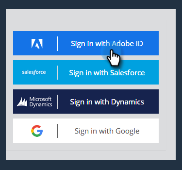

# Configuration d’Adobe Admin Console {#adobe-admin-console-setup}

La première étape pour utiliser [!DNL Marketo Measure] est de créer un compte Adobe Admin Console et de s’y connecter. Si vous n’avez pas encore reçu l’e-mail contenant les instructions de connexion, contactez la personne responsable de votre compte [!DNL Marketo Measure].

## Configurer votre Adobe Admin Console et votre fournisseur d’identité {#set-up-your-adobe-admin-console-and-identity-provider}

En tant que produit de la suite Adobe, [!DNL Marketo Measure] tire parti de toutes les fonctionnalités d’Adobe Admin Console pour Identity Management. Vous trouverez plus de ressources [ici](https://helpx.adobe.com/fr/enterprise/using/admin-console.html).

Nous vous recommandons de passer en revue toutes les ressources, bonnes pratiques et options disponibles pour [Identity Management](https://helpx.adobe.com/enterprise/using/set-up-identity.html).

Pour obtenir des conseils sur la configuration d’Identity Management dans Adobe Admin Console, contactez la personne responsable de votre compte [!DNL Marketo Measure].

Pour faciliter l’authentification et l’autorisation des utilisateurs et utilisatrices avec vos instances [!DNL Marketo Measure], vous devez suivre les étapes suivantes dans Adobe Admin Console :

**Configurer la fiche produit de [!DNL Marketo Measure]**

Lorsque vous accédez à Adobe Admin Console, vous pouvez voir les instances produits [!DNL Marketo Measure] présentes dans la section Vue d’ensemble.

Cliquer sur la fiche produit de [!DNL Marketo Measure] affichera toutes vos instances [!DNL Marketo Measure]. Par défaut, chaque instance [!DNL Marketo Measure] possède son propre profil, précédé du préfixe « [!DNL Marketo Measure] ». Tous les administrateurs, administratrices, utilisateurs ou utilisatrices ajoutés à ce profil ou à tout autre profil de cette instance pourront se connecter à [!DNL Marketo Measure].

Aucune action n’est requise pour créer un profil dans les instances produits [!DNL Marketo Measure].

Pour commencer à ajouter des utilisateurs et utilisatrices pouvant accéder à [!DNL Marketo Measure], reportez-vous à la section [Ajouter [!DNL Marketo Measure]  des administrateurs et administratrices et des  [!DNL Marketo Measure] utilisateurs et utilisatrices](#adding-marketo-measure-admins-and-marketo-measure-users) ci-dessous.

## Ajouter des administratreurs et administratrices [!DNL Marketo Measure] et des utilisateurs et utilisatrices [!DNL Marketo Measure] {#adding-marketo-measure-admins-and-marketo-measure-users}

L’étape suivante consiste à accorder l’accès à l’application [!DNL Marketo Measure] en ajoutant des utilisateurs et des utilisatrices. Vous pouvez le faire dans le répertoire des administrateurs et administratrices et des utilisateurs et utilisatrices de la fiche produit de [!DNL Marketo Measure].

| Type d’utilisateur ou d’utilisatrice | Description |
|---|---|
| Administrateurs et administratrices | Il s’agit des administrateurs, administratrices, utilisateurs et utilisatrices expérimentés de l’application [!DNL Marketo Measure] avec la capacité de mettre à jour et gérer les options de configuration spécifiques de [!DNL Marketo Measure]. |
| Utilisateurs et utilisatrices | Il s’agit des utilisateurs et utilisatrices standard de l’application [!DNL Marketo Measure] avec des autorisations en lecture seule dans l’application [!DNL Marketo Measure] |

Lors de l’ajout d’un utilisateur ou d’une utilisatrice à son groupe respectif, vous verrez leur [type d’identité répertorié](https://helpx.adobe.com/enterprise/admin-guide.html/enterprise/using/set-up-identity.ug.html).

>[!NOTE]
>
>Pour être un administrateur ou une administratrice de [!DNL Marketo Measure] (dans [experience.adobe.com/marketo-measure](https://experience.adobe.com/marketo-measure){target="_blank"}), un utilisateur ou une utilisatrice doit être ajouté en tant qu’utilisateur ou utilisatrice _et_ en tant qu’administrateur ou administratrice à n’importe quel profil produit de [!DNL Marketo Measure] dans la fiche produit de [!DNL Marketo Measure].

**Se connecter à[!DNL Marketo Measure]**

Une fois qu’une personne a été ajoutée à un profil produit, elle peut accéder à ses instances [!DNL Marketo Measure] en sélectionnant l’option **Se connecter avec Adobe ID** à l’adresse [experience.adobe.com/marketo-measure](https://experience.adobe.com/marketo-measure){target="_blank"}.

