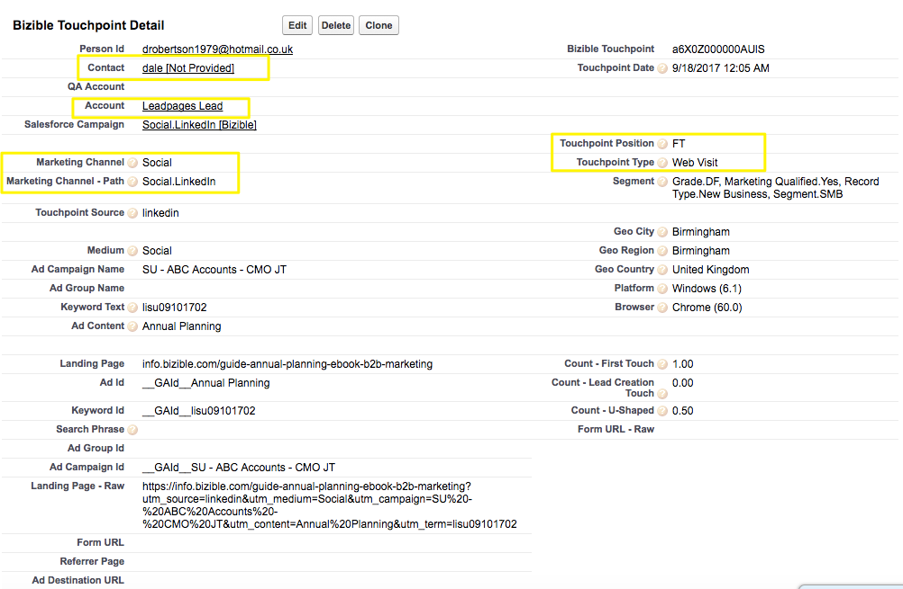
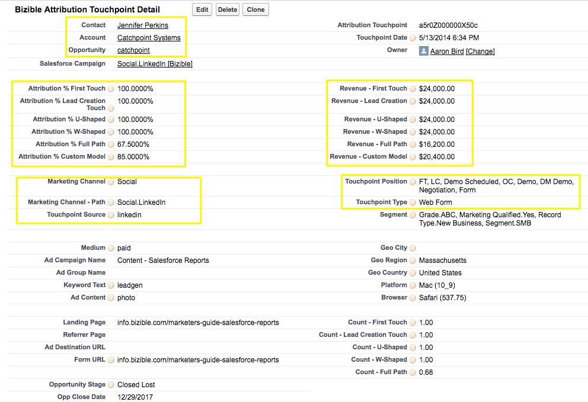

# Différence entre les points de contact acheteur et les points de contact d’attribution acheteur {#difference-between-buyer-touchpoints-and-buyer-attribution-touchpoints}

Découvrez ce qui définit un point de contact acheteur (BT) et un point de contact d’attribution acheteur (BAT), les différences entre les deux et les réponses aux questions fréquemment posées.

La différence principale entre les points de contact acheteur et les points de contact d’attribution acheteur réside dans leur relation avec les objets [!DNL Salesforce]. Les BT se rapportent aux objets Lead, Contact et Cas, mais pas à l’objet Opportunité. En d’autres termes, il n’y aura jamais de revenus associés aux Buyer Touchpoints.

Alors que les objets Buyer Attribution Touchpoint sont liés aux objets Contact, Compte et Opportunité, mais pas à l’objet Prospect, les Buyer Attribution Touchpoints ne sont pas liés aux Prospects. L’objet BAT permet de lier des revenus à des interactions marketing spécifiques.

Différence entre BT et BAT :

<table> 
 <colgroup> 
  <col> 
  <col> 
 </colgroup> 
 <tbody> 
  <tr> 
   <td>Point de contact acheteur (BT)</td> 
   <td>Point de contact d’attribution acheteur (BAT)</td> 
  </tr> 
  <tr> 
   <td> 
    <ul> 
     <li>Fait référence à des objets Prospect, Contact et Dossier.</li> 
     <li>N’est pas associé à l’objet Opportunité.</li> 
     <li>Le revenu n’est pas associé à un Buyer Touchpoint.</li> 
    </ul></td> 
   <td> 
    <ul> 
     <li>Fait référence à des objets Contact, Compte et Opportunité.</li> 
     <li>N’est pas associé à l’objet Lead.</li> 
     <li>Étant donné qu’un Buyer Attribution Touchpoint est associé à une opportunité, tous les BAT sont associés à un revenu.</li> 
    </ul></td> 
  </tr> 
 </tbody> 
</table>

## Questions fréquentes {#faq}

**À quel moment un point de contact acheteur devient-il un point de contact d’attribution acheteur ?**

Un BT devient un BAT une fois qu’il est associé à un contact lui-même associé à une opportunité. Ce qu’il faut comprendre, c’est qu’une interaction marketing spécifique peut être liée à un BT et à un BAT.

**Un point de contact acheteur peut-il avoir une position correspondant à la création d’une opportunité ?**

Un Buyer Touchpoint peut uniquement avoir trois positions : Première touche (FT), Création de lead (LC) ou Envoi de formulaire (points de contact intermédiaires). Puisque les BT ne sont pas liés à des opportunités, ils ne peuvent pas avoir de position de point de contact correspondant à la création ou à la fermeture d’une opportunité.

**Comment les données Buyer Touchpoint sont-elles exploitées ?**

En règle générale, les clientes et clients utilisent les données Buyer Touchpoint pour comprendre l’engagement en haut et au milieu de l’entonnoir. En d’autres termes, les utilisateurs et utilisatrices de [!DNL Marketo Measure] savent qui envoie des formulaires, qui visite leur site, quel article de blog est souvent consulté, quelle publicité AdWords amène à une conversion des prospects, etc. Les données Buyer Touchpoint sont particulièrement utiles pour comprendre l’engagement de vos leads et contacts.

**À quoi ressemble un point de contact acheteur dans Salesforce ?**

Voici une copie d’écran d’un BT dans [!DNL Salesforce] :

{width="600" zoomable="yes"}

**À quoi ressemble un point de contact d’attribution acheteur dans Salesforce ?**

Voici une copie d’écran d’un BAT dans [!DNL Salesforce] :

{width="600" zoomable="yes"}
