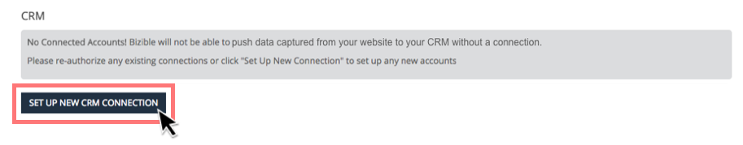

# Connexion de Marketo Measure à Salesforce {#connect-marketo-measure-to-salesforce}

Cet article présente un aperçu de la manière de connecter votre compte [!DNL Salesforce] à votre compte [!DNL Marketo Measure].

## Connexion de [!DNL Marketo Measure] à [!DNL Salesforce] {#connecting-marketo-measure-with-salesforce}

1. Utilisez un navigateur incognito pour vous connecter à [!DNL Marketo Measure].

1. Dans la barre de menus en haut de l’écran, accédez à **[!UICONTROL Mon compte]** et cliquez sur l’option **[!UICONTROL Paramètres]** .

1. Dans la colonne des options de paramétrage située à gauche, cliquez sur **[!UICONTROL Connexions]** située sous la section [!UICONTROL Intégrations] .

   

1. Sous la section CRM dans Connexions, cliquez sur **[!UICONTROL Configurer une nouvelle connexion CRM]**.

   

1. Une fenêtre contextuelle s’affiche vous demandant de sélectionner la connexion CRM. Cliquez sur **[!UICONTROL Connect]** en regard du logo [!DNL Salesforce].

   

1. Une fenêtre contextuelle finale s’affiche, vous demandant vos informations d’identification [!DNL Salesforce], sandbox ou production. Saisissez vos informations et cliquez sur **[!UICONTROL Autoriser]** pour connecter le compte à [!DNL Marketo Measure].

>[!NOTE]
>
>[!DNL Marketo Measure] ne peut être connecté qu&#39;à une instance [!DNL Salesforce] à la fois.
>
>* Une instance [!DNL Marketo Measure] peut être connectée à une instance Sandbox SFDC pour tester l’intégration avant de basculer vers votre instance de production SFDC.
>* Si vous testez d’abord avec un environnement de test SFDC, nous vous recommandons vivement d’en tester un qui est une réplique exacte de votre instance de production SFDC en termes de champs sur les objets Lead, Contact, Account, Opportunity, Campaign et Case. Si des triggers APEX actifs en production se déclenchent lors des mises à jour des objets Lead, Contact, Account, Opportunity, Campaign et Case, essayez de les activer dans votre environnement de test.
>* Une fois les tests terminés, vous mettez à jour votre compte [!DNL Marketo Measure] pour qu’il pointe vers votre environnement de production [!DNL Salesforce] (au lieu de sandbox [!DNL Salesforce]). En raison de la manière dont l’intégration a été créée, une fois qu’un compte [!DNL Marketo Measure] est connecté à Production [!DNL Salesforce], vous ne pouvez pas revenir &quot;en arrière&quot; et vous connecter à une organisation Sandbox [!DNL Salesforce].

## Utilisation des crédits API {#api-credits-usage}

Marketo Measure utilise une tâche d’intégration CRM pour interagir avec Salesforce d’un client par le biais d’un utilisateur intégré. Tous les exchanges de données via cet utilisateur utilisent des crédits API Salesforce. Vous avez la possibilité d’allouer un quota de crédit à un utilisateur d’intégration, qui sert à réguler les appels API excessifs. Ce quota ou cette limite est réinitialisé toutes les 24 heures.

Vous pouvez accéder à cette limite dans Marketo Measure via : **My Account** > **Settings** > **CRM** > **General** > **Daily CRM API limit**, et vous pouvez la configurer pour vos clients.

### Définition d’une limite pour les créations d’API {#setting-a-limit-for-api-credits}

1. Accédez à **Mon compte** > **Paramètres**.

1. Sous CRM, cliquez sur **Général**. L’option **Limite de l’API CRM quotidienne** s’affiche.

1. Cliquez sur l’icône représentant un cadenas pour la modifier.

   

1. Saisissez une limite supérieure ou égale à 100 000. Cliquez sur **Enregistrer** lorsque vous avez terminé.

   

>[!NOTE]
>
>Pour augmenter les crédits d’API Salesforce disponibles pour votre solution connectée, contactez votre administrateur Salesforce et référencez [ce document Salesforce](https://developer.salesforce.com/docs/atlas.en-us.salesforce_app_limits_cheatsheet.meta/salesforce_app_limits_cheatsheet/salesforce_app_limits_platform_api.htm){target="_blank"}.

>[!MORELIKETHIS]
>
>[Notifications d’erreur](/help/configuration-and-setup/getting-started-with-marketo-measure/error-notifications.md){target="_blank"}
