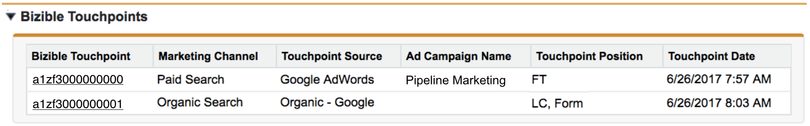

# Objets Salesforce de [!DNL Marketo Measure] {#marketo-measure-salesforce-objects}

>[!NOTE]
>
>Vous pouvez voir des instructions spécifiant &quot;[!DNL Marketo Measure]&quot; dans notre documentation, mais consultez toujours &quot;Bizible&quot; dans votre CRM. Nous nous efforçons de mettre à jour cette version et la nouvelle image sera bientôt répercutée dans votre CRM.

When [!DNL Marketo Measure] est installé dans [!DNL Salesforce] (SFDC), plusieurs [!DNL Marketo Measure] Les objets sont ajoutés. Cet article explique plusieurs de ces [!DNL Marketo Measure] Objets. Certains objets [!DNL Marketo Measure] ajoute à [!DNL Salesforce] sont :

* [Point de contact de l&#39;acheteur](#touchpoint)
* [Point de contact d’attribution de l’achat](#attribution)
* [[!DNL Marketo Measure] Individu](#person)
* [[!DNL Marketo Measure] Tests A/B](#ab)
* [[!DNL Marketo Measure] Événements](#events)

Les points de contact capturés par les éléments dont vous souhaitez effectuer le suivi écrivent dans les objets personnalisés créés par l’installation de la variable [!DNL Bizible Salesforce] module.

[!DNL Marketo Measure] Les objets sont associés à des normes spécifiques [!DNL Salesforce] Objets. Cela vous permet de créer des rapports sur [!DNL Marketo Measure] et [!DNL Salesforce] Objets combinés. Le tableau ci-dessous indique la [!DNL Salesforce] Objet : [!DNL Marketo Measure] L&#39;objet se rapporte à .

## Point de contact de l&#39;acheteur {#buyer-touchpoint}

La variable [!UICONTROL Point de contact de l’utilisateur] (BT) Object raconte l’histoire marketing d’un individu. Il regroupe toutes les données relatives aux points de contact marketing générés par les Leads et les contacts. Le BT vous montre des informations telles que le canal marketing d’où provient le point de contact ou la campagne publicitaire qui a amené ce prospect/contact particulier à votre site web.

L’objet BT est visible sur les pages Leads et Contacts sous la forme d’un objet **Liste connexe** (voir image ci-dessous).

La liste liée aux BT affiche tous les points de contact appartenant au prospect ou au contact. Dans la liste sont des [!DNL Marketo Measure] Champs qui fournissent des détails supplémentaires sur chaque point de contact. En cliquant sur le numéro d’identifiant du point de contact de l’acheteur, vous accédez à la page Détails du point de contact de l’acheteur, qui fournit encore plus de détails sur le point de contact, comme la première page web visitée par le prospect/contact lors de cette session web (**landing page**).

## Point de contact d’attribution de l’achat {#buyer-attribution-touchpoint}

La variable [!UICONTROL Point de contact d’attribution de l’achat] L’objet raconte l’histoire des interactions marketing de vos contacts à propos d’une opportunité. Il affiche la variable *attribution* données liées aux points de contact marketing. Cet objet vous permet de voir le montant du crédit de recettes attribué à chaque point de contact marketing. Le type de modèle d’attribution que vous utilisez détermine le pourcentage de recettes attribué aux points de contact.

Les points de contact d’attribution d’achat (BAT) ne sont créés qu’une fois qu’une opportunité a été créée, relative à des contacts qui disposent de données de point de contact d’achat (BT). Les MAT ne seront pas créées sans opportunité. Une fois l’opportunité créée, l’objet BAT utilise la variable [!DNL Salesforce] *Quantité* sur l’ opportunité pour comprendre le montant des recettes à attribuer aux points de contact.

A **workflow** doit être créé si vous utilisez une [champ Montant personnalisé](/help/advanced-marketo-measure-features/custom-revenue-amount/using-a-custom-revenue-amount-field.md) pour afficher les recettes sur l’objet d’opportunité. [!DNL Marketo Measure] n’est pas en mesure de lire les informations affichées dans les champs Montant personnalisés et, par conséquent, ne peut pas renseigner les données d’attribution des recettes sur les points de contact. Ce workflow utilisera la variable **[!DNL Marketo Measure]Montant de l’opportunité** Champ, l’un des [!DNL Marketo Measure] champs personnalisés, pour associer la valeur des recettes du champ Montant personnalisé au champ Montant de l’opportunité .

L’objet BAT est visible sur la [!UICONTROL Opportunité], [!UICONTROL Contact], et [!UICONTROL Compte] Objet en tant que liste associée. Cette liste affiche tous les points de contact avec les données d’attribution appartenant à une opportunité. Si vous cliquez sur l’identifiant de point de contact d’attribution de l’achat, vous accédez à la page Détails du point de contact d’attribution de l’achat . Vous pourrez y voir des données d’attribution plus spécifiques et des informations sur l’origine du point de contact (similaires à ce qui est fourni à partir de l’objet point de contact de l’acheteur).

## [!DNL Marketo Measure] Individu {#marketo-measure-person}

La variable [!DNL Marketo Measure] Objet Personne associe les objets Lead et Contact. Salesforce ne permet pas de créer des rapports à l’aide de l’objet Lead et Contact dans le même rapport. Par rapport à l’objet Lead et Contact, la variable [!DNL Marketo Measure] Personne vous permet de créer des rapports sur les deux objets dans le même rapport. Cela s’avère particulièrement utile lorsqu’une piste a été convertie en contact. Sur une [!DNL Marketo Measure] Enregistrement de personne : vous verrez une recherche de l’enregistrement de piste et/ou de contact correspondant, une liste associée des points de contact liés à la personne et l’ID de personne (qui est toujours l’adresse électronique du prospect/contact). Depuis la variable [!DNL Marketo Measure] Personne se rapporte à l’objet Lead &amp; Contact, il n’y aura jamais de [!DNL Marketo Measure] Enregistrement de personne lié à un point de contact d’attribution d’achat. Voici un exemple de [!DNL Marketo Measure] Enregistrement de personne dans Salesforce :

## [!DNL Marketo Measure] Test A/B {#marketo-measure-a-b-test}

Si vous exécutez des tests A/B via [!DNL Optimizely] ou VWO (Visual Web Optimizer), vous pouvez connecter ces comptes à vos [!DNL Marketo Measure] pour afficher les données de test A/B dans Salesforce. La variable [!DNL Marketo Measure] L’objet de test A/B vous permet essentiellement de prendre les données de test A/B d’ Optimizely/VWO et de lier les données aux pistes et contacts.

La variable [!DNL Marketo Measure] L’objet de test A/B s’affiche sous la forme d’une liste associée sur [!UICONTROL Pistes], [!UICONTROL Contacts] et [!UICONTROL Opportunité] pages. La liste répertorie toutes les expériences et variations que vous exécutez via Optimizely ou VWO et vous permet de voir les expériences/variations en rapport avec des pistes et des contacts spécifiques.

## [!DNL Marketo Measure] Événements {#marketo-measure-events}

La variable [!DNL Marketo Measure] Objet d’événements vous permet de suivre des événements spécifiques qui se produisent sur votre site web. Pour effectuer le suivi d’événements spécifiques qui se produisent sur votre site web, du code personnalisé doit être ajouté à vos pages en plus des [!DNL Marketo Measure] Javascript. Les informations capturées s’affichent dans la variable [!DNL Marketo Measure] Liste liée aux objets, qui se trouve dans la variable [!UICONTROL Pistes], [!UICONTROL Contacts] et [!UICONTROL Opportunité] pages. La variable [!DNL Marketo Measure] Objet d’événements *ne fait pas* lien vers les données d’attribution. L’objectif de cet objet est de voir si des personnes effectuent des actions spécifiques sur votre site web.

## [!DNL Marketo Measure] Champs {#marketo-measure-fields}

Données capturées par la variable [!DNL Marketo Measure] Javascript sera transmis dans la balise personnalisée [!DNL Marketo Measure] Champs dans notre [!DNL Marketo Measure] Objets. Certains champs ne seront présents que sur certains objets. Pour un glossaire de tous les [!DNL Marketo Measure] champs, s&#39;il vous plaît [cliquez ici](/help/introduction-to-marketo-measure/overview-resources/glossary-of-marketo-measure-fields.md). Pour une visualisation dont [!DNL Marketo Measure] Objet [!DNL Marketo Measure] Le champ se rapporte à, s&#39;il vous plaît [cliquez ici](/help/configuration-and-setup/marketo-measure-and-salesforce/marketo-measure-object-and-field-taxonomy.md).

## [!DNL Marketo Measure] Rapports et tableaux de bord {#marketo-measure-reports-and-dashboards}

La variable [!DNL Marketo Measure] Rapports et tableaux de bord ajoutés à vos [!DNL Salesforce] vous offre des fonctionnalités prêtes à l’emploi de rapports et de visualisation de données. Ces éléments sont de base. [!DNL Marketo Measure] rapports pour vous permettre d’organiser, d’analyser et de comprendre rapidement les données des points de contact.
