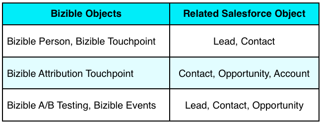

# Objets Salesforce de [!DNL Marketo Measure] {#marketo-measure-salesforce-objects}

>[!NOTE]
>Des instructions spécifiant « [!DNL Marketo Measure] » peuvent s’afficher dans la documentation. Toutefois, votre gestion de la relation client (CRM) mentionne encore « Bizible ». Nous nous efforçons de mettre cela à jour. Notre nouvelle identité de marque (rebranding) sera bientôt répercutée dans votre CRM.

Lorsque [!DNL Marketo Measure] est installé dans [!DNL Salesforce] (SFDC), plusieurs objets [!DNL Marketo Measure] personnalisés sont ajoutés. Cet article fournit une explication de plusieurs de ces objets [!DNL Marketo Measure] personnalisés. Voici quelques objets que [!DNL Marketo Measure] ajoute à [!DNL Salesforce] :

* [Buyer Touchpoint](#touchpoint)
* [Buyer Attribution Touchpoint](#attribution)
* [Personne [!DNL Marketo Measure]](#person)
* [[!DNL Marketo Measure] A/B Testing](#ab)
* [[!DNL Marketo Measure] Événements](#events)

Les points de contact capturés par les éléments que vous souhaitez suivre écriront dans les objets personnalisés créés par l’installation du package [!DNL Bizible Salesforce].

Les objets [!DNL Marketo Measure] se rapportent à des objets [!DNL Salesforce] standard spécifiques. Vous pouvez ainsi créer des rapports sur des objets [!DNL Marketo Measure] et [!DNL Salesforce]. Le tableau ci-dessous indique à quel objet [!DNL Salesforce] l’objet [!DNL Marketo Measure] se rapporte.

## Buyer Touchpoint {#buyer-touchpoint}

L’objet [!UICONTROL Buyer Touchpoint] (BT) raconte l’histoire marketing d’un individu. Il héberge toutes les données relatives aux points de contact marketing générés par les leads et les contacts. Le BT vous montre des informations telles que le canal marketing d’où provient le point de contact ou la campagne publicitaire qui a amené ce prospect/contact spécifique sur votre site web.

L’objet BT est visible sur les pages Leads et Contacts sous la forme d’une **Liste associée** (voir l’image ci-dessous).

La liste liée à BT affiche tous les points de contact appartenant au lead ou au contact. La liste contient des champs de [!DNL Marketo Measure] personnalisés qui fournissent des détails supplémentaires sur chaque point de contact. Cliquez sur le numéro de Buyer Touchpoint ID pour accéder à la page Détails du Buyer Touchpoint , qui fournit encore plus d’informations sur le point de contact, comme la première page web visitée par le prospect/contact au cours de cette session web (**page de destination**).

## Buyer Attribution Touchpoint {#buyer-attribution-touchpoint}

L’objet [!UICONTROL Buyer Attribution Touchpoint] raconte l’histoire des interactions marketing de vos contacts liées à une opportunité. Il affiche les données *attribution* liées aux points de contact marketing. Cet objet vous permet de voir le montant du crédit de revenu attribué à chaque point de contact marketing. Le type de modèle d’attribution que vous utilisez détermine le pourcentage de chiffre d’affaires attribué aux points de contact.

Les points de contact d’attribution de l’acheteur (BAT) ne sont créés qu’une fois qu’une opportunité est créée, laquelle concerne les contacts qui possèdent des données Buyer Touchpoint (BT). Les BAT ne seront pas créées sans une opportunité. Une fois l’opportunité créée, l’objet BAT utilise le champ [!DNL Salesforce] *Montant* de l’opportunité pour déterminer le montant du chiffre d’affaires à attribuer aux points de contact.

Un **workflow** doit être créé si vous utilisez un [champ de montant personnalisé](/help/advanced-features/custom-revenue-amount/using-a-custom-revenue-amount-field.md) pour afficher le chiffre d’affaires sur l’objet d’opportunité. [!DNL Marketo Measure] ne peut pas lire les informations affichées dans les champs de montant personnalisés et ne peut donc pas renseigner les données d’attribution de chiffre d’affaires sur les points de contact. Ce workflow utilisera le champ **[!DNL Marketo Measure]du montant de l’opportunité** l’un des [!DNL Marketo Measure] champs personnalisés, pour mapper la valeur du chiffre d’affaires du champ personnalisé du montant au champ du montant de l’opportunité.

L’objet BAT est visible sur les objets [!UICONTROL Opportunité], [!UICONTROL Contact] et [!UICONTROL Compte] en tant que liste associée. Cette liste affiche tous les points de contact avec les données d’attribution appartenant à une opportunité. Cliquer sur l’ID Buyer Attribution Touchpoint vous redirige vers la page Détails du Buyer Attribution Touchpoint . Vous y trouverez des données d’attribution plus spécifiques et des informations sur l’origine du point de contact (similaires à ce qui est fourni à partir de l’objet Buyer Touchpoint).

## Personne [!DNL Marketo Measure] {#marketo-measure-person}

L’objet de personne [!DNL Marketo Measure] met en relation les objets de lead et de contact. Par défaut, Salesforce ne fournit pas la possibilité de créer des rapports à l’aide de l’objet Lead et Contact dans le même rapport. En établissant un rapport avec l’objet de lead et de contact, la personne [!DNL Marketo Measure] vous permet de créer un rapport sur les deux objets dans le même rapport. Cela s’avère particulièrement utile lorsqu’un prospect a été converti en contact. Sur un enregistrement de personne [!DNL Marketo Measure], vous verrez une recherche sur l’enregistrement de lead et/ou de contact correspondant, une liste connexe des points de contact liés à la personne et l’ID de personne (qui est toujours l’adresse e-mail du lead/contact). Puisque la personne [!DNL Marketo Measure] est liée à l’objet de lead et de contact, aucun enregistrement de personne [!DNL Marketo Measure] lié à un Buyer Attribution Touchpoint ne sera jamais créé. Vous trouverez ci-dessous un exemple d’enregistrement [!DNL Marketo Measure] Personne dans Salesforce :

## Test A/B [!DNL Marketo Measure] {#marketo-measure-a-b-test}

Si vous exécutez des tests A/B via [!DNL Optimizely] ou VWO (Visual Web Optimizer), vous pouvez connecter ces comptes à votre compte [!DNL Marketo Measure] pour afficher les données des tests A/B dans Salesforce. L’objet de test A/B [!DNL Marketo Measure] vous permet essentiellement de prendre les données de test A/B d’Optimizely/VWO et de lier les données aux leads et aux contacts.

L’objet de test A/B [!DNL Marketo Measure] s’affiche sous la forme d’une liste associée sur les pages [!UICONTROL Leads], [!UICONTROL Contacts] et [!UICONTROL Opportunité]. La liste fait apparaître toutes les expériences et variations que vous exécutez dans Optimizely ou VWO, et vous permet de voir les expériences/variations en ce qui concerne des prospects et contacts spécifiques.

## [!DNL Marketo Measure] Événements {#marketo-measure-events}

L’objet Événements [!DNL Marketo Measure] vous permet de suivre des événements spécifiques qui se produisent sur votre site web. Pour suivre des événements spécifiques qui se produisent sur votre site web, du code personnalisé doit être ajouté à vos pages en plus du code JavaScript [!DNL Marketo Measure]. Les informations capturées s’affichent dans la liste [!DNL Marketo Measure] liée aux objets, qui se trouve sur les pages [!UICONTROL Leads], [!UICONTROL Contacts] et [!UICONTROL Opportunité]. L’objet Événements [!DNL Marketo Measure] *ne lie pas* aux données d’attribution. L’objectif de cet objet est de voir si des personnes effectuent des actions spécifiques sur votre site web.

## [!DNL Marketo Measure] Fields {#marketo-measure-fields}

Les données capturées par le JavaScript [!DNL Marketo Measure] sont transmises dans les champs de [!DNL Marketo Measure] personnalisés au sein des objets [!DNL Marketo Measure]. Certains champs ne sont présents que sur certains objets. Vous pouvez consulter le [glossaire des [champs [!DNL Marketo Measure]]](/help/glossary.md) et une [visualisation des [!DNL Marketo Measure] objets](/help/configuration-and-setup/marketo-measure-and-salesforce/marketo-measure-object-and-field-taxonomy.md) associés.

## Rapports et tableaux de bord [!DNL Marketo Measure] {#marketo-measure-reports-and-dashboards}

Les rapports et tableaux de bord [!DNL Marketo Measure] qui sont ajoutés à votre [!DNL Salesforce] vous offrent des fonctionnalités prêtes à l’emploi de création de rapports et de visualisation des données. Il s’agit de rapports de [!DNL Marketo Measure] de base pour vous permettre d’organiser, d’analyser et de comprendre rapidement les données de point de contact.
