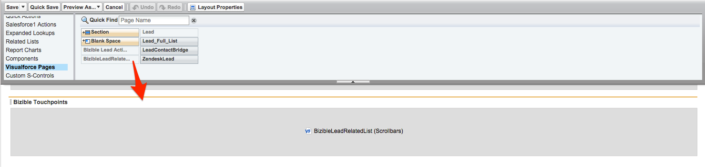

# Instructions de mise en page {#page-layout-instructions}

>[!NOTE]
>
>Vous pouvez voir des instructions spécifiant &quot;[!DNL Marketo Measure]&quot; dans la documentation, mais consultez toujours &quot;Bizible&quot; dans votre CRM. Nous nous efforçons de mettre à jour cette version. Notre nouvelle identité (rebranding) sera bientôt répercutée dans votre CRM.

Pour afficher facilement [!DNL Marketo Measure] , il est recommandé de mettre à jour les mises en page pour le [!UICONTROL Compte], [!UICONTROL Contact], [!UICONTROL prospect], [!UICONTROL Opportunité], et [!UICONTROL Campagne] Objets. Les instructions sont ventilées pour chaque disposition de page d’objet ci-dessous.

Pour commencer, accédez d’abord à [!DNL Salesforce] Configurez les paramètres et recherchez [!UICONTROL Personnaliser] .

## Objet de campagne {#campaign-object}

Il est recommandé d’ajouter la variable [!DNL Marketo Measure] dans votre campagne SFDC pour votre environnement de test uniquement. Les champs peuvent être utilisés pour tester la génération du point de contact. En production, il est recommandé de n’ajouter que la variable [!DNL Marketo Measure] Bouton Mettre à jour la date du point de contact en bloc. Il n’est pas recommandé d’ajouter la variable [!DNL Marketo Measure] à la production puisque vous pouvez créer la règle de synchronisation de campagne.

1. Dans l’option Créer , sélectionnez **[!UICONTROL Campagnes]**.

1. Cliquez sur **[!UICONTROL Disposition de page]**.

   

1. Cliquez sur **[!UICONTROL Modifier]** en regard de la mise en page à mettre à jour.

   

1. Dans le [!UICONTROL fields] , sélectionnez l’option **[!UICONTROL Activation des points de contact d’achat]** et faites-le glisser à l’emplacement de votre choix sur la page. Ajoutez ensuite le **[!UICONTROL Date de début du point de contact]** et **[!UICONTROL Date de fin du point de contact]** des champs.

   

1. Ensuite, dans la partie supérieure de la page, cliquez sur le[!UICONTROL Boutons]&quot; dans le menu de recherche rapide.

1. Faites glisser le **[!UICONTROL Date de point de contact de mise à jour en bloc]** à votre section de boutons personnalisés.

   

1. Cliquez sur **[!UICONTROL Enregistrer]**.

   >[!NOTE]
   >
   >Si vous utilisez plusieurs types d’enregistrements Campaign, vous devez mettre à jour les valeurs de liste de sélection pour la variable **[!UICONTROL Activation des points de contact d’achat]** champ . Voir [cet article](/help/channel-tracking-and-setup/offline-channels/configurations-for-multiple-campaign-record-types.md) pour obtenir des instructions.

## Prospects {#leads}

1. Dans l’option Créer , sélectionnez **[!UICONTROL Pistes]**.

1. Cliquez sur **[!UICONTROL Disposition de page]**.

1. Cliquez sur **[!UICONTROL Modifier]** en regard de la mise en page à mettre à jour. Gardez à l’esprit que plusieurs mises en page peuvent contenir les sections Points de contact de l’acheteur .

1. Cliquez sur l’option de page VisualForce à gauche dans le menu de recherche rapide.

1. Créez une section et nommez-la &quot;Points de contact d’achat&quot;.

   >[!NOTE]
   >
   >Sélectionnez le format &quot;une colonne&quot; pour chacune de ces sections.

1. Faites glisser le **[!UICONTROL Liste liée aux pistes Marketo Measure]** Page VisualForce dans la section de mise en page.

   

1. Cliquez sur la clé à molette dans le [!DNL VisualForce] et définissez la hauteur sur 100 et activez les barres de défilement.

1. De retour dans le menu, sélectionnez l’option [!UICONTROL Applications de canevas] et créez une section appelée &quot;Marketo Measure Insights&quot; sous les points de contact. [!DNL VisualForce] de la section que vous avez créée.

   >[!NOTE]
   >
   >Sélectionnez le format &quot;une colonne&quot; pour chacune de ces sections.

1. Faites glisser le [!DNL Marketo Measure Insights] Application de canevas dans cette section nouvellement créée. Cliquez sur **Enregistrer**. Il est parfois nécessaire d’enregistrer d’abord la mise en page avant de la déposer dans l’application Canvas, car Salesforce ne la reconnaît pas instantanément. Ainsi, après avoir créé la section, enregistrez la mise en page, puis modifiez-la pour faire glisser l’application de canevas dans cette section. Cela s’applique à chaque objet.

   >[!NOTE]
   >
   >Pour le [!DNL Marketo Measure Insights] Application de canevas pour un bon fonctionnement, [les autorisations doivent être correctement configurées.](/help/configuration-and-setup/marketo-measure-insights-canvas-app/marketo-measure-insights-configuration.md).

   >[!TIP]
   >
   >La plupart des clients n’utilisent pas les champs qui se terminent par (FT) ou (LC), car il s’agit de champs hérités d’avant la balise [!DNL Marketo Measure] Le point de contact existait en tant qu’objet.

Si vous utilisez la variable [!DNL Marketo Measure] fonction ABM, [Cliquez ici pour obtenir des instructions de mise en page supplémentaires](/help/advanced-marketo-measure-features/account-based-marketing/account-based-marketing-overview.md).

## Contacts {#contacts}

1. Dans l’option Créer , sélectionnez **[!UICONTROL Contacts]**.

1. Cliquez sur **[!UICONTROL Disposition de page]**.

1. Sélectionnez la mise en page que vous souhaitez modifier.

   Accédez à l’option Listes connexes du menu de recherche rapide et ajoutez le **[!UICONTROL Points de contact de l’utilisateur]** liste associée.

1. Cliquez sur l&#39;icône en forme de clé à molette et ajoutez les colonnes suivantes dans cet ordre :

   * Point de contact de l&#39;acheteur
   * Canal marketing
   * Source du point de contact
   * Nom de la campagne publicitaire
   * Position du point de contact
   * Date du Touchpoint

1. Trier Par : Date Du Point De Contact, Croissant.

   

1. Développez l’option Boutons et désélectionnez **[!UICONTROL Nouveau]**.

   

1. Revenez au [!UICONTROL Liste connexe] dans le menu, puis ajoutez maintenant la fonction **[!UICONTROL Point de contact d’attribution de l’achat]** liste associée.

1. Cliquez sur l&#39;icône en forme de clé à molette et ajoutez les colonnes suivantes dans cet ordre :

   * Point de contact d’attribution
   * Canal marketing
   * Opportunité
   * Nom de la campagne publicitaire
   * Type de point de contact
   * Position du point de contact
   * Attribution % en forme W (_ou modèle d’attribution le plus robuste, tel que Chemin complet ou Personnalisé_)
   * En forme de W Recettes (_ou modèle d’attribution le plus robuste, tel que Chemin complet ou Personnalisé_)
   * Date du Touchpoint

1. Tri par point de contact [!UICONTROL Date] > [!UICONTROL ascendant].

1. Développez la section Boutons et désélectionnez **[!UICONTROL Nouveau]**.

1. Cliquez sur **[!UICONTROL Enregistrer]**.

## Opportunités {#opportunities}

1. Dans l’option Créer , sélectionnez **[!UICONTROL Opportunités]**.

1. Cliquez sur **[!UICONTROL Disposition de page]**.

1. Sélectionnez la mise en page que vous souhaitez modifier.

1. Ajoutez la variable **[!UICONTROL Point de contact d’attribution de l’achat]** Liste connexe, puis cliquez sur la clé à molette pour ajouter les colonnes suivantes pour les opportunités :

   * Point de contact d’attribution
   * Canal marketing
   * Contact
   * Nom de la campagne publicitaire
   * Type de point de contact
   * Position du point de contact
   * Attribution % en forme W (_ou modèle d’attribution le plus robuste, tel que Chemin complet ou Personnalisé_)
   * En forme de W Recettes (_ou modèle d’attribution le plus robuste, tel que Chemin complet ou Personnalisé_)
   * Date du Touchpoint

1. Tri par [!UICONTROL Date du point de contact] > [!UICONTROL ascendant].

1. Désélectionner **[!UICONTROL Nouveau]** dans la fonction [!UICONTROL Boutons] .

1. Cliquez sur **[!UICONTROL Enregistrer]**.

## Comptes {#accounts}

1. Dans l’option Créer , sélectionnez **[!UICONTROL Comptes]**.

1. Cliquez sur **[!UICONTROL Disposition de page]**.

1. Sélectionnez la mise en page que vous souhaitez modifier.

1. Ajoutez la variable **[!UICONTROL Point de contact d’attribution de l’achat]** Liste connexe, puis cliquez sur la clé à molette pour ajouter les colonnes suivantes :

   * Point de contact d’attribution
   * Canal marketing
   * Opportunité
   * Nom de la campagne publicitaire
   * Type de point de contact
   * Position du point de contact
   * Attribution % en forme W (_ou modèle d’attribution le plus robuste, tel que Chemin complet ou Personnalisé_)
   * En forme de W Recettes (_ou modèle d’attribution le plus robuste, tel que Chemin complet ou Personnalisé_)
   * Date du Touchpoint

1. Tri par date de point de contact > ascendant.

1. Désélectionner **[!UICONTROL Nouveau]** dans la fonction [!UICONTROL Boutons] .

1. Cliquez sur **[!UICONTROL Enregistrer]**.

Si vous utilisez la variable [!DNL Marketo Measure] fonction ABM, passez en revue les [instructions de mise en page supplémentaires](/help/advanced-marketo-measure-features/account-based-marketing/account-based-marketing-overview.md).
