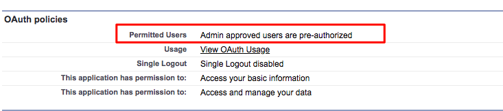

# Configuration des analyses [!DNL Marketo Measure] {#marketo-measure-insights-configuration}

L’application Zone de travail [!DNL Marketo Measure] Insights doit être ajoutée à la mise en page de la page de prospect, mais elle nécessite une configuration supplémentaire dans la section Applications connectées de votre configuration de [!DNL Salesforce]. Suivez ces instructions pour vous assurer que l’application Canvas dispose des autorisations appropriées.

1. Accédez à [!DNL Salesforce] Configuration et cliquez sur **[!UICONTROL Applications connectées]** sous l’onglet [!UICONTROL Gérer les applications].

1. Sélectionnez le [!DNL Marketo Measure Insights] dans la liste qui s’affiche.

1. Dans la section [!UICONTROL Politiques OAuth] , définissez le paramètre Utilisateurs autorisés sur « Les utilisateurs approuvés par l’administrateur sont préautorisés ». Un pop-up s’affiche, cliquez sur **[!UICONTROL OK]** puis **[!UICONTROL Enregistrer]**.

   

1. Une fois la page enregistrée, vous pouvez cliquer sur le bouton **[!UICONTROL Gérer les profils]**.

   

1. Sélectionnez tous les profils qui doivent avoir accès à [!DNL Marketo Measure] Insights et cliquez sur **[!UICONTROL Enregistrer]**.
