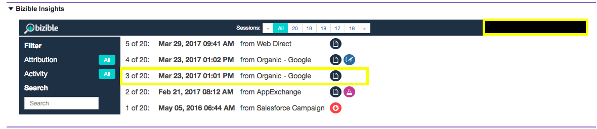

# Explication des analyses [!DNL Marketo Measure] {#marketo-measure-insights-explained}

En savoir plus sur les [!DNL Marketo Measure] Vue des informations dans [!DNL Salesforce], y compris ce que représentent les différentes icônes et comment utiliser la fonction. Cette fonctionnalité s’avère particulièrement utile pour afficher les 20 premières sessions d’un prospect, d’un contact ou d’un compte.

Une fois qu’une personne est suivie par la variable [!DNL Marketo Measure] javascript et qu’il remplit un formulaire sur votre site web, la personne deviendra un prospect dans votre système et nous transmettrons ses données marketing numériques à votre organisation Salesforce (SFDC). Dans ce cas, les données de point de contact renseignées dans la variable [!DNL Marketo Measure] Section Informations sur les pistes (une application de canevas) sur les objets de piste/contact/opportunité/compte.

Tout d’abord, vous verrez dans la partie centrale de vos insights le nombre de sessions que la personne a eues sur votre site web. Vous pouvez faire défiler ces sessions et naviguer à votre gré.

Vous pouvez consulter le cumul de toutes vos sessions si vous cliquez sur &quot;Toutes&quot; dans la partie centrale supérieure de vos informations. Vous y comprendrez les dates des sessions individuelles, le canal ou la source qui les ont générées, ainsi qu’un ensemble d’icônes spécifiant plus d’informations.

La première chose que vous verrez, ce sont les icônes FT ou LC. Elles représentent la position du point de contact de vos sessions répertoriées. Plus précisément, le FT signifie Première touche et le LC signifie Création de piste. Vous pouvez avoir plusieurs sessions, mais un seul point de contact peut être le FT ou le LC. Vous ne trouverez jamais plusieurs fichiers FT ou LC associés à une seule personne.

Les icônes qui ressemblent à du papier indiquent qu’une page vue s’est produite au cours de la session. Il est probable que chaque session inclura cette icône.

L’icône qui ressemble à un bécher signale qu’une expérience de test A/B a eu lieu. Nous intégrons Optimizely et VWO à ce stade. Avec cette intégration, nous pouvons pousser l’expérience et la variation que l’utilisateur a vues sur sa session spécifique.

Si vous cliquez sur une session spécifique (vous pouvez le faire en cliquant sur la date réelle de la session ou dans la partie centrale supérieure des sessions groupées), vous pourrez voir les détails de la session. Au cours de chaque session, vous pouvez voir toutes les pages spécifiques que l’utilisateur a vues classées par date et heure.

Sur le côté droit de chaque session, vous pouvez voir plus de données marketing granulaires que nous transmettons à la [!DNL Marketo Measure] dans votre SFDC. Dans cet exemple, vous pouvez voir Groupe d’annonces, Contenu de publicités, Campagne, Mot-clé, Support. Vous pouvez également faire défiler l’écran vers le bas pour afficher d’autres [!DNL Marketo Measure] données que nous fournissons.

Enfin, une fois qu’une personne dispose d’une myriade de sessions, vous pouvez utiliser certains filtres dans [!UICONTROL Informations] pour rechercher des parties spécifiques de leur engagement sur votre site. Vous pouvez filtrer par [!UICONTROL Position du point de contact] par exemple.

Vous pouvez également effectuer des recherches par Pages vues, Tests AB ou Forms.
