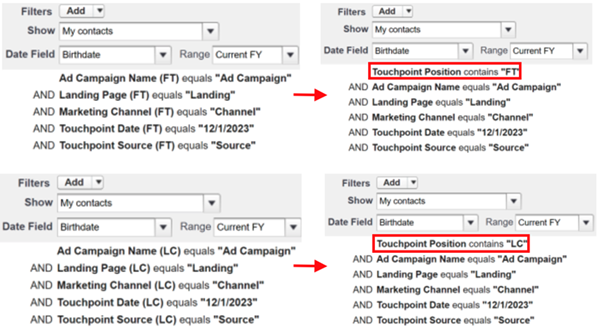

# Notes de mise à jour : 2024 {#release-notes-2024}

Vous trouverez ci-dessous toutes les nouvelles fonctionnalités ainsi que les fonctionnalités mises à jour pour nos versions de 2024.

## Version du 4e trimestre {#q4-release}

### Règles de segmentation améliorées

Vous pouvez maintenant créer des segments à l’aide des champs Campagne et Membre de la campagne, en plus des champs Point de contact et Contact. Cette amélioration vous permet d’analyser et de disséquer vos données plus efficacement dans Discover.

### Mise à jour : paramètre de gestion des erreurs pour les exports GRC

Nous avons tenu compte de vos commentaires concernant la mise en pause des traitements et proposons une nouvelle fonctionnalité dans l’interface utilisateur. À partir d’aujourd’hui, vous pouvez choisir si les traitements d’export doivent être suspendus en cas d’erreur. Utilisez le nouveau bouton (bascule) dans **Mon compte** > **Paramètres** → **CRM** → **Général**. Ce commutateur est activé par défaut pour améliorer l’intégrité et la visibilité des données. Cependant, si vous préférez ne pas utiliser cette fonctionnalité, vous pouvez la désactiver dans l’UI et les traitements d’export reprendront. Cette mise à jour est conçue pour améliorer la fiabilité de vos processus de gestion des données tout en vous assurant un meilleur contrôle.

#### Dates clés et déploiement par phases

Disponibilité immédiate du bouton (bascule) : le bouton (bascule) est désormais actif dans l’interface utilisateur et est activé par défaut pour empêcher que les données ne soient ignorées pendant les tâches d’exportation. Si vous préférez que les traitements d’export continuent de s’exécuter malgré les erreurs, désactivez le bouton (bascule).

Mise en pause de la tâche le 1er octobre 2024 : à compter du 1er octobre 2024, si le bouton (bascule) est actif et qu’une erreur au niveau des enregistrements se produit lors d’une tâche d’exportation, la tâche se met en pause pour s’assurer qu’aucune donnée n’est perdue. Ces erreurs sont généralement dues à des autorisations manquantes, à des règles de validation personnalisées incorrectement appliquées ou à des problèmes de workflows/déclencheurs. Vous recevrez des notifications concernant ce problème. Une fois corrigé, le traitement d’export reprendra à partir du point d’interruption. Si vous choisissez de ne pas mettre les traitements en pause, vous continuerez à recevoir des notifications en cas de problèmes et, une fois ceux-ci corrigés, les enregistrements ignorés seront automatiquement réexportés.

#### Pourquoi c’est important.

**Renforcement de l’intégrité des données et pérennité de votre intégration** : en arrêtant le traitement dès le premier signe de problème, nous évitons les pertes de données et garantissons leur exactitude. Cela permet une résolution rapide des erreurs, ce qui améliore la qualité de l’export des données et la fiabilité globale du système.

**Visibilité immédiate :** grâce aux notifications push, vous recevrez des alertes opportunes pour les erreurs d’autorisation, ce qui vous permettra de répondre rapidement et de minimiser les impacts potentiels sur vos opérations.

#### Pour vous aider à faire la transition

Pour vous aider à vous adapter à cette modification, nous avons créé une documentation sur la nouvelle fonctionnalité, avec des descriptions des erreurs claires et des étapes de résolution de problèmes exhaustives.

* Nouvelle documentation : [paramètre de gestion des erreurs pour les exports CRM](/help/configuration-and-setup/crm-error-handling.md)
* [Notifications d’erreur](/help/configuration-and-setup/error-notifications.md)

## Version du 3e trimestre {#q3-release}

**Rappel : obsolescence des champs de Salesforce - 14 juin**

Comme annoncé l’année dernière, nous allons [supprimer progressivement nos tâches d’exportation vers des objets de lead/contact](https://nation.marketo.com/t5/employee-blogs/marketo-measure-salesforce-lead-and-contact-field-deprecation-06/ba-p/350179){target="_blank"} afin de simplifier notre intégration et d’éliminer la nécessité d’exporter vers des objets Salesforce standard. Vous pouvez obtenir les mêmes données de vos objets de point de contact en suivant les étapes [documentées ici](/help/2023.md){target="_blank"}. Nous partagerons également la documentation sur la création de workflows pour ajouter ces données à l’objet Lead/Contact. L’obsolescence prendra effet le 14 juin 2024.

Ce changement aura les deux avantages clés suivants :

* **Réduction des coûts de l’API Salesforce** : la clientèle peut s’attendre à une réduction des coûts de leur API Salesforce d’environ 10 %.
* **Intégration rationalisée** : la majorité des erreurs des traitements d’export est liée à ces traitements. Leur suppression permettra de rationaliser considérablement notre intégration.

**Tableau de bord de l’opportunité attribuée**

Nous avons le plaisir de vous présenter le nouveau [Tableau de bord Opportunités attribuées](/help/attributed-opportunity-dashboard.md){target="_blank"}, conçu pour vous donner une vue d’ensemble exhaustive de la manière dont vos efforts marketing contribuent aux opportunités de pipeline naissantes et matures. Ce tableau de bord vous permet de vous plonger dans les détails de chaque opportunité ouverte et fermée pouvant être attribuée à vos stratégies, avec la possibilité de filtrer par étape d’opportunité. Il fournit des informations sur les canaux, sous-canaux ou campagnes qui se classent le plus haut en termes de montant des opportunités attribuées. Il affiche le montant total des opportunités attribuées, ainsi que le nombre d’opportunités ouvertes et fermées attribuées.

**Synchronisation des cookies Marketo Engage pour Marketo Measure Ultimate**

La synchronisation des cookies de Marketo Engage est désormais disponible pour Marketo Measure Ultimate. Pour utiliser cette fonctionnalité, procédez comme suit :

1. Sur la page Schémas AEP, modifiez le schéma « Personne B2B » et ajoutez le groupe de champs « Détails de la personne Marketo Engage ».
1. Lors de l’ingestion des données à MMU, mappez le champ ID de cookie du groupe de champs au champ Cookies de Marketo Engage.

**Phases de boomerang activées pour les clients de niveau 2**

Jusqu’à présent réservée aux clients de niveau 3, la fonctionnalité Étape Boomerang sera également accessible à tous les clients de niveau 2 à compter du 13 juin 2024. Pour plus d’informations sur cette fonctionnalité, consultez la documentation ci-dessous.

* [Étapes et points de contact Boomerang](/help/channel-tracking-and-setup/boomerang-stages-and-touchpoints.md){target="_blank"}
* [Configuration d’étapes de boomerang](/help/channel-tracking-and-setup/setting-up-boomerang-stages.md){target="_blank"}
* [Scénarios d’étape de boomerang](/help/channel-tracking-and-setup/boomerang-stage-scenarios.md){target="_blank"}

## Version du 2e trimestre {#q2-release}

**Obsolescence des fonctionnalités de Marketo Measure en réponse à l’élimination progressive des cookies tiers**

En réponse aux préoccupations croissantes concernant la confidentialité, les cookies tiers sont progressivement supprimés et la date limite du troisième trimestre 2024 établie par Google Chrome indique la fin de leur existence. Marketo Measure abandonnera certaines fonctionnalités qui dépendent de cookies tiers, en particulier le suivi inter-domaines et l’attribution après affichage (View-through), qui dépendent du cookie d’impression Google/DoubleClick. Cette modification n’aura aucune incidence sur les autres fonctionnalités de Marketo Measure ni sur l’utilisation de cookies propriétaires. D’après la chronologie de Google, ces fonctionnalités doivent être abandonnées d’ici le 1er juin, mais les clientes et les clients pourront toujours accéder aux données collectées avant cette date.

* [Adaptation à l’obsolescence des cookies tiers dans Marketo Measure](https://nation.marketo.com/t5/employee-blogs/adapting-to-third-party-cookie-deprecation-in-marketo-measure/ba-p/345110){target="_blank"}
* [Cookies Marketo Measure](/help/marketo-measure-tracking/marketo-measure-cookies.md){target="_blank"}

**Déploiement échelonné de notre gestion améliorée des erreurs**

Nous déployons progressivement une gestion améliorée des erreurs pour les traitements d’export, en commençant par des notifications in-app immédiates pour les erreurs d’autorisation, puis en adoptant une nouvelle approche consistant à mettre les traitements d’exportation en pause au moment où l’erreur se produit. Ce changement vise à améliorer l’intégrité et la visibilité des données, en assurant des processus de gestion des données plus fluides et plus fiables pour nos utilisateurs et nos utilisatrices. Afin de garantir une transition en douceur et de limiter au maximum les perturbations de vos opérations, nous mettons en œuvre ces changements en deux phases :

* Disponibilité immédiate des notifications Pulse : vous recevrez des notifications Pulse in-app en cas d’erreur d’autorisation lors des traitements d’export. Celles-ci n’interrompent pas vos exports, mais vous aident à en savoir plus sur les erreurs sans affecter vos traitements actuels.
* Implémentation des pauses de traitement le 25 avril : **REPORTÉ** - Après avoir pris en compte les commentaires des utilisateurs et utilisatrices de Marketo Measure, nous avons décidé de reporter l’implémentation des pauses de traitement d’export au moment de l’erreur, initialement planifiée pour le 25 avril. Nous avons conscience que l’arrêt des traitements n’est peut-être pas l’approche la plus efficace. Nous nous engageons à trouver une meilleure solution qui préserve l’intégrité des données et minimise les perturbations. Nous mettons en pause toute modification de notre système actuel jusqu’à ce que nous puissions garantir une solution qui s’aligne plus étroitement sur les besoins de nos utilisateurs et utilisatrices.

_Pourquoi c’est important_

Renforcement de l’intégrité des données et pérennité de votre intégration : nous arrêtons le traitement dès le premier signe de problème afin d’éviter les pertes de données et de garantir son exactitude. Cela permet de résoudre rapidement les problèmes, d’améliorer la qualité de l’export des données et la fiabilité du système.

Visibilité immédiate : l’introduction des notifications Pulse permet de réagir rapidement aux erreurs d’autorisation, limitant ainsi les répercussions potentielles sur vos opérations.

_Pour vous aider à faire la transition_

Pour vous aider à vous adapter à cette modification, [nous avons créé une documentation](/help/configuration-and-setup/error-notifications.md){target="_blank"} avec des descriptions des erreurs claires et des étapes de résolution de problèmes exhaustives.

**Action requise pour l’intégration LinkedIn**

LinkedIn a récemment publié une version mise à jour de son API de synchronisation des leads. Authentifiez à nouveau la connexion LinkedIn dans votre instance Marketo Measure d’ici le 20 mai pour éviter toute interruption.

