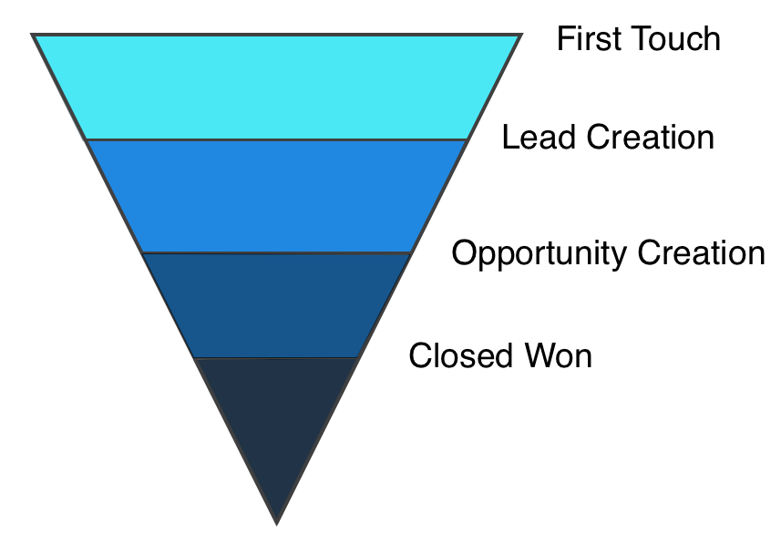

# Attribution marketing {#marketing-attribution}

## Bienvenue dans Marketo Measure {#welcome-to-marketo-measure}

Marketo Measure permet aux professionnels du marketing de déterminer les actions marketing les plus efficaces pour générer des recettes pour leur société. Marketo Measure est une solution d’attribution marketing qui effectue automatiquement le suivi et les rapports sur les performances des canaux, ce qui vous permet d’identifier les canaux qui génèrent le plus d’engagement client et d’optimiser vos dépenses marketing en conséquence.

## Attribution marketing {#marketing-attribution-1}

**Attribution marketing** est le processus d’attribution d’un crédit de recettes à un point de contact marketing. Pour ce faire, il vous suffit de suivre l’ensemble du parcours client d’un prospect, depuis sa toute première interaction avec votre société jusqu’au moment où l’opération se termine. Les recettes générées par l’opération sont réattribuées aux points de contact marketing qui ont motivé la vente. Le montant du crédit de recettes attribué à un point de contact dépend de l’influence de ce point de contact sur la décision d’achat du client.

**Points de contact** se rapportent aux interactions qu’un prospect/prospect a avec vos efforts marketing en ligne ou hors ligne. Il y en a quatre **major **points de contact** qui sont prises en compte dans l’attribution marketing. Elles reflètent les différentes étapes du parcours du client. Ces principaux points de contact, également appelés **points de contact de jalon**, sont : Première touche (FT), Création de piste (LC), Création d’opportunités (OC), Offre à succès fermée (CW).

Ces touches de jalon sont la base du Marketo Measure **modèles d’attribution**. Marketo Measure offre six modèles d’attribution. Chaque modèle se concentre sur différentes étapes du parcours client et offre une structure générale pour attribuer un crédit de recettes à vos points de contact marketing. Le modèle que vous utilisez dépend des étapes du parcours qui vous intéressent le plus et de la quantité de données sur lesquelles vous souhaitez générer des rapports. Les modèles d’attribution proposés par Marketo Measure sont les suivants :

* First Touch
* Création de prospects
* En U
* En W
* Chemin complet
* Modèle personnalisé

>[!NOTE]
>
>[En savoir plus sur chaque modèle d’attribution](/help/introduction-to-marketo-measure/overview-resources/marketo-measure-attribution-models.md).

## Pourquoi l’attribution est importante {#why-attribution-is-important}

En règle générale, les équipes marketing génèrent des rapports sur l’engagement, l’activité et d’autres mesures logicielles. Par conséquent, les marketeurs doivent souvent faire face à un défi : déterminer les recettes réelles générées par leurs efforts pour l’entreprise. L’attribution marketing résout ce problème en liant les efforts marketing directement aux recettes de vente. Les marketeurs disposent ainsi des mesures difficiles dont ils ont besoin pour :

* Déterminer les campagnes et canaux les plus performants et les plus rentables
* Affectez des fonds marketing à des canaux hautement performants
* Identifier les canaux marketing les plus responsables de la conversion de prospects en clients
* Prévision des objectifs marketing par rapport aux recettes

En outre, l’attribution marketing corrige le décalage entre les équipes commerciales et marketing. Puisque les équipes de vente génèrent des rapports sur les recettes et les pipelines, et que les équipes marketing dépendent principalement de mesures souples, les marketeurs ne peuvent pas déterminer les efforts qui ont eu le plus d’influence sur la réalisation d’une vente. L’association des efforts marketing aux recettes permet aux deux équipes de parler la même langue et permet aux marketeurs de démontrer comment leurs efforts ont contribué à l’évolution des clients.
