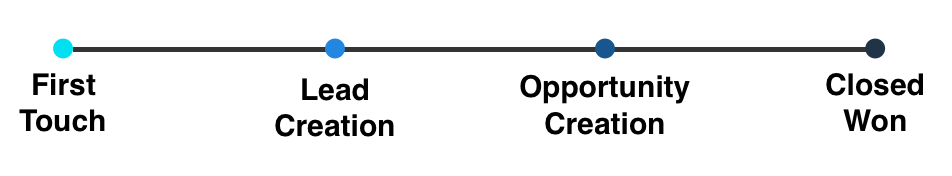
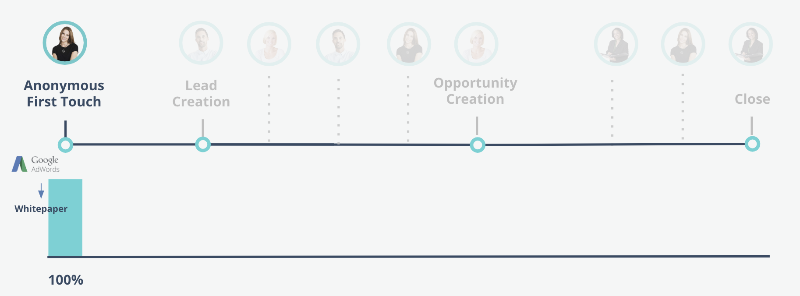
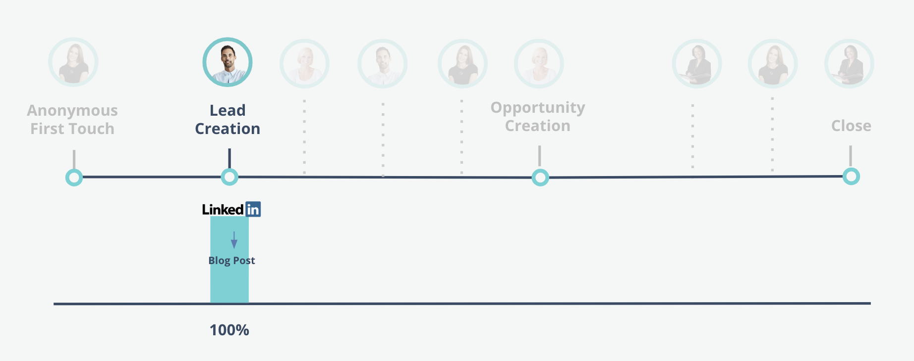
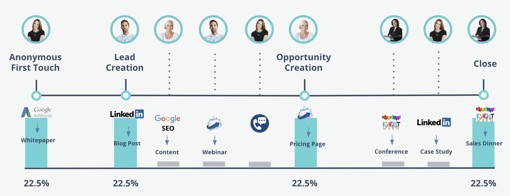

# Modèles d’attribution Marketo Measure {#marketo-measure-attribution-models}

Marketo Measure propose six types de modèles d’attribution :

* Premier contact
* Création de prospects
* En U
* En W
* Chemin complet
* Modèle personnalisé

Ces modèles n’ont pas tous la même complexité. Les modèles Premier contact et Création de prospects sont des modèles simples, composés d’une seule prise de contact. Les quatre autres sont plus complexes, et comprennent plusieurs points de contact. La structure des modèles d’attribution de Marketo Measure reflète les quatre principaux points de contact qui jalonnent le parcours client :

* Premier contact (FT pour « First Touch »)
* Création de prospects (LC pour « Lead Creation »)
* Création d’opportunité (OC pour « Opportunity Creation »)
* Vente conclue et réussie (CW pour « Closed-Won deal »)

Dans les **modèles simples**, le crédit d’attribution est attribué à un unique point de contact.
Dans les **modèles complexes**, la plupart du crédit d’attribution est attribué à deux points de contact ou plus. Le crédit restant est attribué aux points de contact intermédiaires, situés entre les principaux jalons.

Les sections suivantes détaillent chaque modèle d’attribution, ainsi que la manière dont le crédit est affecté.

## Modèles simples {#single-touch-models}

**Modèle « Premier contact »**

Le modèle Premier contact se concentre uniquement sur la première interaction qu’un prospect a avec votre organisation. Il attribue 100 % du crédit au premier point de contact entre le prospect et votre société, appelé « Premier contact » (FT).

Imaginons que Kate visite `www.adobe.com` pour la première fois via une annonce publicitaire AdWords et consulte un livre blanc. Le canal AdWords recevra 100 % du crédit d’attribution de cette opportunité.

**Modèle « création de prospects »**

Le modèle « création de prospects » attribue 100 % du crédit au point de contact où un prospect fournit ses coordonnées et devient un client potentiel.

Dans la suite de l’exemple précédent, après la première visite de Kate sur `www.adobe.com` via AdWords, Austin se rend à son tour sur le site Web via un article sur LinkedIn. Il remplit un formulaire et devient un prospect. Dans ce modèle, LinkedIn recevra 100 % du crédit d’attribution.

## Modèles complexes {#multi-touch-models}

Les modèles complexes sont utilisés pour des cycles de vente plus longs et qui comprennent plusieurs points de contact. Ils sont particulièrement utiles si plusieurs personnes d’un même compte ou d’une même société sont impliquées dans le parcours d’achat.

**Modèle en forme de U**

Le modèle en U se concentre sur les points de contact FT et LC, Dans ce modèle, les points de contact FT et LC reçoivent chacun 50 % du crédit des revenus.

La première visite de Kate sur `www.adobe.com` via une annonce AdWords reçoit alors 50 % du crédit d’attribution. et les 50 % restants sont attribués à l’article sur LinkedIn qui a conduit Augustin à remplir un formulaire et à devenir un client potentiel.

**Modèle en forme de W**

Le modèle en W comprend trois jalons : les points de contact FT, LC et OC se voient attribuer chacun 30 % du crédit d’attribution. Les 10 % restants sont attribués de façon proportionnelle à tout point de contact intermédiaire qui se produit entre ces trois jalons.

Kate et Augustin mentionnent Marketo Measure à leur collègue, Hillary. Elle trouve un élément de contenu via une recherche Google et remplit un formulaire. Plus tard, Augustin reçoit un e-mail lui proposant de participer à un webinaire et remplit le formulaire d’inscription sur le site web. Kate discute avec un représentant ou une représentante du produit Marketo Measure.

Hillary reçoit un e-mail avec un lien vers la page des tarifs, qu’elle consulte. Une opportunité est alors créée pour leur compte. La visite d’Hillary sur la page des tarifs reçoit du crédit, car il s’agit de l’interaction marketing la plus proche de la date de création de l’opportunité. Chacun des jalons se voit attribuer 30 % du crédit, et les 10 % restants sont répartis entre les points de contact intermédiaires.

**Modèle en chemin complet**

Le modèle en chemin complet comprend les quatre jalons. Les points FT, LC, OC et CW reçoivent chacun 22,5 % du crédit de revenus, et les 10 % restants sont répartis à parts égales entre les points de contact intermédiaires.

Après la création de l’opportunité, Kate, Augustin et Hillary décident de présenter Marketo Measure à leur CMO, Elizabeth. Elizabeth assiste à une conférence où Marketo Measure organise un événement. Sur LinkedIn, Kate tombe sur un article portant sur une étude de cas et remplit un formulaire pour télécharger le contenu. Elizabeth assiste à un dîner d’affaires organisé par Marketo Measure. Après le dîner, elle décide d’acheter Marketo Measure et devient une cliente. Dans ce scénario, le dîner d’affaires se voit attribuer 22,5 % du crédit de recettes correspondant à la vente. De la même façon, les points FT, LC et OC reçoivent chacun 22,5 % du crédit. Les 10 % restants sont répartis entre les points de contact intermédiaires.

**Modèle d’attribution personnalisé**

Marketo Measure propose également un modèle d’attribution personnalisé, qui permet aux utilisateurs de choisir les points de contact ou les étapes personnalisées à inclure dans leur modèle. En outre, les utilisateurs et les utilisatrices peuvent contrôler le pourcentage du crédit d’attribution alloué à chacun de ces éléments. Si une opportunité ne comporte pas de points de contact intermédiaires dédiés, le pourcentage sera réparti à parts égales entre les autres positions.
