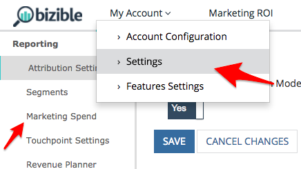

# Coûts associés aux canaux marketing {#marketing-channel-costs}

L’un des avantages les plus fondamentaux de l’utilisation [!DNL Marketo Measure] est la possibilité de lier les efforts marketing directement à l’impact sur les recettes, avec autant de granularité que vous le souhaitez. Il est possible d’afficher le retour sur investissement au niveau du point de contact. Pour tirer parti de cet avantage, les coûts du canal doivent simplement être transférés vers la variable [!DNL Marketo Measure] application. Les rapports sur le ROI sont automatiquement créés et disponibles dans la **Tableau de bord du ROI marketing** in [experience.adobe.com/marketo-measure](https://experience.adobe.com/marketo-measure){target="_blank"}.

[Cliquez ici pour accéder directement aux instructions.](/help/marketing-spend/spend-management/marketing-channel-costs.md#uploading-marketing-costs)

La variable [!DNL Marketo Measure] La fonctionnalité de dépenses marketing permet aux clients de télécharger leurs dépenses sur tous les canaux, sous-canaux et campagnes. Plus les données sont ajoutées par les clients, plus le tableau de bord d’attribution des recettes répertorie les rapports de retour sur investissement.

Les coûts signalés et importés à partir des connexions publicitaires directes sont automatiquement extraits au niveau le plus granulaire et n’ont pas besoin d’être transférés. Cela inclut nos intégrations actuelles avec Google AdWords, Bing Ads, Doubleclick et Facebook.

[Cliquez ici pour accéder directement aux questions fréquentes.](/help/marketing-spend/spend-management/marketing-channel-costs.md#faq)

## Définitions {#definitions}

**Dépensé par campagne**

Au niveau le plus granulaire, les clients peuvent entrer les dépenses par campagnes individuelles, regroupées dans leur canal respectif. Pour les campagnes CRM, [!DNL Marketo Measure] a extrait l’ID de campagne dans une colonne distincte qui vous aidera à mapper les dépenses de campagne hors ligne de votre CRM dans ce tableau. L&#39;ajout de dépenses à ce niveau permettra aux clients d&#39;afficher le ROI de Campaign et d&#39;optimiser les performances de Campaign.

Le total de toutes les campagnes n’a pas besoin de totaliser les valeurs entrées au niveau du sous-canal ou du canal, mais il ne peut pas dépasser les valeurs entrées au niveau du sous-canal ou du canal. Si la somme est inférieure à la valeur saisie au niveau du sous-canal ou du canal, [!DNL Marketo Measure] ajoutera automatiquement une ligne pour &quot;Autre&quot; afin de couvrir la différence et de combler les trous.

**Dépensé par sous-canal**

À un niveau supérieur, les clients peuvent entrer les dépenses par Subchannel, regroupées sous son canal. L’ajout de dépenses à ce niveau permet aux clients d’afficher le retour sur investissement du sous-canal et d’optimiser les performances par sous-canal.

Le total de tous les sous-canaux n’a pas besoin de totaliser les valeurs entrées dans le canal, mais il ne peut pas dépasser les valeurs entrées dans le canal. Si la somme est inférieure à la valeur saisie au niveau du canal, [!DNL Marketo Measure] ajoutera automatiquement une ligne pour &quot;Autre&quot; afin de couvrir la différence et de combler les trous.

**Dépensé par canal**

Au niveau le plus élevé, les clients peuvent entrer les dépenses par canal. L’ajout de dépenses à ce niveau permet aux clients d’afficher le retour sur investissement du canal et d’optimiser les performances par canal.

**Sélecteur de date**

La période par défaut commencera à partir de la date de début avec [!DNL Marketo Measure] jusqu’au mois en cours. Pour garantir que les coûts restent corrects, vous ne pouvez pas indiquer les coûts pour les mois futurs, mais vous pouvez saisir les coûts pour les mois précédant votre partenariat avec [!DNL Marketo Measure].

**Filtrer**

Pour affiner vos résultats dans le tableau des dépenses marketing, sélectionnez un canal dans la partie supérieure pour filtrer les autres canaux. Cela s’avère utile lorsque vous avez une équipe axée sur un canal unique.

**Rechercher**

Utilisez la zone de recherche pour trouver le texte correspondant à partir des canaux, sous-canaux ou campagnes.

**Télécharger les coûts actuels**

Le fichier CSV téléchargé extrait les résultats de l’écran actuel, ce qui signifie que toutes les dates, filtres ou recherches appliqués sont téléchargés en l’état.

**Téléchargement d’un fichier CSV**

Quelle que soit la vue qui se trouve dans le navigateur, s’il s’agit d’une vue filtrée ou de la vue par défaut avec toutes les dates et tous les canaux, vous pouvez télécharger n’importe quel fichier CSV.

L’erreur la plus courante à laquelle nous sommes confrontés est le format des colonnes de dates, qui se produit si le format de date est modifié et peut se produire intentionnellement si vous passez d’Excel à Google Sheets. Gardez à l’esprit que la date doit être MM-AA, donc le 12 septembre et non le 12 septembre, ou le 12 mai et non 05-12.

## Avant de commencer {#before-you-begin}

[!DNL Marketo Measure] est fourni avec 13 canaux par défaut qui peuvent être utilisés ou développés. En outre, jusqu’à 40 canaux en ligne et hors ligne peuvent être créés pour s’adapter à votre structure marketing unique. Sur la base de cela, un total de 200 sous-canaux peuvent être créés pour prendre en charge ces canaux en ligne et hors ligne.

[!DNL Marketo Measure] téléchargera automatiquement les coûts des canaux marketing à partir des plateformes avec lesquelles il dispose d’une intégration API, telles que Bing Ads et Google AdWords. Coûts des plateformes qui ne sont pas intégrées à [!DNL Marketo Measure] doit être chargé manuellement. Les canaux marketing doivent être configurés avant le chargement des données de coût.

## Chargement des coûts marketing {#uploading-marketing-costs}

Une fois les canaux et règles marketing configurés ou mis à jour, les coûts associés peuvent être transférés. Pour ce faire, procédez comme suit :

**Étape 1 : accédez à la page des dépenses marketing dans le [!DNL Marketo Measure] Application.**

Accédez au **[!UICONTROL Mon compte]** , cliquez sur **[!UICONTROL Paramètres]** puis accédez à la **[!UICONTROL Dépenses marketing]** dans la barre latérale gauche, sous **[!UICONTROL Reporting]** .

**Étape 2 : téléchargement du fichier CSV Coûts actuels**

Accédez à droite de l’écran et cliquez sur **[!UICONTROL Télécharger les coûts actuels].** Cette option vous permet de télécharger une feuille de calcul au format CSV.

**Étape 3 : ouverture du fichier CSV et modification**

Vous pouvez importer le fichier et l’ouvrir à l’aide des feuilles de calcul Google Sheets, Apple Numbers, Microsoft Excel ou du logiciel de votre choix. [!DNL Marketo Measure] recommande d’utiliser des feuilles de calcul Google.

Après avoir importé la feuille, apportez les modifications souhaitées, telles que l’ajout de coûts aux canaux et aux sous-canaux ou la mise à jour des informations existantes.

Vérifiez les règles logiques dans votre feuille. Chaque ligne doit contenir un canal et un de ses sous-canaux séparés par un (.) point à la fin. Il est important d’utiliser ce format de manière cohérente.

Par exemple, pour indiquer Facebook comme sous-canal et Social comme canal, la règle doit être écrite comme suit : &quot;Social.Facebook&quot;. De même, pour effectuer le suivi d’un événement hors ligne, la syntaxe du canal doit être : &quot;Events.Big Conference&quot;. Des exemples sont présentés dans l’image ci-dessous :

_Remarques supplémentaires_:

Ne modifiez pas les dates dans la feuille de calcul car cela peut entraîner des problèmes lors du téléchargement du document.

Ne laissez aucun champ vide. Même s’il n’y a pas de valeur en dollars à ajouter, saisissez 0 $ comme montant en dollars.

Les coûts Bing Ads et Google AdWords n’ont pas besoin d’être renseignés ou mis à jour car [!DNL Marketo Measure] extrait automatiquement ces données de sa connexion API avec ces plateformes.

**Étape 4 : enregistrer le fichier au format CSV**

Si vous utilisez des feuilles de calcul Google Sheets, veillez d’abord à télécharger le fichier. N’excluez ou ne supprimez aucune donnée mensuelle, car elle risque de poser des problèmes lors du transfert du fichier CSV vers [!DNL Marketo Measure] plus tard.

**Étape 5 : téléchargement du fichier CSV**

Accédez au **[!UICONTROL Coût]** de la [!DNL Marketo Measure] et cliquez sur **[!UICONTROL Upload.CSV]**. Le système actualise et reflète les nouvelles informations.

## Questions fréquentes {#faq}

**Pourquoi les nombres apparaissent-ils dans le fichier CSV ?**

Si aucune valeur n’est saisie à un niveau supérieur comme Canal ou Sous-canal, [!DNL Marketo Measure] additionne automatiquement les niveaux enfants pour vous, qui seront présentés une fois votre fichier chargé. En outre, si la somme des enfants est inférieure à une valeur saisie pour le parent, [!DNL Marketo Measure] ajoute une ligne &quot;Autre&quot; pour afficher la différence dans le total.

**Comment les Campagnes sont-elles déterminées dans la liste que je vois ?**

Actuellement, nos résultats répertorient les campagnes que nous avons vues créditées d’un point de contact. Si une campagne a déclenché une activité, nous allons l’afficher en fonction de la date du point de contact où elle s’est produite.

**Trop de lignes et de colonnes doivent être passées à l’écran. Puis-je consolider la vue ?**

La possibilité de modifier la période, de filtrer le canal ou de rechercher des valeurs vous permet de consolider les résultats du tableau pour mieux répondre à vos besoins.

**Pourquoi ne puis-je pas télécharger un fichier ?**

Nous avons différents jeux d’autorisations dans la variable [!DNL Marketo Measure] Application. Pour charger un fichier, vous devez être un &quot;AccountAdmin&quot;. Pour contourner ce problème, demandez l’accès à votre AccountAdmin ou demandez à votre AccountAdmin de télécharger le fichier en votre nom. Vous trouverez une liste d’utilisateurs et leurs rôles sous **[!UICONTROL Mon compte]** > **[!UICONTROL Paramètres]** > **[!UICONTROL Affichage/ajout d’utilisateurs de compte]**.
