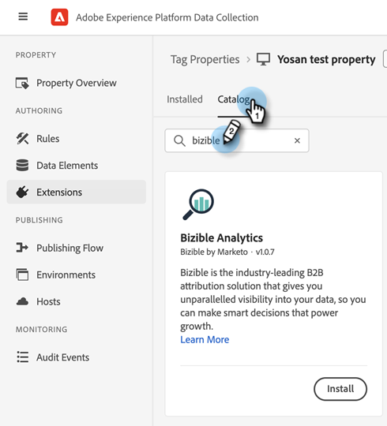

# Intégrations [!DNL Marketo Measure] avec Adobe Launch {#marketo-measure-integrations-with-adobe-launch}

L’extension Adobe Launch est conçue pour les utilisateurs [!DNL Marketo Measure] qui utilisent déjà Adobe Launch sur leur site web. L’extension sert de solution de gestion des balises que vous pouvez utiliser pour configurer et charger dynamiquement des scripts sur vos pages en fonction de certains événements et conditions.

Une fois installée et configurée dans Adobe Launch, l’extension [!DNL Marketo Measure] charge le script Bizible.js sur les pages où le script Adobe Launch est présent. Cela permet aux professionnels du marketing d’ajouter Bizible.js par le biais de la configuration d’Adobe Launch, plutôt que de modifier explicitement la page web pour ajouter la balise de script Bizible.js.

## Configuration de l’extension Adobe Launch {#configure-the-adobe-launch-extension}

>[!PREREQUISITES]
>
>Consultez les liens suivants pour en savoir plus sur Adobe Launch et ses extensions :
>
>* [[!DNL Marketo Measure]  Extension &#x200B;](https://experienceleague.adobe.com/docs/experience-platform/destinations/catalog/email/bizible.html?lang=fr#catalog){target="_blank"}
>* [Présentation d’Adobe Launch](https://experienceleague.adobe.com/docs/platform-learn/implement-in-websites/overview.html?lang=fr){target="_blank"}
>* [Présentation De L’Extension Adobe Launch](https://experienceleague.adobe.com/docs/experience-platform/tags/extension-dev/overview.html?lang=fr){target="_blank"}

1. Créez une propriété en suivant les étapes [décrites dans cet article](https://experienceleague.adobe.com/docs/platform-learn/implement-in-websites/configure-tags/create-a-property.html?lang=fr#go-to-the-data-collection-interface){target="_blank"}.

1. Cliquez sur la propriété que vous avez créée.

   

1. Cliquez sur **[!UICONTROL Extensions]**.

   

1. Cliquez sur l’onglet **[!UICONTROL Catalogue]** et recherchez « [!UICONTROL Bizible] ».

   

1. Dans le volet [!UICONTROL Analyses Bizible], cliquez sur **[!UICONTROL Installer]**.

   

1. Dans le champ ID de compte Bizible, saisissez l’URL de votre site Web (par exemple, `adobe.com`).

   

1. Cliquez sur **[!UICONTROL Enregistrer]**

   

1. Cliquez sur **[!UICONTROL Règles]**, puis sélectionnez **[!UICONTROL Créer une règle]**.

   

1. Cliquez sur le bouton **[!UICONTROL Ajouter]** sous [!UICONTROL Événements].

   

1. Dans la liste déroulante Extension , sélectionnez **[!UICONTROL Core]**. Ensuite, dans le menu déroulant Type d’événement , sélectionnez **[!UICONTROL Bibliothèque chargée (haut de page)]**. Si vous ne donnez pas de nom à votre événement, un nom par défaut est appliqué. Cliquez sur **[!UICONTROL Conserver les modifications]** lorsque vous avez terminé.

   

1. Cliquez sur le bouton **[!UICONTROL Ajouter]** sous Actions.

   

1. Dans le menu déroulant Extension , sélectionnez **[!UICONTROL Bizible Analytics]**. Ensuite, dans le menu déroulant Type d’action, sélectionnez **[!UICONTROL Initialiser]**. Si vous ne donnez pas de nom à votre action, une action par défaut est appliquée. Cliquez sur **[!UICONTROL Conserver les modifications]** lorsque vous avez terminé.

   

1. Cliquez sur **[!UICONTROL Enregistrer]**

   

