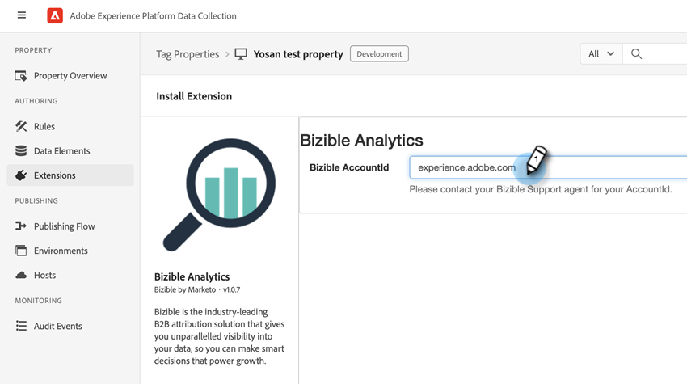

# Intégrations [!DNL Marketo Measure] avec Adobe Launch {#marketo-measure-integrations-with-adobe-launch}

L’extension Adobe Launch est conçue pour les [!DNL Marketo Measure] utilisateurs qui utilisent déjà Adobe Launch sur leur site web. L’extension sert de solution de gestion des balises que vous pouvez utiliser pour configurer et charger dynamiquement des scripts sur vos pages en fonction de certains événements et conditions.

Une fois installé et configuré dans Adobe Launch, la variable [!DNL Marketo Measure] l’extension charge le script bizible.js sur les pages où se trouve le script Adobe Launch. Cela permet aux marketeurs d’ajouter bizible.js via la configuration Adobe Launch, plutôt que de modifier explicitement la page web pour ajouter la balise de script bizible.js.

## Configuration de l’extension Adobe Launch {#configure-the-adobe-launch-extension}

>[!PREREQUISITES]
>
>Consultez les liens suivants pour en savoir plus sur Adobe Launch et ses extensions :
>
>* [[!DNL Marketo Measure] Extension](https://experienceleague.adobe.com/docs/experience-platform/destinations/catalog/email/bizible.html#catalog){target="_blank"}
>* [Présentation d’Adobe Launch](https://experienceleague.adobe.com/docs/platform-learn/implement-in-websites/overview.html){target="_blank"}
>* [Présentation de l’extension Adobe Launch](https://experienceleague.adobe.com/docs/experience-platform/tags/extension-dev/overview.html){target="_blank"}

1. Créez une propriété en suivant les étapes [dans cet article](https://experienceleague.adobe.com/docs/platform-learn/implement-in-websites/configure-tags/create-a-property.html#go-to-the-data-collection-interface){target="_blank"}.

1. Cliquez sur la propriété que vous avez créée.

   

1. Cliquez sur **[!UICONTROL Extensions]**.

   

1. Cliquez sur le bouton **[!UICONTROL Catalogue]** et recherchez &quot;[!UICONTROL Bizible].&quot;

   

1. Dans le [!UICONTROL Bizible Analytics] mosaïque, cliquez **[!UICONTROL Installer]**.

   

1. Dans le champ Bizible AccountId , saisissez l’URL de votre site web (par exemple : `adobe.com`).

   

   >[!NOTE]
   >
   >Ce champ n’est pas l’&quot;ID de compte&quot; dans la table Business_Prod.Business . Toutes les activités web à partir de l’URL donnée (par exemple, `adobe.com`) sont mappés à la variable [!DNL Marketo Measure] client.

1. Cliquez sur **[!UICONTROL Enregistrer]**.

   

1. Cliquez sur **[!UICONTROL Règles]**, puis sélectionnez **[!UICONTROL Créer une règle]**.

   

1. Cliquez sur le bouton **[!UICONTROL Ajouter]** bouton sous [!UICONTROL Événements].

   

1. Dans la liste déroulante Extension , sélectionnez **[!UICONTROL Core]**. Ensuite, dans la liste déroulante Type d’événement , sélectionnez **[!UICONTROL Bibliothèque chargée (Haut de page)]**. Si vous ne donnez pas de nom à votre événement, un nom par défaut est appliqué. Cliquez sur **[!UICONTROL Conserver les modifications]** une fois terminé.

   

1. Cliquez sur le bouton **[!UICONTROL Ajouter]** sous Actions.

   

1. Dans la liste déroulante Extension , sélectionnez **[!UICONTROL Bizible Analytics]**. Ensuite, dans la liste déroulante Type d’action , sélectionnez **[!UICONTROL Initialiser]**. Si vous ne donnez pas de nom à votre action, une valeur par défaut est appliquée. Cliquez sur **[!UICONTROL Conserver les modifications]** une fois terminé.

   

1. Cliquez sur **[!UICONTROL Enregistrer]**.

   
