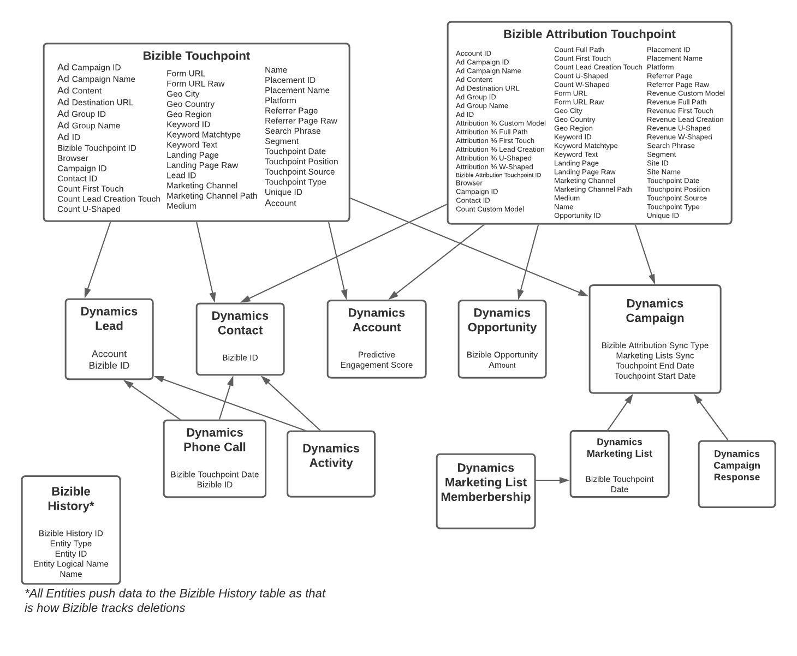

# Taxonomie de [!DNL Marketo Measure] et de Dynamics {#marketo-measure-and-dynamics-taxonomy}

Vous trouverez ci-dessous un organigramme qui représente la manière dont les objets personnalisés [!DNL Marketo Measure] sont liés aux objets Dynamics Standard.
 

{width="800" zoomable="yes"}
