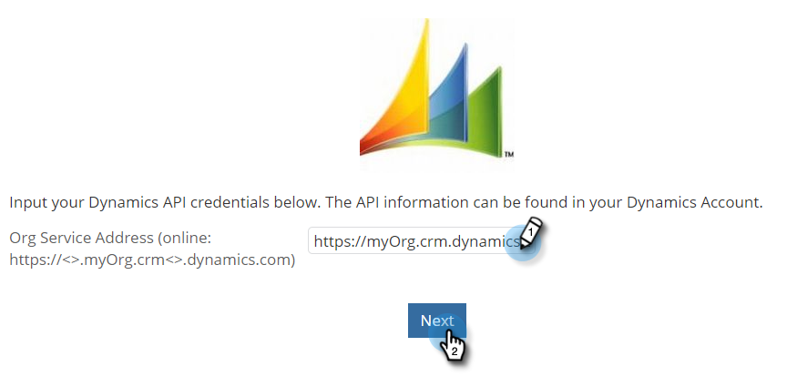
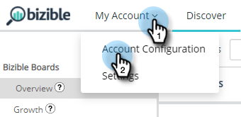

# [!DNL Microsoft Dynamics] Guide d&#39;installation CRM {#microsoft-dynamics-crm-installation-guide}

>[!NOTE]
>
>Vous pouvez voir des instructions spécifiant &quot;[!DNL Marketo Measure]&quot; dans notre documentation, mais consultez toujours &quot;Bizible&quot; dans votre CRM. Nous nous efforçons de mettre à jour cette version et la nouvelle image sera bientôt répercutée dans votre CRM.

## Versions prises en charge {#supported-versions}

[!DNL Marketo Measure] prend en charge les éléments suivants : [!DNL Microsoft Dynamics CRM] versions :

* [!DNL Microsoft Dynamics 2016] (En ligne et On-Premise)
* [!DNL Microsoft Dynamics 365] (En ligne et On-Premise)

Pour la connexion et l&#39;authentification, [!DNL Marketo Measure] prend en charge les versions Principales Directory Federated Services (ADFS) suivantes :

* ADFS 4.0 - [!DNL Windows Server 2016]
* ADFS 5.0 - [!DNL Windows Server 2019]

## Installation de la solution gérée {#install-the-managed-solution}

[Télécharger et installer](assets/marketo-measure-dynamics-extension.zip) le fichier zip dans Dynamics CRM.

**[!UICONTROL Paramètres]** > **[!UICONTROL Personnalisations]** > **[!UICONTROL Solutions]** > **[!UICONTROL Importer]** (bouton) > **[!UICONTROL Choisir un fichier]**.

>[!NOTE]
>
>Les deux captures d’écran suivantes peuvent légèrement différer de la vôtre, car elles ont été réalisées lors d’une mise à niveau de solution.

## [!DNL Marketo Measure] Autorisations utilisateur {#marketo-measure-user-permissions}

Nous vous recommandons de créer un [!DNL Marketo Measure] Utilisateur dans Dynamics pour que nous puissions exporter et importer des données via afin d’éviter tout problème avec d’autres utilisateurs de votre CRM. Prenez note du nom d’utilisateur et du mot de passe, ainsi que de l’URL du point de terminaison, qui sera utilisé lors de la création de la variable [!DNL Marketo Measure] compte .

## Rôles de sécurité {#security-roles}

Si votre organisation utilise des rôles de sécurité Dynamics, veillez à ce que l’utilisateur connecté ou le [!DNL Marketo Measure] L’utilisateur dispose des autorisations de lecture/écriture suffisantes pour les entités requises.

Les rôles de sécurité se trouvent ici : **[!UICONTROL Paramètres]** > **[!UICONTROL Sécurité]** > **[!UICONTROL Rôles de sécurité]**.

Pour [!DNL Marketo Measure] entités personnalisées, nous aurons besoin d’autorisations complètes sur toutes nos entités.

>[!NOTE]
>
>Les utilisateurs qui fermeront les opportunités auront également besoin d’autorisations complètes.

Pour les entités Dynamics standard, reportez-vous à la section [!DNL Marketo Measure] Document de schéma Dynamics. à un niveau élevé, [!DNL Marketo Measure] il suffit de lire certaines entités pour rassembler les données appropriées et d’écrire dans des champs personnalisés qui seront installés avec la solution gérée. Nous ne créerons pas de nouveaux enregistrements standard, ni ne mettrons à jour de champs standard.

## Inclure les points de contact sur les mises en page : {#include-touchpoints-on-page-layouts}

1. Pour chaque entité, accédez à l’éditeur de formulaire. Vous pouvez le trouver sous **[!UICONTROL Paramètres]** > **[!UICONTROL Personnalisations]** > **[!UICONTROL Personnalisation du système]** > `[Entity]` > **[!UICONTROL Forms]**. Vous pouvez également le trouver dans les paramètres pendant que vous affichez un enregistrement.

   * Les entités à configurer : Compte, opportunité, contact, prospect et campagne.

   * Pour configurer les campagnes, vous devez activer l’option &quot;Synchronisation des campagnes&quot; dans **[!UICONTROL CRM]** > **[!UICONTROL Campagnes]**.

   

1. Mise en page : ajouter d’abord un &quot;[!UICONTROL Une colonne]&quot; dans la section que vous souhaitez que les points de contact soient actifs. Dans cette nouvelle colonne, une sous-grille doit être ajoutée à chaque formulaire dans vos entités Compte, Opportunité, Contact et Prospère.

   

   

1. Sélectionnez l’objet (points de contact d’attribution de l’achat ou points de contact de l’achat) qui doit être rendu dans la sous-grille, qui dépend de la relation de l’objet. Vous pouvez éventuellement modifier les colonnes qui s’afficheront en cliquant sur le bouton Modifier . Une mise en page par défaut a été définie par la solution gérée.

   Sous-grille Point de contact d’attribution de l’achat - Comptes, opportunités et contacts\
   Sous-grille Point de contact de l’acheteur - Pistes et contacts

   

1. Une fois la mise à jour du formulaire terminée, publiez et enregistrez vos modifications.

## Considérations relatives aux schémas {#schema-related-considerations}

**Chiffre d&#39;affaires**

[!DNL Marketo Measure] pointe par défaut vers le champ Recettes réelles standard. Si vous n’utilisez pas cette méthode, veuillez expliquer comment vous signalez les recettes à votre ingénieur de solutions ou à votre gestionnaire de succès en tant que processus personnalisé nécessaire.

**Date de fermeture**

[!DNL Marketo Measure] pointe vers le champ Date de fermeture réelle prêt à l’emploi. Si vous n’utilisez pas ce paramètre ou si vous utilisez également le champ Date de fermeture estimée, veuillez expliquer votre processus à votre ingénieur de solutions ou à votre responsable de succès. Un workflow personnalisé peut être nécessaire pour tenir compte des deux champs.

## Configuration de votre Adobe Admin Console et de votre fournisseur d’identité {#set-up-your-adobe-admin-console-and-identity-provider}

La première étape de l’utilisation de [!DNL Marketo Measure] est de créer et de se connecter à votre Adobe Admin Console configuré. Si vous n’avez pas encore reçu l’e-mail contenant des instructions de connexion, contactez votre [!DNL Marketo Measure] Gestionnaire de compte.

En tant que produit dans Adobe Suite, [!DNL Marketo Measure] tire parti de toutes les fonctionnalités de Adobe Admin Console pour Identity Management. Plus de ressources peuvent être [ici](https://helpx.adobe.com/fr/enterprise/using/admin-console.html).

Nous vous recommandons de passer en revue toutes les ressources, bonnes pratiques et options disponibles pour [Identity Management](https://helpx.adobe.com/enterprise/using/set-up-identity.html).

Pour obtenir des conseils sur la configuration d’Identity Management dans Adobe Admin Console et les consulter, contactez votre [!DNL Marketo Measure] Gestionnaire de compte.

Pour faciliter l’authentification et l’autorisation des utilisateurs avec votre [!DNL Marketo Measure] instances, les étapes suivantes sont requises dans Adobe Admin Console :

**Configuration de la variable [!DNL Marketo Measure] Product Card**

Lors de l’accès à Adobe Admin Console, vous verrez [!DNL Marketo Measure] Instance(s) de produit(s) présente(s) dans la section Aperçu .

Cliquez sur le bouton [!DNL Marketo Measure] La carte de produit vous montrera toutes vos [!DNL Marketo Measure] instances. Par défaut, chaque [!DNL Marketo Measure] L’instance possède son propre profil, précédé du préfixe &quot;[!DNL Marketo Measure]&#39;. Tous les administrateurs ou utilisateurs ajoutés à ce profil ou à tout autre profil de cette instance pourront se connecter à [!DNL Marketo Measure].

Aucune action n’est requise pour créer un profil dans la variable [!DNL Marketo Measure] Instance(s) de produit.

Pour commencer à ajouter des utilisateurs pouvant accéder à [!DNL Marketo Measure], reportez-vous à la section [Ajouter [!DNL Marketo Measure] Administrateurs et [!DNL Marketo Measure] Utilisateurs](#adding-marketo-measure-admins-and-marketo-measure-users) ci-dessous.

## Ajouter [!DNL Marketo Measure] Administrateurs et [!DNL Marketo Measure] Utilisateurs {#adding-marketo-measure-admins-and-marketo-measure-users}

L’étape suivante consiste à accorder l’accès à la variable [!DNL Marketo Measure] en ajoutant des utilisateurs. Vous pouvez le faire dans le répertoire des administrateurs et des utilisateurs de la variable [!DNL Marketo Measure] carte produit.

| Type d&#39;utilisateur | Description |
|---|---|
| Administrateurs | il s’agit des administrateurs et des utilisateurs experts de la fonction [!DNL Marketo Measure] Application pleine capacité à mettre à jour et à gérer [!DNL Marketo Measure]Options de configuration spécifiques |
| Utilisateurs | il s’agit des utilisateurs standard de la variable [!DNL Marketo Measure] Application avec des autorisations de lecture seule dans [!DNL Marketo Measure] application |

Lors de l’ajout d’un utilisateur à son groupe respectif, les [Type d’identité répertorié](https://helpx.adobe.com/enterprise/admin-guide.html/enterprise/using/set-up-identity.ug.html).

>[!NOTE]
>
>Pour être un [!DNL Marketo Measure] administrateur (dans [experience.adobe.com/marketo-measure](https://experience.adobe.com/marketo-measure){target="_blank"}), un utilisateur doit être ajouté en tant qu’utilisateur _et_ d’un administrateur à n’importe quel [!DNL Marketo Measure] profil de produit dans la variable [!DNL Marketo Measure] carte produit.

**Connexion à[!DNL Marketo Measure]**

Une fois qu’un utilisateur a été ajouté à un profil de produit, il peut accéder à son [!DNL Marketo Measure] en choisissant la ou les instances **Connexion avec Adobe ID** à [experience.adobe.com/marketo-measure](https://experience.adobe.com/marketo-measure){target="_blank"}.

## Configuration des connexions et des fournisseurs de données {#configuring-your-connections-and-data-providers}

Après vous être connecté à la variable [!DNL Marketo Measure] et qui ont été configurés en tant qu’utilisateur dans Adobe Admin Console, l’étape suivante consiste à configurer vos différentes connexions de données.

**CRM en tant que fournisseur de données**

1. Dans votre [!DNL Marketo Measure] , cliquez sur **[!UICONTROL Mon compte]** et sélectionnez **[!UICONTROL Paramètres]**.

   

1. Sous [!UICONTROL Intégrations] dans le volet de navigation de gauche, cliquez sur **[!UICONTROL Connexions]**.

   

1. Cliquez sur le bouton **[!UICONTROL Configurer une nouvelle connexion CRM]** bouton .

   

1. En regard de [!UICONTROL Microsoft Dynamics CRM], cliquez sur le bouton **[!UICONTROL Connexion]** bouton .

   

1. Sélectionner [!UICONTROL Informations d’identification] ou [!UICONTROL OAuth].

   

   >[!NOTE]
   >
   >Pour plus d’informations sur OAuth, consultez la page [cet article](/help/marketo-measure-and-dynamics/getting-started-with-marketo-measure-and-dynamics/oauth-with-azure-active-directory-for-dynamics-crm.md). Si vous avez des questions sur le processus, contactez votre [!DNL Marketo Measure] Gestionnaire de compte.

1. Dans cet exemple, nous avons choisi les informations d’identification. Saisissez vos informations d’identification, puis cliquez sur **[!UICONTROL Suivant]**.

Après la connexion, vous verrez les détails de votre connexion Dynamics dans la liste Connexions CRM/MAP .

**Connexions à un compte publicitaire**

Pour connecter vos comptes publicitaires à [!DNL Marketo Measure], commencez par consulter le [!UICONTROL Connexions] dans l’onglet [!DNL Marketo Measure] application.

1. Suivez les étapes 1 et 2 ci-dessus. _CRM en tant que fournisseur de données_ .

1. Cliquez sur le bouton **[!UICONTROL Configurer une nouvelle connexion CRM]** bouton .

   

1. Sélectionnez la plateforme souhaitée.

   

**[!DNL Marketo Measure]Javascript**

Pour [!DNL Marketo Measure] pour effectuer le suivi de vos activités web, plusieurs étapes sont nécessaires pour la configuration.

1. Cliquez sur le bouton **[!UICONTROL Mon compte]** et sélectionnez **[!UICONTROL Configuration du compte]**.

   

1. Saisissez votre numéro de téléphone. Pour le site Web, saisissez le domaine racine Principal qui sera utilisé pour [!DNL Marketo Measure] suivi sur votre site web. Cliquez sur **[!UICONTROL Enregistrer]** une fois terminé.

   

   >[!NOTE]
   >
   >Pour ajouter plusieurs domaines racine, contactez votre [!DNL Marketo Measure] Gestionnaire de compte.

1. Le [[!DNL Marketo Measure] JavaScript](/help/marketo-measure-tracking/setting-up-tracking/adding-marketo-measure-script.md) doit ensuite être placé sur l’ensemble du site et des landing pages. Nous vous recommandons de coder en dur le script dans l’en-tête de vos landing pages ou de l’ajouter via un système Tag Management tel que [Gestionnaire de balises de Google](/help/marketo-measure-tracking/setting-up-tracking/adding-marketo-measure-script-via-google-tag-manager.md).

   >[!NOTE]
   >
   >Par défaut, [!DNL Marketo Measure] exporte 200 enregistrements par crédit d’API chaque fois qu’une tâche envoie des données à votre service de gestion de la relation client. Pour la plupart des clients, cela permet d’obtenir un équilibre optimal entre les crédits d’API consommés par [!DNL Marketo Measure] et les exigences en matière de ressources du processeur sur le CRM. Toutefois, pour les clients avec des configurations CRM complexes, comme les workflows et les triggers, une taille de lot réduite peut s’avérer utile pour améliorer les performances CRM. À cette fin, [!DNL Marketo Measure] permet aux clients de configurer la taille du lot d’exportation CRM. Ce paramètre est disponible sur la page Paramètres > CRM > Général de la [!DNL Marketo Measure] l’application web et les clients peuvent choisir entre des tailles de lot de 200 (par défaut), 100, 50 ou 25.
   >
   >Lorsque vous modifiez ce paramètre, gardez à l’esprit que des tailles de lots plus petites consommeront plus de crédits d’API de votre CRM. Il est conseillé de réduire la taille du lot uniquement si vous rencontrez un délai d’expiration du processeur ou une charge élevée du processeur dans votre CRM.

   >[!NOTE]
   >
   >Lorsque vous désactivez Marketo Measure pour exporter des données vers Dynamics, aucune donnée existante n’est supprimée. Pour obtenir de l’aide sur la suppression des données existantes, contactez le support Dynamics.
