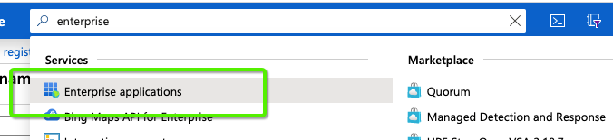
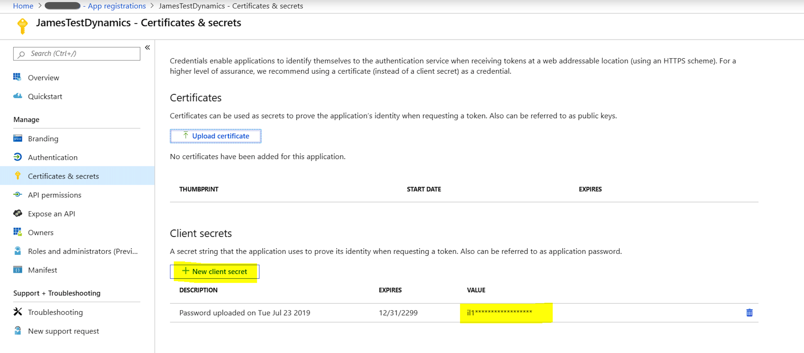

# OAuth avec [!DNL Azure Active Directory] pour Dynamics CRM {#oauth-with-azure-active-directory-for-dynamics-crm}

## Qui est touché {#who-s-affected}

Cette configuration est destinée aux nouvelles [!DNL Marketo Measure] clients utilisant Dynamics CRM avec une [!DNL Azure Active Directory] (AAD) ou pour les clients qui souhaitent migrer de leur nom d’utilisateur et mot de passe hérités vers [!DNL Azure Active Directory] avec OAuth.

>[!NOTE]
>
>Pour ces deux scénarios, AAD est configuré ici pour faciliter la connexion de votre instance Dynamics dans [!DNL Marketo Measure] en tant que fournisseur de données.

## Configurer une nouvelle application {#set-up-new-application}

1. Se connecter à [Portail Azure](https://portal.azure.com/#home).

1. Choisissez votre client Azure AD en cliquant sur votre compte dans le coin supérieur droit de la page, puis en cliquant sur la navigation Switch Directory , puis en sélectionnant le client approprié (ignorez cette étape si vous n’avez qu’un seul client Azure AD sous votre compte ou si vous avez déjà sélectionné le client Azure AD approprié).

   

1. Recherchez &quot;[!DNL Azure Active Directory]&quot; dans la barre de recherche, puis cliquez sur le nom à ouvrir.

   

1. Cliquez sur **[!UICONTROL Inscriptions des applications]** dans le menu de gauche.

   

1. Cliquez sur **[!UICONTROL Nouvelle inscription]** en haut.

   

1. Suivez les invites et créez une application. Peu importe qu’il s’agisse d’une application web ou d’une application cliente publique (mobile et bureau), mais si vous souhaitez des exemples spécifiques d’applications web ou d’applications clientes publiques, consultez notre [quickstarts](https://docs.microsoft.com/en-us/azure/active-directory/develop/v1-overview).\
   a. Le nom est le nom de l’application et décrit votre application aux utilisateurs finaux.\
   b. Sous Types de compte pris en charge, sélectionnez Comptes dans n’importe quel annuaire organisationnel et compte Microsoft personnel.\
   c. Indiquez l’URI de redirection. Pour les applications web, il s’agit de l’URL de base de l’application à laquelle les utilisateurs peuvent se connecter. Par exemple, `http://localhost:12345`. Pour le client public (mobile et bureau), Azure AD l’utilise pour renvoyer des réponses de jeton. Saisissez une valeur spécifique à votre application. Par exemple, `http://MyFirstAADApp`.

1. Une fois l’enregistrement terminé, Azure AD attribuera à votre application un identifiant client unique (l’ID d’application). Cette valeur est nécessaire dans la section suivante. Vous pouvez donc la copier depuis la page de l’application.

1. Pour trouver votre application dans le portail Azure, cliquez sur **[!UICONTROL Inscriptions des applications]**, puis cliquez sur **[!UICONTROL Toutes les applications]**. Ouvrez l’application que vous venez de créer

1. Cliquez sur **[!UICONTROL Authentification]** dans le menu de gauche.

   

1. Ajoutez la variable [!DNL Marketo Measure] URL de redirection : `https://apps.bizible.com/OAuth2` et `https://apps.bizible.com/OAuth2?identityOnly=true` à la liste des URL de redirection.

   

1. Accédez à l’onglet Autorisations de l’API et assurez-vous que les autorisations appropriées sont attribuées à l’application.

   

1. À partir de là, saisissez &quot;[!UICONTROL enterprise]&quot; dans la zone de recherche, puis cliquez sur **[!UICONTROL Applications d’entreprise]**.

   

1. Recherchez et ouvrez votre nouvelle application dans la liste des applications.

1. Dans l’onglet Autorisations , cliquez sur **[!UICONTROL Octroi du consentement de l’administrateur pour (nom de l’instance)]**.

   

1. Cliquez sur **[!UICONTROL Accepter]**.

   

1. Dans le[!UICONTROL Utilisateurs et groupes]&quot; , assurez-vous que les &quot;Utilisateurs et groupes&quot; valides sont affectés à l’application.

   

## Création d’un utilisateur d’application {#creating-an-application-user}

Une fois l’enregistrement de l’application effectué, un utilisateur de l’application peut être créé.

1. Accédez à votre environnement de service de données commun (`https://[org].crm.dynamics.com`).

1. Accédez à **[!UICONTROL Paramètres]** > **[!UICONTROL Sécurité]** > **[!UICONTROL Utilisateurs]**.

1. Choisir **[!UICONTROL Utilisateurs d’application]** dans le filtre d’affichage.

1. Sélectionner **[!UICONTROL + Nouveau]**.

1. Dans le formulaire Utilisateur de l’application, saisissez les informations requises.

   >[!NOTE]
   >
   >* Les informations de nom d’utilisateur ne doivent pas correspondre à un utilisateur existant dans la variable [!DNL Azure Active Directory].
   >
   >* Dans le champ ID de l’application , saisissez l’ID de l’application que vous avez enregistrée précédemment dans Azure AD.

1. Si la configuration est correcte, après avoir sélectionné **[!UICONTROL Enregistrer]**, la variable **[!UICONTROL URI de l’ID d’application]** et **[!UICONTROL Azure AD Object Id]** renseigne automatiquement les valeurs correctes.

1. Avant de quitter le formulaire utilisateur, sélectionnez **[!UICONTROL Gestion des rôles]** et attribuez un rôle de sécurité à cet utilisateur de l’application afin qu’il puisse accéder aux données de l’organisation souhaitée.

## Connexion de votre instance Dynamics via OAuth {#connecting-your-dynamics-instance-via-oAuth}

1. Lors de la première configuration de votre connexion Dynamics, suivez les étapes 1 à 5 de la section &quot;CRM as a Data Provider&quot; dans [cet article](/help/marketo-measure-and-dynamics/getting-started-with-marketo-measure-and-dynamics/microsoft-dynamics-crm-installation-guide.md).

1. Lorsque vous êtes invité à saisir les informations d’identification OAuth, renseignez l’ID client, le secret client et l’URI d’ID d’application configurés dans la section ci-dessus.

a. L’identifiant du client est l’identifiant de l’étape #7 dans la section ci-dessus. Si vous ne l’avez pas écrit, l’ID de l’application s’affiche dans les Paramètres de l’enregistrement de l’application.

b. Le secret client est le secret d’application créé sur le portail Azure pour votre application sous Certificats et secrets.

c. L’URI d’ID d’application est l’URL de l’API web cible (ressource sécurisée). Pour trouver l’URL de l’ID d’application, sur le portail Azure, cliquez sur [!DNL Azure Active Directory], cliquez sur Inscriptions de l’application, ouvrez la page Paramètres de l’application, puis cliquez sur Propriétés. Cela peut également être une ressource externe telle que `https://graph.microsoft.com`. Il s’agit normalement de l’URL de l’instance Dynamics.

1. Cliquez ensuite sur **[!UICONTROL Envoyer]**, vous serez invité à vous connecter avec [!DNL Azure Active Directory]. Une fois l’authentification réussie, votre compte Dynamics sera connecté en tant que fournisseur de données dans [!DNL Marketo Measure].

## Réauthentification de votre compte Dynamics {#re-authenticating-your-dynamics-account}

1. Lorsque vous êtes dans le [!DNL Marketo Measure] application, accédez à **[!UICONTROL Mes paramètres]** > **[!UICONTROL Paramètres]** > **[!UICONTROL Connexions]**.

1. Cliquez sur l’icône de clé dans la section CRM en regard de la connexion Dynamics.

1. Une fois que vous avez cliqué sur la touche, une fenêtre contextuelle s’affiche et vous êtes invité à saisir l’ID client, le secret client et l’URI d’ID d’application, comme dans le flux d’inscription.

   

1. Cliquez ensuite sur **[!UICONTROL Envoyer]**, vous serez invité à vous connecter avec [!DNL Azure Active Directory]. Une fois l’authentification réussie, votre compte Dynamics sera réautorisé dans [!DNL Marketo Measure].
