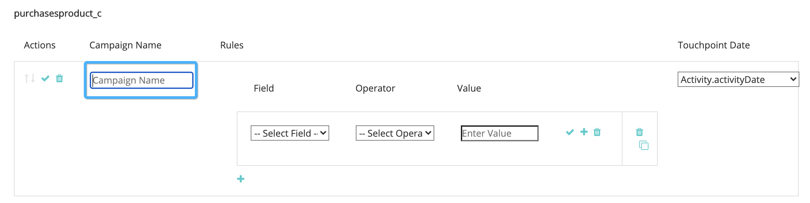

# [!DNL Marketo Engage] Intégration des activités {#marketo-engage-activities-integration}

Dans le cadre de la [!DNL Marketo Measure] et [!DNL Marketo Engage] L’intégration, cet effort d’extraction des activités Marketo joue un rôle énorme. Par le biais des activités Marketo, le système effectue le suivi des événements tels que Clic électronique, Changer de score ou Modifier l’état de progression. Ces types d’activité peuvent être analysés et définis pour sélectionner un sous-ensemble éligible aux points de contact. Une fois les points de contact créés sur ces activités, ils sont suivis dans le parcours d’engagement et mesurés avec vos autres canaux marketing tels que Recherche payante ou Marketing partenaire.

## Exigences {#requirements}

* Instance Marketo de production
* Production [!DNL Salesforce] ou [!DNL Microsoft Dynamics] instance
* Tout paiement [!DNL Marketo Measure] abonnement
* Synchronisation des personnes Marketo activée ([!DNL Marketo Measure] Paramètres)
* Programmes Marketo activés ([!DNL Marketo Measure] Paramètres)
* Activités Marketo activées ([!DNL Marketo Measure] Paramètres)

## Configuration {#setup}

1. Pour commencer à configurer les activités Marketo, accédez à **Mon compte** > **Paramètres** > **Activités**.

   

   

   La première chose requise est de sélectionner la liste des types d’activité sur lesquels vous prévoyez de créer des règles. Aucun type d’activité n’est requis, mais nous vous recommandons également de ne pas surcharger vos points de contact et de ne pas diluer l’importance des jalons significatifs. Cela dit, vous n’aurez peut-être pas besoin de plus de 5 types d’activité pour effectuer le suivi des engagements pertinents.

1. Cliquez sur le menu déroulant sous [!UICONTROL Sélectionner les types d’activités] pour commencer à choisir les différents types.

   

1. Une fois toutes les activités dont vous avez besoin sélectionnées, elles sont également renseignées dans votre [!UICONTROL Liste des activités sélectionnées] ainsi que sous [!UICONTROL Définition de règles].

   

1. Pour chaque type d’activité, vous devez définir une ou plusieurs règles qui déterminent quels enregistrements sont éligibles pour les points de contact. Dans notre exemple, nous allons ajouter une règle pour le type d’activité &quot;Changer de score&quot; afin que le système crée un point de contact lorsqu’une personne Marketo atteint un score de 90 ou plus.

1. Tout d’abord, selon le type d’activité, vous devrez peut-être configurer une [!DNL Marketo Measure] Nom de la campagne pouvant être utilisé ultérieurement pour le mappage des canaux. [!DNL Marketo Measure] Les noms de campagne peuvent être réutilisés dans plusieurs règles. Cela permet d’obtenir des noms plus larges qui peuvent être utilisés dans une règle de canal unique. Tous les types d’activité ne contiennent pas de programme Marketo. Par conséquent, un nom doit être ajouté à cette première étape.

   Voici un exemple de ce à quoi ressemblerait cette étape supplémentaire :

   

1. Dans notre exemple &quot;Changer de score&quot;, il n’est pas nécessaire de saisir un nom de campagne, car nous pouvons extraire ces informations du programme Marketo. Vous pouvez maintenant créer l’expression de règle. Dans notre exemple, nous allons sélectionner le champ &quot;[!UICONTROL Nouvelle valeur]&quot; avec un opérateur de &quot;[!UICONTROL est supérieur à]&quot; avec une valeur de 90.

   Vous pouvez développer les règles et ajouter des filtres ou critères supplémentaires en ajoutant des instructions &quot;et&quot; ou &quot;ou&quot; pour affiner les résultats.

   

   

1. Enfin, choisissez ce que nous devons utiliser comme Date du point de contact. Tous les champs de date ou date/heure disponibles s’affichent ici à partir de Marketo. Si vous ne disposez pas de champs de date personnalisés, vous verrez &quot;[!UICONTROL Date d’activité].&quot;

   

1. Veillez à cliquer sur **[!UICONTROL Enregistrer en tant que brouillon]** en cours de route afin de ne pas perdre vos modifications.

   

1. Accédez au **[!UICONTROL Mappage des attributs]** .

   

1. Pour chaque type d’activité que vous avez sélectionné, vous avez la possibilité de mapper des attributs Marketo supplémentaires aux champs de point de contact afin que vous puissiez afficher et générer des rapports sur ces valeurs dans [!DNL Marketo Measure Discover] ou dans le CRM.

   De nombreux champs ont été automatiquement mappés et ne peuvent pas être modifiés afin d’être cohérents avec nos autres intégrations. Pour rechercher ces valeurs, reportez-vous à la section Mappages de champ ci-dessous. Pour certains types d’activité, Marketo inclut des attributs pour une page d’entrée, une page de référence ou un navigateur que vous pouvez éventuellement mapper à un champ de point de contact. Dans l’exemple ci-dessous, nous avons fait quelques suggestions supplémentaires qui peuvent être supprimées.

1. Sélectionnez le champ Point de contact de l’acheteur dans la colonne de gauche à laquelle vous souhaitez mapper l’achat. Sélectionnez ensuite l’attribut Marketo à renseigner dans le champ Point de contact de l’acheteur . N’oubliez pas qu’il s’agit d’un mappage supplémentaire facultatif par-dessus ceux qui sont [!DNL Marketo Measure] a déjà été établi.

   Champs mappables :

   * Ville
   * Pays
   * Région
   * Page de destination
   * Page du référent
   * Page du formulaire
   * Date du formulaire
   * Plateforme
   * Navigateur

   >[!NOTE]
   >
   >Les champs de publicité tels que Contenu de la publicité ou Mot-clé ne sont pas disponibles dans cette liste, car ils sont réservés à nos intégrations de plateforme publicitaire.

## Types d’activité {#activity-types}

Certains types d’activité nous fournissent l’identifiant de programme et le nom de programme. Il est donc facile de les associer à l’identifiant de campagne et au nom de campagne sur le point de contact de l’acheteur. Pour d’autres, il n’y a pas d’association de programme. Par conséquent, une partie de la définition de règles nécessite que vous créiez une [!DNL Marketo Measure] Nom de la campagne. Vous trouverez ci-dessous des listes de chaque catégorie :

**Types d’activité avec ID de programme**

Envoyer un courrier électronique (6)\
Email diffusé (7)\
Rebond des emails (8)\
Désabonner le courrier électronique (9)\
Ouverture d’un courrier électronique (10)\
Clic sur Courriel (11)\
Modifier la valeur des données (13)\
Score de modification (22)\
Ajouter à la liste (24)\
État des modifications dans la progression (104)\
Ajouter à la formation (113)\
Change Nurture Cadence (115)

>[!NOTE]
>
>des types d’activité auxquels nous nous attendons avec un ID de programme, si une activité est détectée sans programme, [!DNL Marketo Measure] n’acceptera pas cela comme point de contact éligible, car nous ne pouvons pas avoir de valeurs de campagne nulles.

**Types d’activité sans ID de programme**

Cliquez sur Lien (3)\
Nouveau prospect (12)\
Piste de synchronisation vers SFDC (19)\
Convertir le prospect (21)\
Modifier le propriétaire (23)\
Supprimer de la liste (25)\
Activité de la DDC (26)\
Email Bounce Soft (27)\
Supprimer le prospect de SFDC (29)\
Fusionner les pistes (32)\
Ajouter à l’opportunité (34)\
Supprimer de l’opportunité (35)\
Opportunité de mise à jour (36)\
Supprimer la piste (37)\
Envoyer une alerte (38)\
Envoyer un e-mail de vente (39)\
Ouverture d’un courrier électronique de vente (40)\
Clic sur Courriel de vente (41)\
Ajouter à la campagne SFDC (42)\
Supprimer de la campagne SFDC (43)\
Changement de statut dans la campagne SFDC (44)\
Recevoir un courrier électronique de vente (45)\
Demander la campagne (47)\
Rebond des courriers électroniques de vente (48)\
Étape de modification des recettes (101)\
Modifier manuellement l’étape des recettes (102)\
Modifier le segment (108)\
Appelez Webhook (110)\
Transmis à un courrier électronique ami (111)\
Reçu par courrier électronique d’ami (112)\
Changer de suivi des infirmières (114)\
Push Lead to Marketo (145)\
Piste de synchronisation vers Microsoft (300)\
Dialogue de partage de contenu (400) Engagé (158) Document Interagi avec (159) Dialogue Rendez-vous Planifié (160) Objectif de dialogue Atteint (161) Activité personnalisée (xxx)

## Mappage de canaux {#channel-mapping}

Pour l’une des règles d’un type d’activité avec un ID de programme, le canal de programme Marketo est déterminé à partir du programme. Nous utilisons le canal du programme pour mapper vos canaux hors ligne personnalisés. Vous devrez donc vous assurer que vos canaux sont correctement configurés. [suivant les instructions ici](/help/marketo-measure-and-marketo/marketo-measure-integrations-with-marketo/marketo-engage-programs-integration.md#channel-mapping).

Et pour l’une des règles d’un type d’activité sans ID de programme, la première étape consistait à créer un nom de campagne. Utilisez ce nom de campagne pour configurer vos canaux en ligne personnalisés [présenté ici](/help/channel-tracking-and-setup/online-channels/online-custom-channel-setup.md).

Si les canaux de vos activités Marketo ne sont pas correctement configurés, il est probable que vos nouveaux points de contact tombent sous le canal &quot;Autre&quot;.

## Coûts du programme {#program-costs}

Grâce à l’importation des données des programmes Marketo, les coûts sont automatiquement téléchargés à partir des Coûts de la période et le coût reporté dans Marketo est distribué tout au long du mois affecté. Si, par exemple, 1 000 $ est signalé pour janvier 2021, les 1 000 $ sont répartis sur 31 jours. Les coûts sont présentés dans la section [!DNL Marketo Measure Discover].

## Mappage des cookies {#cookie-mapping}

Suite au [!DNL Marketo Measure] intégration à Marketo, la variable [!DNL Marketo Measure] L’ID de cookie est également mappé et synchronisé avec la variable [!DNL Marketo Munchkin Id]. Cela permet de réduire l’écart pour attribuer la première touche anonyme à une session web plutôt que d’attribuer les touches FT et LC à une activité Marketo. Imaginez ce scénario :

Mark clique sur une publicité Facebook et accède à wayneenterprises.com où il reçoit un cookie. [!DNL Marketo Measure] Id 123 et [!DNL Marketo Munchkin Id] 456. Aucun remplissage de formulaire n’a lieu.

L’équipe marketing de Wayne Entreprises envoie un courrier électronique à des pistes ciblées spécifiques, l’une d’elles étant `mark@email.com`.

`mark@email.com` reçoit l’e-mail et les clics publicitaires et atteint le `wayneenterprises.com`. Cela devient `mark@email.com's` deuxième visite à `wayneenterprise.com` avec les mêmes identifiants de cookie, mais il n’y avait aucun remplissage de formulaire, pour [!DNL Marketo Measure], il s’agit toujours d’un visiteur anonyme.

L’équipe marketing Wayne Entreprises crée une règle Activité Marketo afin de générer des points de contact pour un type d’activité &quot;Clic e-mail&quot;.

La mise en oeuvre actuelle créerait un point de contact FT et LC unique pour `mark@email.com` de l’activité Marketo à partir du type d’activité &quot;Clic email&quot;.

Avec cette amélioration du mappage de cookies, le FT revient et est crédité à la publicité Facebook et le LC est crédité au courrier électronique.

>[!NOTE]
>
>Avec le comportement du mappage de cookies, vous pouvez trouver certains points de contact LC provenant d’une visite web. Il est possible qu’une piste apparaisse dans Marketo sans activité associée, puis [!DNL Marketo Measure] téléchargé ce prospect, correspondait aux cookies associés, puis le tracait vers la session web la plus récente, même si aucune activité de formulaire n’avait créé le prospect.

## Questions fréquentes {#faq}

**Comment savoir si vous devez créer une règle Programmes Marketo ou une règle Activités Marketo ?**

La variable [!DNL Marketo Engage] L’intégration de programmes est un moyen simple de générer des points de contact selon qu’une personne est membre d’un programme ou non. Si vous souhaitez définir une règle en fonction du moment où une personne passe à un état de programme spécifique, la variable [!DNL Marketo Engage] L’intégration des activités sera la configuration souhaitée, en particulier le type d’activité &quot;Changement d’état dans la progression&quot; afin que la date du point de contact puisse être mappée à la date d’activité générée par le système.

**Pourquoi le nom de mon type de point de contact est-il tronqué ?**

Le champ Type de point de contact a été créé dans la [!DNL Marketo Measure] module contenant 16 caractères. Malheureusement, la modification de la limite de caractères du champ nécessiterait l’obsolescence du champ existant et la création d’un nouveau champ. La valeur du type de point de contact est le type d’activité, qui est également défini dans le champ Moyen .

**Pourquoi mon Type d’activité personnalisé n’apparaît-il pas dans la liste des activités disponibles ?**

Seuls les types d’activité personnalisés &quot;Approuvé&quot; sont affichés, et non les activités Version préliminaire ou Approuvé avec Version préliminaire.

**Comment déterminer les types d’activité pour lesquels je souhaite générer un point de contact ?**

Bien qu’il n’y ait pas de limite au nombre de types d’activité que vous pouvez créer, nous vous recommandons généralement de ne pas dépasser 5 types d’activité. Il faut du temps pour déterminer quelles activités marketing sont suffisamment pertinentes pour faire partie du parcours de point de contact. Par exemple, &quot;Désabonner le courrier électronique&quot; peut ne pas être un point de contact important à suivre, mais &quot;Clic électronique&quot; avec des filtres supplémentaires peut être un bon point. Cela varie selon chaque organisation et chaque équipe. Nous vous suggérons donc de travailler avec vos équipes pour réfléchir sur la meilleure approche à suivre.

**Pourquoi mon nom de navigateur est-il coupé ?**

La variable [!DNL Marketo Measure] Le nom du navigateur est limité à 20 caractères, bien que la valeur de l’agent utilisateur que nous obtenons de Marketo ait tendance à être une chaîne plus longue.

BrowserInfo.Name\
BrowserInfo.Version\
PlatformInfo.Name\
PlatformInfo.Version
