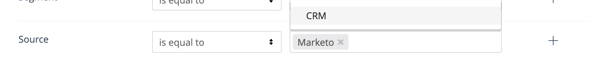

# [!DNL Marketo Engage] Intégration de personnes {#marketo-engage-people-integration}

L’intégration des personnes Marketo permet [!DNL Marketo Measure] pour commencer à télécharger des personnes à partir de Marketo et commencer à lier leurs sessions suivies à l’individu et mapper les points de contact à leurs engagements. Historiquement, [!DNL Marketo Measure] n’a pu mapper les points de contact qu’à une personne du CRM. Les marketeurs peuvent ainsi mesurer leurs efforts marketing plus tôt que d’attendre une étape ou de déclencher la synchronisation avec le CRM.

## Exigences {#requirements}

* Instance Marketo de production
* Production [!DNL Salesforce] ou [!DNL Microsoft Dynamics] instance
* Tout paiement [!DNL Marketo Measure] abonnement
* SOLR activé (veuillez contacter [Prise en charge de Marketo](https://nation.marketo.com/t5/Support/ct-p/Support) pour activer cette option)

## Fonctionnement {#how-it-works}

En tant que client actuel, [!DNL Marketo Measure] télécharge déjà des personnes à partir de votre CRM. Le processus standard est le suivant : [!DNL Marketo Measure] télécharge les personnes et mappe l’adresse électronique à une session web dont nous avons effectué le suivi via bizible.js.

Avec l’introduction du téléchargement de personnes Marketo, [!DNL Marketo Measure] est désormais en mesure de mapper les sessions web à un plus grand nombre d’individus, ceux qui n’ont pas été synchronisés avec le CRM. Nous le voyons généralement en raison de processus internes qui attendent que les personnes atteignent un certain statut avant d’être transférées vers le CRM.

When [!DNL Marketo Measure] mappe correctement la personne Marketo à une session web ; notre traitement génère tous les points de contact pertinents pour cette personne, qui sont à terme reportables dans [!DNL Marketo Measure Discover]. Si cette personne Marketo est envoyée au CRM, [!DNL Marketo Measure] gérera le scénario de duplication et recréera le point de contact de la personne CRM, puis marquera l’ensemble initial comme &quot;doublon&quot;.

Pour détecter ces doublons, veillez à ce que [!DNL Marketo-Salesforce] ou [!DNL Marketo-Dynamics] La synchronisation renseigne les ID de piste et de contact sur la personne Marketo. Si l’ID est synchronisé correctement, vous devriez être en mesure de voir l’ID de gestion de la relation client sur l’enregistrement de la personne, comme ceci :

Les clients ont la possibilité de créer des rapports sur l’ensemble des personnes Marketo et des personnes CRM dans le [!DNL Marketo Measure] Découvrez-le. Si vous souhaitez créer des rapports uniquement sur les personnes CRM, nous vous recommandons de créer un segment pour les filtrer.

## [!DNL Marketo Measure Discover] {#marketo-measure-discover}

Lors de la création de rapports sur les pistes (personnes) dans [!DNL Marketo Measure Discover], vous verrez le total de vos prospects Marketo et CRM. Pour créer des rapports uniquement sur les personnes Marketo ou uniquement sur les prospects CRM, vous souhaiterez créer une catégorie de segments pour votre source, puis créer des règles de segments pour Marketo et CRM à l’aide du champ &quot;Système source&quot; pour définir la règle. Une fois vos segments créés, la catégorie Source est disponible pour les filtrer dans vos [!DNL Marketo Measure Discover] tableaux de bord.

## Appariement des champs {#field-mappings}

<table> 
 <colgroup> 
  <col> 
  <col> 
 </colgroup> 
 <tbody> 
  <tr> 
   <th>
<strong>biz_leads</strong>
</th> 
   <th>
<strong>Marketo</strong>
</th> 
  </tr> 
  <tr> 
   <td>
ID
</td> 
   <td>
id
</td> 
  </tr> 
  <tr> 
   <td>
MODIFIED_DATE
</td> 
   <td>
updatedAt<strong>*</strong>
</td> 
  </tr> 
  <tr> 
   <td>
CREATED_DATE
</td> 
   <td>
createdAt
</td> 
  </tr> 
  <tr> 
   <td>
EMAIL
</td> 
   <td>
E-mail
</td> 
  </tr> 
  <tr> 
   <td>
WEB_SITE
</td> 
   <td>
site web
</td> 
  </tr> 
  <tr> 
   <td>
COMPANY
</td> 
   <td>
société
</td> 
  </tr> 
  <tr> 
   <td>
IS_CONVERTED
</td> 
   <td>
s/o
</td> 
  </tr> 
  <tr> 
   <td>
ACCOUNT_ID
</td> 
   <td>
Identifiant de compte (L2A)
</td> 
  </tr> 
  <tr> 
   <td>
BIZIBLE_STAGE
</td> 
   <td>
Statut
</td> 
  </tr> 
  <tr> 
   <td>
IS_DELETED
</td> 
   <td>
true/false
</td> 
  </tr> 
 </tbody> 
</table>

*Il existe un problème de comportement connu en raison duquel les champs de l’entité Société Marketo n’ont pas d’incidence sur la valeur updateAt de la personne. Par conséquent, si des champs pertinents tels que Site Web ou Société sont mis à jour, [!DNL Marketo Measure] ne saura pas que ces valeurs sont modifiées, car la valeur updateAt date/time n’est pas mise à jour. Cela a un impact sur la fonction ABM, où nous ne disposerions pas de nouvelles données pour résoudre le problème du compte de l’prospect. Il n&#39;y a pas de solution pour le moment, mais il y a des projets pour y remédier à l&#39;avenir.

## Questions fréquentes {#faq}

**Pourquoi le nombre de mes prospects diffère-t-il entre mon CRM et [!DNL Marketo Measure Discover]?**

Comme cette intégration nous permet de créer des points de contact pour les pistes que nous avons importées directement de Marketo, il se peut que certaines pistes n’aient pas été synchronisées avec le CRM. Par conséquent, le nombre de points de contact dans Discover pourrait être supérieur à celui du CRM, puisque les points de contact ne sont transmis que pour les pistes CRM.

**Comment cela remplace-t-il mes données ?**

Cette intégration fusionne en fait les jeux de données dans votre [!DNL Marketo Measure] de sorte que rien n’est remplacé. Ce que nous attendons de vos Leads CRM actuels, c’est que lorsque nous téléchargeons l’équivalent de 2 ans de Leads Marketo, nous mettions simplement à jour cet enregistrement Lead pour montrer qu’il existait également une correspondance avec un prospect Marketo. Tout cela se produit dans le serveur principal et les points de contact doivent rester identiques. Nous nous attendons également à voir plus de points de contact en raison des pistes Marketo éligibles. Si nous pouvons trouver des sessions web associées à ces personnes Marketo, nous allons commencer à voir les points de contact comptabilisés dans [!DNL Marketo Measure].

**Est-il possible de télécharger uniquement mes utilisateurs à partir de Marketo et de couper la connexion CRM ?**

Pour le moment, non. Cette option sera disponible à l’avenir, mais nous devons développer d’autres phases de cette intégration Marketo afin de pouvoir connecter les programmes, opportunités et offres de Marketo à [!DNL Marketo Measure].

**Importez-vous TOUTES mes personnes Marketo ?**

Pour l’instant, le plus tôt que nous importerons est le 1/1/2018, de sorte que nous ayons au moins 2 ans de données, ce qui est le même comportement que nous appliquons à partir des téléchargements CRM. Nous implémenterons un comportement amélioré pour télécharger une fenêtre variable de 2 ans une fois la connexion Marketo établie.

Nous ne filtrons pas non plus pour aucun type de personne, de sorte que toutes les personnes qui se trouvent dans la fenêtre de deux ans seront importées et seront éligibles pour les points de contact.

**Qu’est-ce que la technologie SOLR et pourquoi ai-je besoin qu’elle soit activée pour utiliser cette fonctionnalité ?**

L’activation de SOLR pour votre instance Marketo est une étape triviale qui ouvre de l’espace matériel dans Marketo afin que votre abonnement puisse utiliser la variable [!DNL Marketo Measure] intégration. Si SOLR n’est pas activé, nous n’avons pas accès à certains appels qui nous permettraient sinon de télécharger les personnes appropriées à partir de votre instance Marketo.
