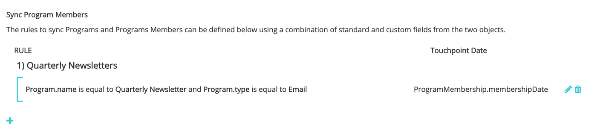
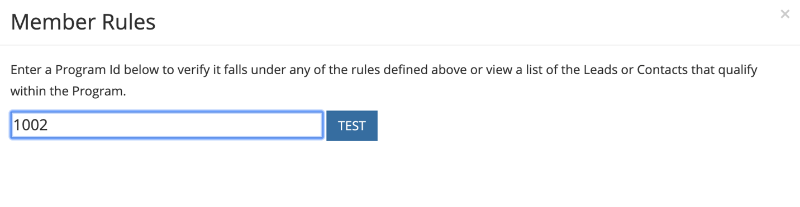
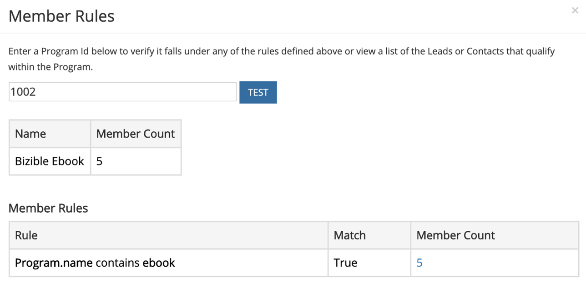

# [!DNL Marketo Engage] Intégration de programmes {#marketo-engage-programs-integration}

Par le biais de la [!DNL Marketo Measure] intégration avec [!DNL Marketo Engage] Pour les programmes, nos clients peuvent commencer à créer des points de contact pour le suivi de l’attribution à partir des adhésions au programme Marketo. Grâce à cette fonctionnalité, les marketeurs peuvent commencer à suivre les abonnements aux programmes à partir de programmes de messagerie ou d’engagement qui ne sont pas visibles par la variable [!DNL Marketo Measure] javascript et doivent être mesurés dans le parcours d’attribution.

## Disponibilité {#availability}

Tous les niveaux.

## Exigences {#requirements}

* Instance Marketo de production
* Production Salesforce ou instance Microsoft Dynamics
* Tout paiement [!DNL Marketo Measure] abonnement
* Synchronisation des personnes Marketo activée ([!DNL Marketo Measure] Paramètres)
* Programmes Marketo activés ([!DNL Marketo Measure] Paramètres)

## Configuration {#setup}

**Règles**

1. Pour commencer à configurer des règles sur les programmes Marketo, accédez à **[!UICONTROL Mon compte]** > **[!UICONTROL Paramètres]** > **[!UICONTROL Programmes]**. Cliquez sur le bouton **+** pour commencer à créer votre première règle.

   

   

1. Vous pouvez éventuellement définir un nom pour la règle si cela permet d’en effectuer le suivi. Vous allez d’abord sélectionner le champ à définir pour votre règle dans la liste des champs Programme et Adhésion au programme . Continuez à créer la règle en sélectionnant l’opérateur et la valeur attendue à vérifier.

   

1. Ajoutez une autre instruction dans la même zone pour configurer un critère &quot;et&quot; dans la règle ou cliquez sur l’icône + en dehors de la zone pour configurer une instruction &quot;ou&quot;.

   

1. Sélectionnez le champ Date ou Date/Heure à utiliser pour le mappage à la Date du point de contact. Pour afficher la liste des valeurs disponibles à partir de Marketo, saisissez une accolade. `{` et nous afficherons les champs disponibles.

   

   >[!NOTE]
   >
   >Si votre règle souhaite capturer la date d’activité ou la date à laquelle un membre du programme a atteint un état particulier, vous souhaiterez utiliser la variable [!DNL Marketo Engage] Intégration d’activités et configuration d’une règle pour le type d’activité &quot;Changement d’état dans la progression&quot;.

   

La règle terminée doit ressembler à ceci :

## Test {#test}

Après avoir créé certaines règles, vous pouvez le tester afin de vérifier que votre instruction correspond à vos programmes.

1. Pour exécuter un test, cliquez sur le bouton **[!UICONTROL TEST]** comme illustré ci-dessous.

   

1. Un modal s’affiche, où vous pouvez saisir l’ID de programme à partir de Marketo.

   

   Une fois que vous avez saisi l’identifiant, cliquez sur le bouton [!UICONTROL Test] , notre moteur de règles passe en revue chaque règle et détermine si le programme correspond ou non à l’une des règles. Dans l’exemple ci-dessous, vous pouvez voir que le programme 1002, appelé [!DNL Marketo Measure] Ebook comporte 5 membres de programme et est éligible en raison de la règle affichée.

   Les règles sont exécutées sur une taille d’échantillon de 5 000 membres. Si votre programme contient plus de 5 000 membres, il est possible que nous ne vérifiions pas la compatibilité de tous les membres. Cet outil sert simplement à vérifier que les règles sont correctement construites.

   

   Vous pouvez cliquer sur Nombre de membres pour afficher la liste des ID de personnes Marketo éligibles dans le programme.

   

## Mappage de canaux {#channel-mapping}

Dans la liste des canaux de programme Marketo, vous souhaitez mapper les valeurs à la variable [!DNL Marketo Measure] canaux marketing personnalisés que vous avez créés dans Paramètres. Tous les points de contact générés par ces programmes hériteront des noms de canal et de sous-canal que vous sélectionnez ici.

1. Commencez par accéder à **[!UICONTROL Mon compte]** > **[!UICONTROL Paramètres]** > **[!UICONTROL Canaux hors ligne]**.

1. Dans la partie supérieure, vous avez la possibilité de mapper vos types de campagne CRM, puis, dans la partie inférieure, vous verrez les options de vos canaux de programme Marketo.

1. Sélectionnez tout d’abord le canal qui doit correspondre à la valeur, puis sélectionnez éventuellement le sous-canal. Une fois que vous avez terminé, cliquez sur **[!UICONTROL Enregistrer]** en bas.

   

## Coûts du programme {#program-costs}

Grâce à l’importation des données des programmes Marketo, les coûts sont automatiquement téléchargés à partir des Coûts de la période et le coût reporté dans Marketo est distribué tout au long du mois affecté. Si, par exemple, 1 000 $ est signalé pour janvier 2021, les 1 000 $ sont répartis sur 31 jours. Les coûts sont présentés dans la section [!DNL Marketo Measure Discover].

## Fonctionnement {#how-it-works}

**Appariement des champs**

<table> 
 <colgroup> 
  <col> 
  <col> 
 </colgroup> 
 <tbody> 
  <tr> 
   <th>biz_ad_campaigns</th> 
   <th>Marketo</th> 
  </tr> 
  <tr> 
   <td>ID</td> 
   <td>id</td> 
  </tr> 
  <tr> 
   <td>IS_DELETED</td> 
   <td>(vérifier si le programme existe toujours via l’API)</td> 
  </tr> 
  <tr> 
   <td>
NOM
</td> 
   <td>name</td> 
  </tr> 
 </tbody> 
</table>

| biz_campaign_members | Marketo |
|---|---|
| ID | &quot;MarketoProgramMembership&quot;_ProgramId_Lead Id |
| MODIFIED_DATE | updatedAt |
| CREATED_DATE | membershipDate |
| LEAD_ID | Id (appartenance à une liste) |
| LEAD_EMAIL | Email (abonnement à une liste) |
| STATUT | progressStatus |
| HAS_RESPONDED | reachStatus |
| CAMPAIGN_NAME | programName |
| CAMPAIGN_ID | programId |
| CAMPAIGN_TYPE | marketing |

## Mappage des cookies {#cookie-mapping}

Suite au [!DNL Marketo Measure] intégration à Marketo, la variable [!DNL Marketo Measure] L’ID de cookie est également mappé et synchronisé avec la variable [!DNL Marketo Munchkin Id]. Cela permet de réduire l’écart pour attribuer la première touche anonyme à une session web plutôt que d’attribuer les touches FT et LC à une activité Marketo. Imaginez ce scénario :

Marquer les clics sur un [!DNL Facebook] et arrive sur wayneentreprises.com où il reçoit un cookie [!DNL Marketo Measure] Id 123 et [!DNL Marketo Munchkin Id] 456. Aucun remplissage de formulaire n’a lieu.

L’équipe marketing de Wayne Entreprises envoie un courrier électronique à des pistes ciblées spécifiques, l’une d’elles étant `mark@email.com`.

`mark@email.com` reçoit l&#39;email et les clics publicitaires et atterrit sur wayneentreprises.com. Cela devient `mark@email.com's` deuxième visite à `wayneenterprise.com` avec les mêmes identifiants de cookie, mais il n’y avait aucun remplissage de formulaire, pour [!DNL Marketo Measure], il s’agit toujours d’un visiteur anonyme.

L’équipe marketing Wayne Entreprises crée une règle Activité Marketo afin de générer des points de contact pour un type d’activité &quot;Clic e-mail&quot;.

La mise en oeuvre d’aujourd’hui créerait un point de contact FT et LC unique pour `mark@email.com` de l’activité Marketo à partir du type d’activité &quot;Clic email&quot;.

Avec cette amélioration du mappage de cookies, le FT revient et est crédité au [!DNL Facebook] et le LC seraient crédités au courrier électronique.

>[!NOTE]
>
>Avec le comportement du mappage de cookies, vous pouvez trouver certains points de contact LC provenant d’une visite web. Il est possible qu’une piste apparaisse dans Marketo sans activité associée, puis [!DNL Marketo Measure] téléchargé ce prospect, correspondait aux cookies associés, puis le tracait vers la session web la plus récente, même si aucune activité de formulaire n’avait créé le prospect.

## FAQ {#faq}

**Comment définir la date du point de contact comme date de progression ou la date à laquelle le changement d’état est survenu pour mon membre de programme ?**

Si votre règle souhaite capturer la date d’activité ou la date à laquelle un membre du programme a atteint un état particulier, vous souhaiterez utiliser la variable [!DNL Marketo Engage] Intégration d’activités et configuration d’une règle pour le type d’activité &quot;Changement d’état dans la progression&quot;. Sinon, la variable [!DNL Marketo Engage] L’intégration de programmes rend disponible uniquement la date d’adhésion, qui est la première date à avoir introduit la personne Marketo dans le programme, même s’il existe plusieurs états.

**Puis-je obtenir une liste de sélection des options de date pour la date du point de contact ?**

Pour déclencher la saisie automatique, commencez par saisir une accolade. `{` dans le champ de texte, les champs disponibles s’affichent.

**Si je crée des règles de programme Marketo et que je dispose également de règles de campagne CRM, seront-elles comptabilisées deux fois ?**

Cela dépend de votre définition de règle, mais peut-être, oui. Vous souhaitez évaluer votre jeu de règles afin que vous n’ayez pas de règles couvrant un programme et une campagne, car nous ne dédupliquerons ni ne détecterons les appartenances similaires. Une solution possible consiste à copier vos règles Campaign dans Programmes si vous souhaitez que Marketo soit votre source unique de vérité, puis à supprimer les règles Campaign. Une autre option consiste à ajouter un critère &quot;CreatedOn&quot; ou &quot;CreatedDate&quot; dans vos règles, de sorte que les règles antérieures à une certaine date utilisent les règles et règles de Campaign après qu’une certaine date utilisera les règles de programme. Il y a beaucoup de solutions possibles, mais cela demandera un peu de planification et de coordination.

**Les champs personnalisés d’appartenance à un programme Marketo sont-ils disponibles à définir ?**

En raison de limitations techniques, nous ne pouvons pas prendre en charge pour l’instant les champs personnalisés d’appartenance à un programme. Une fois ces champs disponibles via des API Marketo supplémentaires, ils nous seront exposés et visibles pour que vous puissiez les utiliser.

**Comment savoir si je dois utiliser des programmes ou des activités ?**

Le [!DNL Marketo Engage] L’intégration de programmes est un moyen simple de générer des points de contact selon qu’une personne est membre d’un programme ou non. Si vous souhaitez définir une règle en fonction du moment où une personne passe à un état de programme particulier, la variable [!DNL Marketo Engage] L’intégration des activités est la configuration que vous souhaitez, en particulier le type d’activité &quot;Modifier l’état de progression&quot;.
