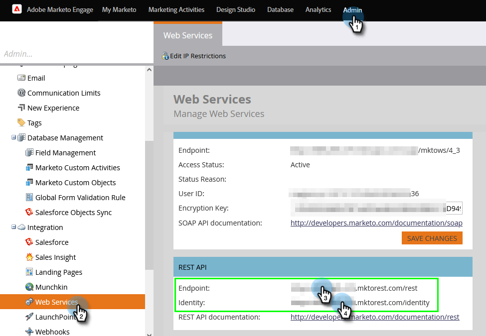
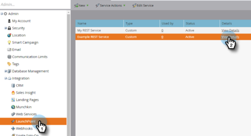
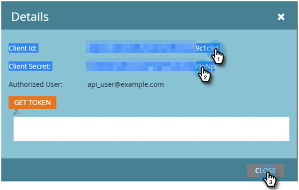
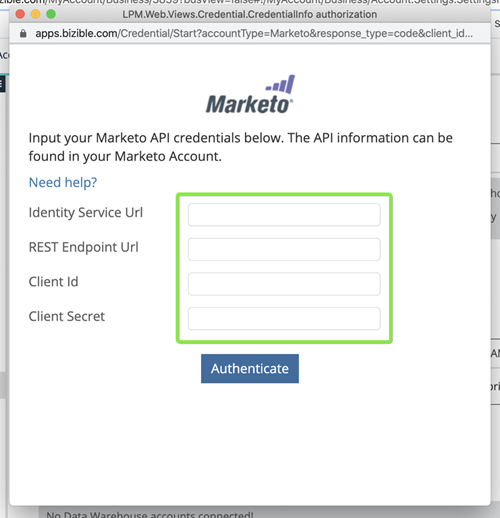
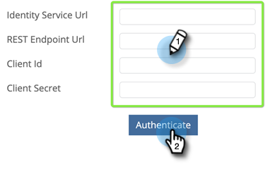

# Configurer la connexion Marketo {#set-up-marketo-connection}

Voici comment configurer votre connexion à Marketo.

>[!PREREQUISITES]
>
>[Créez un rôle Utilisateur API uniquement](https://experienceleague.adobe.com/docs/marketo/using/product-docs/administration/users-and-roles/create-an-api-only-user.html?lang=fr){target="_blank"} pour la connexion [!DNL Marketo Measure]/Marketo Engage.

1. Dans [!DNL Marketo Measure], cliquez sur la liste déroulante **[!UICONTROL Mon compte]** et sélectionnez **[!UICONTROL Paramètres]**.

   

1. Sous [!UICONTROL Intégrations], cliquez sur **[!UICONTROL Connexions]**.

   

1. Cliquez sur **[!UICONTROL Configurer une nouvelle connexion CRM]**.

   

1. Cliquez sur le bouton **[!UICONTROL Connexion]** en regard de Marketo.

   

1. Dans un nouvel onglet, connectez-vous à votre compte Marketo Engage. Accédez à **Admin** > **Services web**. Faites défiler jusqu’à API REST. Mettez en surbrillance et enregistrez le point d’entrée et l’URL du service d’identités. Vous en avez besoin pour les étapes suivantes.

   

1. Toujours dans Marketo Engage, sélectionnez **LaunchPoint** dans l’arborescence de gauche. Recherchez le service personnalisé que vous souhaitez connecter à Marketo Measure et cliquez sur **Afficher les détails**.

   

1. Mettez en surbrillance et enregistrez l’ID client et le secret client. Cliquez sur **Fermer**.

   

1. De retour en [!DNL Marketo Measure], renseignez les champs avec les données que vous avez collectées.

   

1. Après avoir saisi les valeurs, cliquez sur **[!UICONTROL Authentifier]**. Votre compte Marketo Engage est connecté à [!DNL Marketo Measure].

   

   >[!NOTE]
   >
   >[!DNL Marketo Measure] effectue des appels à l’API Marketo en votre nom sans utiliser aucune de vos limites d’API Marketo. Vous n’avez donc pas à vous soucier des limites et de l’affectation de crédit avec d’autres intégrations.
