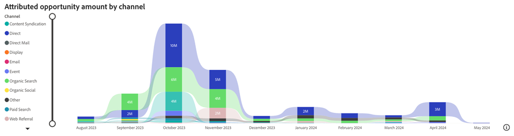
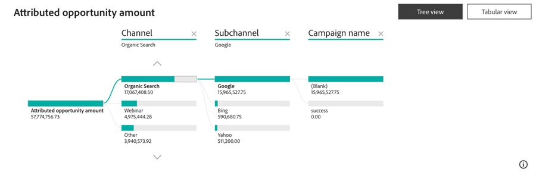

# Tableau de bord Opportunité attribuées {#attributed-opportunity-dashboard}

Le tableau de bord des opportunités attribuées offre une vue d’ensemble exhaustive de la manière dont les efforts marketing contribuent aux opportunités de pipeline naissantes et matures. Découvrez les détails de chaque opportunité ouverte et fermée pouvant être attribuée à vos stratégies, avec la flexibilité de filtrer par étape d’opportunité, ce qui souligne l’étendue de l’influence du marketing au-delà des offres fermées.

**Questions aux réponses du tableau de bord**:

* Quels canaux, sous-canaux ou campagnes se classent en termes de montant d’opportunité attribué ?
* Quel est le montant total des opportunités attribuées et le nombre de nos opportunités ouvertes et fermées attribuées ?

## Composants de tableau de bord {#dashboard-components}

### Mosaïques IPC {#kpi-tiles}

* **Montant de l’opportunité attribuée**: contribution totale aux recettes, basée sur le modèle d’attribution sélectionné, issue des opportunités fermées et ouvertes avec les points de contact créés au cours de la période filtrée.
* **Opportunités attribuées**: nombre d’opportunités fermées et ouvertes ayant des points de contact.

### Graphique Attribué du montant des opportunités par canal dans le temps {#attributed-opportunity-amount-by-channel-over-time-chart}

Graphique à barres empilées affichant le montant total des opportunités attribuées, segmenté par canal, pour chaque mois/trimestre/année.

* Utilisez les fonctionnalités d’exploration et d’exploration pour classer les données par mois, trimestre ou année.
* Passez la souris sur un segment de barre ou l’espace entre les barres pour afficher des informations détaillées.

**Questions aux réponses du graphique**:

* Quels canaux ont généré le montant d’opportunité le plus attribué chaque trimestre ?
* Quelle était la répartition du montant d’opportunité attribué par canal le mois dernier ?

### Tableau Montant de l’opportunité attribuée {#attributed-opportunity-amount-table}

Montant total des opportunités attribuées segmenté par canal, sous-canal et campagne, présenté aux formats Tableau et Arborescence. Cliquez sur le bouton dans le coin supérieur droit pour basculer entre les vues.

**Questions sur les réponses du panorama**:

* En quoi la distribution du montant d’opportunité attribué varie-t-elle entre différents sous-canaux au sein d’un canal ?
* Quelles campagnes sous un certain sous-canal génèrent le plus grand montant d’opportunité attribué ?

#### Vue tabulaire {#tabular-view}

La vue tabulaire offre des informations claires et organisées sur la distribution du montant d’opportunité attribué. Les utilisateurs peuvent rapidement identifier les schémas de performances et identifier les stratégies marketing à fort impact en catégorisant les données dans les canaux, les sous-canaux et les campagnes.

Cliquez sur le bouton **+** en regard de chaque canal pour afficher la ventilation par sous-canal et par campagne.

#### Arborescence {#tree-view}

L’arborescence permet une exploration des données plus interactive et plus granulaire, ce qui permet aux marketeurs d’identifier les tendances, les anomalies ou les performances exceptionnelles dans le cadre de leurs efforts marketing.

Cliquez sur une branche pour approfondir l’analyse de la couche de hiérarchie suivante.

### Volet Filtrer

Ce tableau de bord est équipé des paramètres et filtres suivants :

* Date (en fonction de la date de création de l’opportunité)
* Modèle d’attribution
   * Pour les opportunités ouvertes, les modèles d’attribution &quot;chemin complet&quot; et &quot;personnalisé&quot; offrent des vues ponctuelles et ne représentent pas les résultats d’attribution finale.
* Étape d’opportunité (en fonction de l’étape actuelle)
* Canal, sous-canal
* Campagne
* Segments
