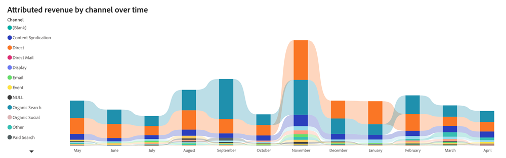

# Tableau de bord des recettes affectées {#attributed-revenue-dashboard}

Le tableau de bord des recettes affectées offre une perspective précise des recettes directement liées à vos activités marketing. Découvrez en détail comment vos stratégies marketing ont contribué à sceller des offres.

Questions sur le panorama :

Quels sont les canaux, sous-canaux ou campagnes qui se classent le plus en termes de recettes attribuées ?
Quel est le montant total de nos recettes attribuées et le nombre de nos contrats à durée indéterminée ?

<table style="table-layout:auto"> 
<tbody>
  <tr> 
   <th>Composant</th> 
   <th>Description</th>
   <th>Champs d’exploration</th>
   <th>Type de date</th>
   <th>Filtres</th>
  </tr>
  <tr>
    <td>Mosaïque Recettes affectées</td>
    <td>Chiffre d’affaires total attribuable aux opportunités "Chiffre d’affaires fermé" avec points de contact enregistrés.</td>
    <td rowspan="6"><li>ID de l’opportunité</li>
<li>Nom de l'opportunité</li>
<li>Date de création d'opportunité</li>
<li>Date de fermeture de l'opportunité</li>
<li>Est fermé (O/N)</li>
<li>Est gagnant (O/N)</li>
<li>Étape actuelle</li>
<li>Modèle d’attribution</li>
<li>Revenu attribué</li>
<li>Recettes réalisées</li></td>
    <td rowspan="6">Jour complet</td>
    <td rowspan="6"><li>Date</li>
<li>Modèle d’attribution</li>
<li>Canal</li>
<li>Sous-canal</li>
<li>Campagne</li>
<li>Segments</li></td>
  </tr>
  <tr>
    <td>Mosaïque Traitements Attribuables</td>
    <td>Nombre total d'offres "à succès clos" issues d'opportunités imputables.</td>
  </tr>
  <tr>
    <td>Recettes affectées par canal au fil du temps</td>
    <td>Graphique à barres empilées affichant le total des recettes attribuées, segmenté par canal associé, pour chaque trimestre/mois.
     </td>
  </tr>
  <tr>
    <td>Tableau des recettes attribuées</td>
    <td>Total des recettes attribuées segmenté par canal, sous-canal et campagne, présenté aux formats Tableau et Arborescence.
     
     </td>
  </tr>
  </tr>
</tbody>
</table>

>[!MORELIKETHIS]
>
>[Découvrir les bases d’un tableau de bord](/help/marketo-measure-discover-ui/dashboards/discover-dashboard-basics.md){target="_blank"}
