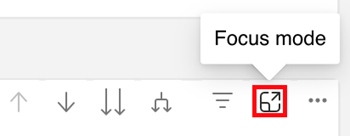

# Découvrir les bases d’un tableau de bord {#discover-dashboard-basics}

Cet article vous guidera tout au long des fonctionnalités fondamentales de l’interface repensée, en vous assurant que vous pouvez accéder facilement à vos données et les interpréter. Découvrez la dynamique du volet de filtrage et les complexités de nos fonctionnalités de création de rapports améliorées, telles que les fonctions d’analyse, le filtrage croisé et les info-bulles.

## Volet Filtrer {#filter-pane}

Chaque tableau de bord comporte une gamme de filtres, accompagnés des commandes suivantes pour une navigation et une personnalisation fluides.

<table style="table-layout:auto"> 
 <tbody> 
  <tr> 
   <th>Nom</th> 
   <th>Icône</th>
   <th>Description</th>
  </tr> 
  <tr> 
   <td>Bouton Hamburger</td> 
   <td></td>
   <td>Active ou ferme le volet de filtrage.</td>
  </tr>
  <tr> 
   <td>Réinitialiser</td> 
   <td></td>
   <td>Redéfinissez les paramètres par défaut des filtres.</td>
  </tr>
   <tr> 
   <td>Filtres en mode visuel</td> 
   <td></td>
   <td>Pointez sur le coin supérieur droit d’un visuel, puis cliquez sur le bouton pour afficher ses filtres actifs.</td>
  </tr>
 </tbody> 
</table>

## Fonctionnalités des rapports {#report-capabilities}

### Zoom avant {#drill-down-and-up}

* Pointez sur un visuel pour déterminer s’il comporte une hiérarchie. C’est ce que indique la présence d’options de contrôle de l’analyse dans la barre d’actions.

* Activez l’analyse en cliquant sur la simple flèche vers le bas mise en surbrillance par un arrière-plan gris. Pour annuler, utilisez l’icône d’exploration.

Pour descendre d’un champ à l’autre, activez l’icône de défilement et sélectionnez un élément visuel, tel qu’une barre.

Utilisez l’icône d’exploration à double flèche pour passer au niveau de hiérarchie suivant.

Utilisez l’icône en forme de branchement pour ajouter un niveau de hiérarchie supplémentaire dans la vue actuelle.

### Exploration {#drill-through}

* Pour explorer les données derrière le visuel, cliquez avec le bouton droit de la souris sur l’élément visuel et sélectionnez l’option &quot;perceuse&quot;.

* Pour exporter les données sous-jacentes, passez la souris sur le coin supérieur droit de la page d’analyse, cliquez sur le bouton &quot;Autres options&quot;, puis sélectionnez &quot;Exporter les données&quot;.

* Pour effectuer un zoom avant sur un visuel ou une mosaïque spécifique, passez la souris sur le coin supérieur droit et sélectionnez le bouton &quot;mise au point&quot;.

### Filtrage croisé {#cross-filtering}

Par défaut, la sélection d’un libellé de valeur ou d’axe dans une visualisation transfère le filtre des autres visuels sur la page du rapport, en s’assurant qu’ils n’affichent que les données pertinentes filtrées.

### Infobulles {#tooltips}

Les info-bulles fournissent des détails supplémentaires sur les données affichées. Pointez simplement sur un élément visuel et une info-bulle contextuelle s’affiche, fournissant des informations ou des explications relatives à ce point de données spécifique.

